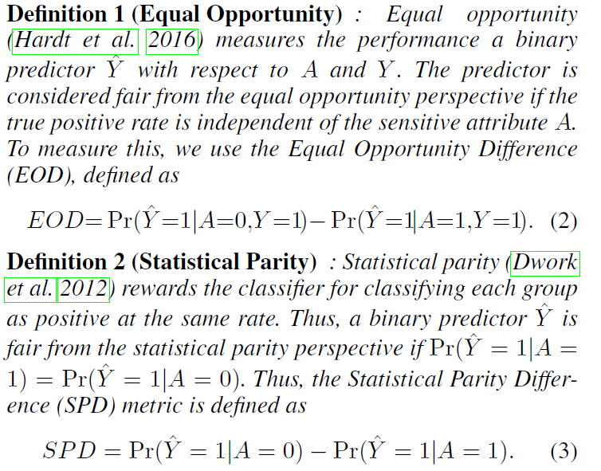
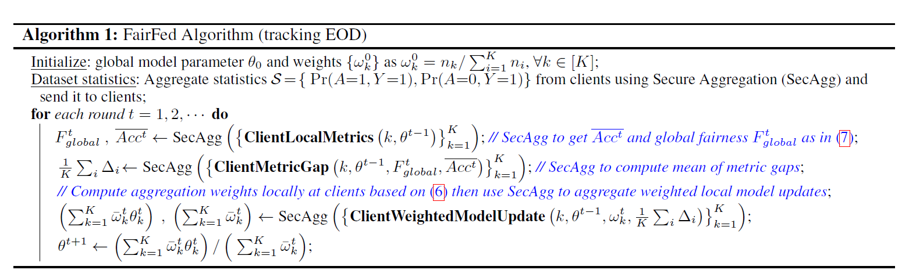
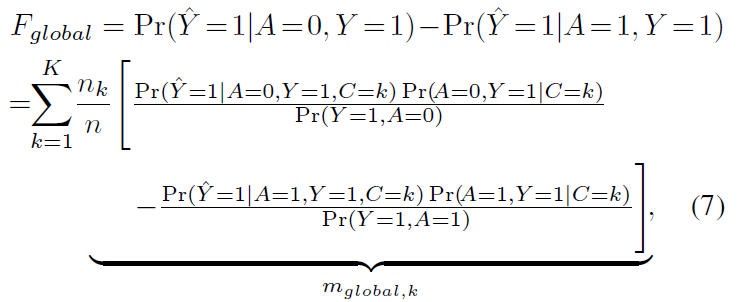

## AI Fairness Method 1

### Basic Information

Title: FairFed: Enabling Group Fairness in Federated Learning

Source: AAAI 2023

Institute: University of Southern California

### Introduction

#### Background

Current methods tackle fairness problems with centralization techniques, which are not suitable for federated learning settings.

Current fairness approaches in FL focus on the training process of clients.

#### Challenge

Aggregate the information from local datasets to achieve higher performance while limiting access to the local dataset directly.

Trade-off: higher performance by considering information globally - exchange of more information in the communication processes.

#### Motivation

To amplify the local debiasing performance, the clients will evaluate the fairness of the global model on their local datasets.

Note:

It's a good point! And it looks like an adversarial approach.

#### Points

1. Attribute-level fairness: enhancing group fairness under data heterogeneity
2. freedom for different debiasing across clients

### Related Work

1. Group fairness in centralized learning
2. Fairness in federated learning

### Method

**Problem Formulation:** traditional FL + fairness

**Evaluation Metric**: Equal Opportunity and Statistical Parity

**Motivation for the model:**

If the training at clients results in locally biased models, then the global model can
potentially be biased since the weighted averaging exaggerates the contribution of model updates from these clients. Hence the global model should de-bias through utilizing the global information of all datasets.

**Algorithm:**

**EO computing**

