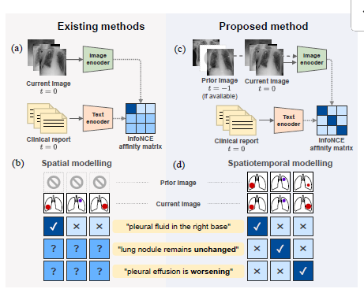
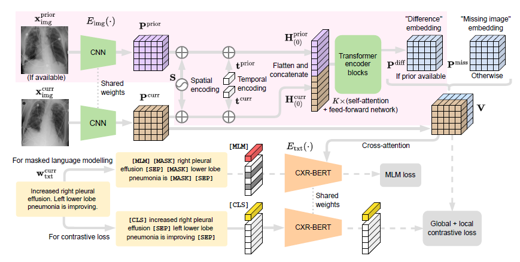

## Paper Review

By Zitao Shuai (ztshuai@umich.edu) 

### Basic Information

Title: Learning to Exploit Temporal Structure for Biomedical Vision–Language Processing

Source: CVPR2023

Institute: Microsoft

### Overview

This paper introduces BioViL-T, a CNN-Transformer hybrid that considers prior images and reports during training and fine-tuning. In the biomedical domain, traditional Vision-Language pre-training methods often focus on aligning single image-report pairs, overlooking the potential of exploiting temporal content. This method imports temporal information to the pre-training process and achieves SOTA in many downstream tasks. This paper also proposes a downstream task for evaluating the performance of the model on the temporal-related task.

Note:

I think this paper might be one of the most important works in the biomedical VL-pre-training domain last year. Since the dataset is complex in the biomedical domain, many types of data can be utilized for the pre-training. Many annotations can be used for data augmentation.

Therefore, different from the natural image domain, much prior knowledge can be used to guide the pre-training process. Our method can be designed based on some intuitive observations of the biomedical downstream tasks. On the other hand, the number of paired data in the biomedical domain is limited, hence we should utilize them in an efficient way, so considering prior knowledge is always useful.

This paper focuses on a misalignment phenomenon that is caused by missing temporal information. Based on this assumption, the author imports temporal information into the model, and forces the pre-trained model to focus on temporal relationships.

This paper really tells a good story, and their method is reasonable and seems efficient. Let's focus on their motivation and how they propose solutions to current problems in the pre-training task of the biomedical domain.

### Motivation: importing temporal information for better alignment

This method focuses on vision-language pre-training in the biomedical domain. The image dataset consists of radiology images and the text dataset consists of the report of them.

The motivation of this paper can be summarized as:

It's clear to see that the difference between the two parts is that the proposed method considers temporal information.

Note:

However, we might notice that there is something related to spatial information while this paper should focus on temporal information.

Even though it sounds weird, it is reasonable if we consider this question: how can we model temporal relationships or structures?

Temporal relationships describe the changes in some objects we are focusing on, hence we need to find something satisfying the following properties:

1. this component should be highly related to the performance of the pre-trained model
2. this component could be easily modeled

Based on these requirements, we might focus on spatial information, due to the following reasons:

1. nodules or something caused by a particular disease always appear in a particular part.
2. experts might write reports based on some particular parts of the image
3. the size and the position of the tumor and the nodule might change over time, which leads to temporal effects.

The first two points tell us: that if we want to get better aligned representations, the spatial information should be better aligned. The third point tells us that some misalignments might happen if we don't take the temporal information into consideration. 

### Method: fusion temporal information

The overview of the method is:

Their pipeline is clear but there are some details. 

There are three loss functions in their pipeline:

1. masked language modeling loss
2. global contrastive loss
3. local contrastive loss

The first two loss terms are conventional, and the local contrastive loss is from [1].

[1] Huang S C, Shen L, Lungren M P, et al. Gloria: A multimodal global-local representation learning framework for label-efficient medical image recognition[C]//Proceedings of the IEEE/CVF International Conference on Computer Vision. 2021: 3942-3951.

And there is also a detail in their graph: the cross-attention part, it's from [2].

[2] Dou Z Y, Xu Y, Gan Z, et al. An empirical study of training end-to-end vision-and-language transformers[C]//Proceedings of the IEEE/CVF Conference on Computer Vision and Pattern Recognition. 2022: 18166-18176.

Note:

This paper avoids mentioning some details, which leads to difficulties in reproducing the results of the paper. However, this writing style can help the reviewers and readers grasp their contribution and highlight the novelty of their method.

In the main graph of the method, the fusion process of the temporal information is strengthened. And the role of loss functions, conventional structures are weakened. In this way, we may think this paper is full of novelty, while they just fuse previous and current images in a way that can be thought of without much effort.

### Experiment: telling good stories with your ablation study results

I think the ablation experiment results of this paper are also interesting. The experiment section is not only trying to show the roles of each component of the method. Additionally, they are dealing with the dataset, and aim to reveal more findings and conclusions rather than "we achieved SOTA".

Different from CV domain, multi-modal learning utilizes both image and text, hence there exist more opportunities to tell good stories based on the data from the text side.

This paper considers the existence of temporal information and investigates the role of temporal words and images. We can compare the performance of the model that is trained with and without importing temporal information. 

And their original manuscript has shown more comprehensive experiment results[3].

[3] [2301.04558.pdf (arxiv.org)](https://arxiv.org/pdf/2301.04558.pdf)

Further, the writing style is also inspiring, we can write the experiment section like:

1. propose a question
2. highlight the conclusion (always positive)
3. analyze the results

This might bring lots of benefits, and one of the most important ones is it can reduce reviewers' time spending on finding the conclusions of the experiment results and give the answers to some of the problems they might propose.
