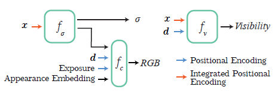

## Paper Review

By Zitao Shuai (ztshuai@umich.edu) 

### Basic Information

Title: Block-NeRF: Scalable Large Scene Neural View Synthesis

Source: CVPR2022

Institute: UCB, Google, Waymo

### Overview

This paper proposes a novel method of representing large-scale environments. They decompose the scene into individually trained NeRFs and compose them in the inference time. Additional information is added to help address the problem of consistency and alignment in both training time and inference time. 

This paper is **weak in presentation however very insightful and full of motivation.** Each detail is inspired by clear motivation. Though this work looks like a combination of existing techniques, I think they have done great work in fusing different embeddings to import more information. We can view appearance, exposure input, and pose refinement as different modalities, and in this viewpoint, this work can also be interpreted as doing multi-modal alignment.

Note:

I think a person who has received basic scientific research training should deliver their work with a well-constructed storyline in a clear way. I guess they only had limited time so they just reported what they had done. 

I think the right way to write the abstract and introduction should be:

1. Introduce the research background so that we can learn about who might like to read this paper.
2. Then we will illustrate our task and current challenges. 
3. We may like to introduce our method in a high-level way to tell the reader how the components of our method tackle the corresponding challenges.
4. And we will summarize our contribution.

This paper lacks the contribution part and is weak in other parts. So I have a hard time reading this paper.

### Introduction

#### Background

NeRF has solved the reconstruction problems successfully, but it focuses on rendering small scenes. Large-scale reconstruction is also a practical and challenging problem.

#### Challenge

In the large-scale and real-world scenario, the presence of transient objects (cars and pedestrians), limitations in model capacity, and variation in the environment will make it hard to do reconstruction.

**Note:**

I think these problems can be attributed to two main factors:

1. Inconsistency in different locations/blocks/subspaces
2. Hard to render a large-scale scene directly.

In the following sections, I will illustrate how they might form their method to tackle these challenges and from where to get the idea to decompose the challenges into small components and solve them one by one.

### Insight from research in Computer Systems

It's a natural idea to decompose the large-scale scene into several blocks. But there exist some significant problems:

1. How to locate the block? Given a block, how should we determine which part it comes from?
2. Different blocks have different environments that might result in distribution shifts in the training dataset. How to keep consistency among different blocks?
3. A block might hinder other blocks, how can we tackle this problem?

I think the solution will be clear if we think about it in the computer systems context:

1. Problem 1 is similar to the design of the cache, we can add an additional bit to declare if a record is dirty, and we can use some bits to provide position information. Hence we might like to use a location embedding/position encoding.
2. Problem 2 and 3 are similar to the signal problem in the computer architecture, where we might like to coordinate the sub-systems. We might like to use additional embeddings to deal with some specific information. (I think it's more explicit to explain the appearance embedding etc. as given conditions and the visibility as signals for avoiding conflicts on views (we can compare the camera view as a kind of resource, and the visibility problem is similar to the dead lock problem).)

However, there still exists a problem: how to fuse these components?

### Similarities between this work and multi-modal learning

The data-flow is as follows:

And we can decompose the component of the model into these parts:

1. decompose and compose blocks, for challenge 2 in the intro.
2. deal with environment and block-specific information, for challenge 1 in the intro.

Then we can summarize some conclusions:

1. **I think since the two components/tasks do not overlap, we can separately use these two kinds of information.** In this paper, the author first fuses the block-specific information with the output of $f_{\sigma}$ to get $\sigma$, and only combines the the positional encoding with x to get visibility. 
2. **For a given task, we might use a network to fuse all of the related information/embeddings**. That might be because we'd like to use this network to learn a function that combines them well and can project them into ground truth.

And this paper also mentioned other issues that might cause the shifts among training samples of different blocks. They import different types of information (maybe as different modalities) to address these problems. Some are heuristic like using distance to determine the weight of the block in the compositing time, and using appearance match to address inconsistency problems.

