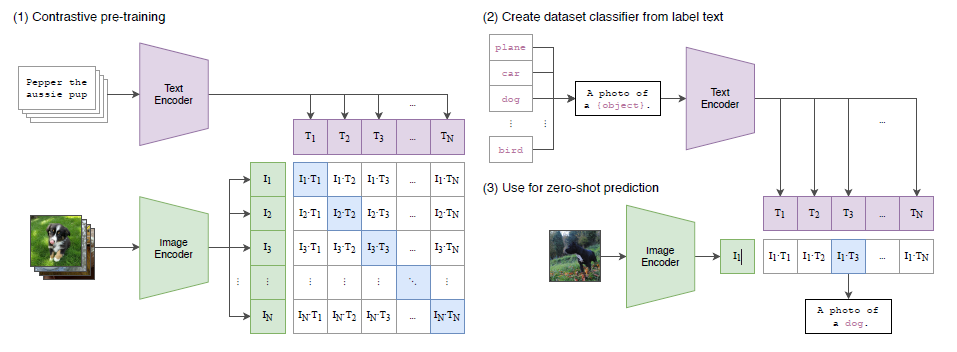

## Paper Review

By Zitao Shuai (ztshuai@umich.edu) 

### Basic Information

Title: Learning Transferable Visual Models From Natural Language Supervision

Source: JMLR

Institute: OpenAI

### Overview

I think everyone in the AI community today knows CLIP.  We are familiar with this graph:

It's simple but efficient.

I just want to collect some existing selected work on extending the CLIP in the following parts and then raise some questions on the further direction.

### Derivatives of CLIP

#### Style CLIP

##### Styleclip: Text-driven manipulation of stylegan imagery[1]

This paper proposes to use CLIP models to create a text-based interface for StyleGAN image manipulation, eliminating manual effort. It introduces an optimization scheme employing CLIP-based loss to adjust input latent vectors based on user-provided text prompts. Additionally, they utilize a latent mapper to infer text-guided latent manipulation for input images, offering faster and more stable text-driven manipulation. The paper also uses a method for mapping text prompts to input-agnostic directions in StyleGAN's style space, which improves the interactive text-driven image manipulation. 

[1] Patashnik O, Wu Z, Shechtman E, et al. Styleclip: Text-driven manipulation of stylegan imagery[C]//Proceedings of the IEEE/CVF International Conference on Computer Vision. 2021: 2085-2094.

#### Objection recognition

##### Grounded Language-Image Pre-training[2]

This paper proposes a new method to learn robust, language-aware visual representations. They focus on unify object detection and phrase grounding during pre-training, offering two key advantages. To achieve this goal, firstly, the model leverages both detection and grounding data to enhance both tasks, creating a robust grounding model. Second, this GLIP model can utilize a large number of image-text pairs, generating grounding boxes through self-training, resulting in semantically rich representations. The learned representations of the model exhibit impressive zero-shot and few-shot transferability to various object recognition tasks and achieve SOTA on many datasets.

[2] Li L H, Zhang P, Zhang H, et al. Grounded language-image pre-training[C]//Proceedings of the IEEE/CVF Conference on Computer Vision and Pattern Recognition. 2022: 10965-10975.

#### Zero-shot detection

##### Open-vocabulary Object Detection via Vision and Language Knowledge Distillation [3]

This paper focuses on advancing open-vocabulary object detection, which can identify objects based on arbitrary text inputs. They claim that the challenge lies in the limited number of the training data, since getting more classes in existing datasets is expensive. To address this problem, the authors propose involving Vision and Language knowledge Distillation for training better detection models. Their method distills knowledge from a pre-trained open-vocabulary image classification model (teacher) into a two-stage detector (student). The teacher encodes category texts and image regions of object proposals, aligning the student's region embeddings with the teacher's text and image embeddings. The proposed model achieves SOTA on multiple datasets.

[3] Gu X, Lin T Y, Kuo W, et al. Open-vocabulary object detection via vision and language knowledge distillation[J]. arXiv preprint arXiv:2104.13921, 2021.

#### image synthesizing

##### CLIPDraw: Exploring Text-to-Drawing Synthesis through Language-Image Encoders [4]

This paper introduces CLIPDraw, utilizing a pre-trained CLIP language-image encoder to generate drawings from natural language input. Unlike pixel-based methods, CLIPDraw uses vector strokes, favoring simpler, recognizable shapes. It compares favorably with optimization-based methods, handling ambiguous text, producing diverse styles, and adapting to complexity as strokes increase.

[4] Frans K, Soros L, Witkowski O. Clipdraw: Exploring text-to-drawing synthesis through language-image encoders[J]. Advances in Neural Information Processing Systems, 2022, 35: 5207-5218.
