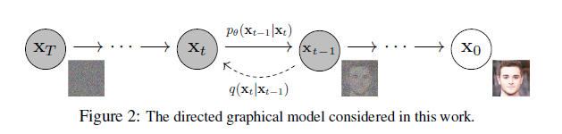
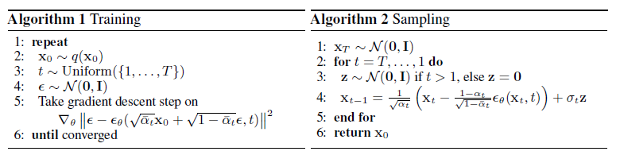
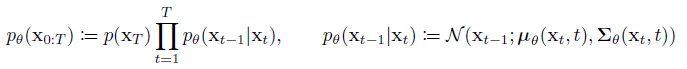
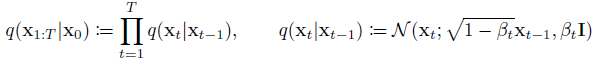
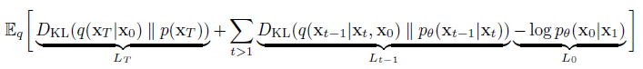
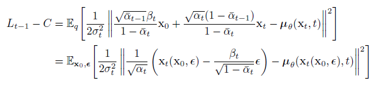

## Paper Review

By Zitao Shuai (ztshuai@umich.edu) 

### Basic Information

Title: Denoising Diffusion Probabilistic Models

Source: NIPS2020

Institute: UCB

### Overview

This paper proposes a novel method for image generation, namely the Denoising Diffusion Probabilistic Model. It shows great performance and has a firm mathematical foundation. It has similarities with VAE, GAN, and other generative models.  In the following part, I will first introduce my understanding of DDPM, then I will talk about the mathematical staff and compare it with the VAE.

### General Idea of DDPM

The general idea of DDPM is: to gradually add noise to images, and gradually remove noisy signals, and recover the image.

**Note:**

I think this idea might come from the VAE and observations on the output features of each layer of a neural network.

We keep telling the story that the last layer of the model will output "predictive semantics" and the first layer of the model will output some edge information. **In other words, we believe the output of different layers corresponds to ground truth with different degrees of semantics**.

Hence, there comes the idea that if we can **control the layers to generate** high-quality images step-by-step? However, it's hard to utilize the output of each layer or block directly. Sometimes we can only consider a backbone and a projector following it.

Fortunately, an ICML2015 paper shows the feasibility of this idea, but that paper starts from another perspective: maybe we can **iteratively** add noise and recover high-quality images step-by-step. **In this way, we transform the idea from model-layer to iteration/batch/step/epoch-layer**.

Even though the motivation is shown in the graph above, we do not really have T blocks to add noise T times. We have an ensembled single module and we can tell the model which iteration it is in by assigning a number t to it, and it will project the input to an output with the projection function corresponding to iteration t. (I'd like to clarify that even if there is only 1 network, we can view t as a signal/condition to select a set of projections for the input of the iteration t.)

And the pseudo algorithm has shown the idea:

### Understanding DDPM from a Probabilistic ML perspective

Some preliminary:

1. the posterior distribution always refers to a model(network) $\phi(Z|X)$, that's because we can view the input X as an n-dim random variable, and the output also can be viewed as a random variable. We always assume this posterior to be n-dim Gaussian for convenience.
2. There is something we might confusing. Take the VAE as an example, each latent Z has its own distribution $P(Z)$ which is unknown, the only thing we know is that its posterior $P(Z|X)$ is assumed to be a Gaussian. The network takes the input X and transforms it to a posterior distribution (with a mean vector and a std vector). Even though we only have a network but have multiple Xs and Zs, the network acts as a selector and maps each X to a particular posterior distribution $P(Z|X)$ and outputs the posterior distribution.

#### Basic background

Let's move on.

Note: it can be implemented using multiple networks, but we can also input different t as conditions to a single model to get the output of different stages.

Then we can derive the optimization objective:

For different time steps t, the loss function could be written as:

#### Understanding the pipeline

Firstly, the hyper-parameters we have are:

1. t: number of steps
2. $\alpha_i,i\in[1,...,T]$

##### For training time:

For each step t, we sample a noise $\epsilon$ from a normal Gaussian and then combine the Input $x_0$ and the noise to get a pseudo $x_{t+1}$.

Then we input it into a noise-predict model to recover the $\epsilon$ we have sampled in this step. And run the gradient descent based on the MSE loss on the fitted $\epsilon$ and true $\epsilon$.

##### For testing time:

The noise-predict module gets the input $x_t$ and the step t, and outputs a predicted noise. Then the input $x_t$ will subtract this noise to get $x_{t-1}$.

**Note:**

In fact, in the training process, we don't really have $x_t$s, we only combine it with a noise corresponding to step t. However, in the testing process, we have these intermediate products and recover the image step-by-step.

It's interesting. We can view the training process as: given an image $x_0$, the noise-predictor try to remember the noise structure at different step, which can transform the Gaussian $X_T$ to $x_0$.

The noise structure is related to the weight vector $\alpha_i$. (There aren't any other factors that might influence the process.)

#### Similarities compared with the VAE

Firstly, they both use variational inference to tackle the generation problem, the mathematical techniques are the same.

And DDPM can be viewed as an iterative VAE since it repeatedly uses the output $x_i$ to generate $x_{i+1}$. Interestingly, this model remembers T different mapping functions in a single network. It looks like a conditional VAE where we also have a condition input in the inference process.