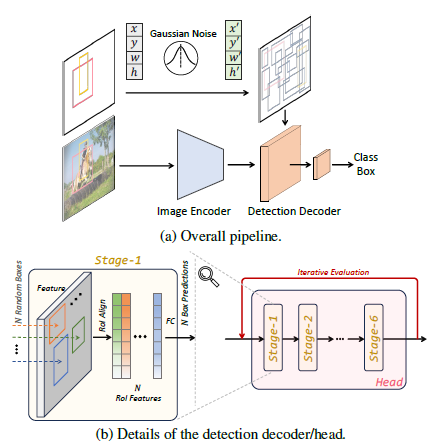
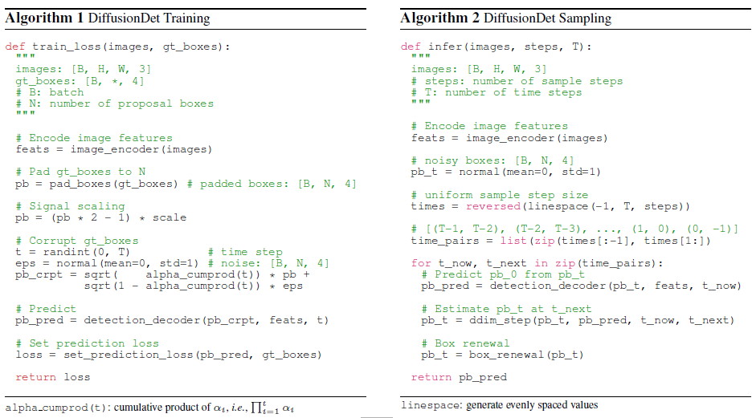

## Paper Review

By Zitao Shuai (ztshuai@umich.edu) 

### Basic Information

Title: DiffusionDet: Diffusion Model for Object Detection

Source: CVPR2023

Institute: CUHK

### Overview

In the setting of conventional research of the diffusion model, we always consider image-noise pairs. Nevertheless, this paper proposes to consider the bounding boxes as variables and model the diffusion process as denoising the input noisy boxes to object boxes, which successfully adapts the diffusion model into the object detection domain. This work doesn't look like a modification or adaptation of the traditional diffusion model, it refers to the idea of the diffusion model and designs its own diffusion-based object detection model. And as a result, their design of the network is also pretty interesting.

Note:

We might have two ways to interpret the idea of this paper. Even though the bound boxes are in the pictures, we can take them apart and consider them separately. Hence, at first, we can view them as different modalities. The bounding box looks like a query(The paper mentions some existing work that considers the bounding box as queries) and is simpler compared with the input image, hence the bounding box can be viewed as a language modality. The second way to understand is to consider the image as a condition, which is also a rare perspective.

### Bounding box as a foreign language

The overview of the framework of the proposed method:

Let's analyze the components of this method.

Firstly, we can notice that the paired bounding box and image are processed independently before being input to the detection decoder.

If we view the noise-addition-part as an encoder, then this should be a twin structure that is widely used in the multi-modal area. Starting from this intuition, we can see that the detection decoder is trying to fuse the information of these two modalities. As shown in (b), there exist some layers to align the representations of the output feature of the encoder and the bounding boxes.

Therefore, I think the bounding boxes here can be viewed as a simple language (like queries) and the downstream task of the multi-modal-like learning paradigm is to generate the "text"(bounding boxes).

### Modeling bounding box as noise

The bounding boxes have several differences compared with the image, which means the de-noising method might be modified.

1. the bounding box itself has less information/semantics
2.  the number of bounding boxes might be 10^0~10^2, while the pixel space is nearly 10^5~10^6

These properties result in some considerations:

1. since the semantics in bounding boxes might be simpler than those in the natural language, the number of iterations of the diffusion process should be smaller.
2.  since the information is heavy on the image side while the bounding box itself has less information, we might not like to use conventional alignment methods like contrastive learning. This paper utilizes the image as a condition for de-noising.

These concerns are reflected in the design of the algorithm pipeline and the network structure:

1. since the bounding box is lighter, the author adds noise to the bounding box directly and doesn't use an encoder to extract latent representations.
2. in the detection head, there are only 6 iterative evaluations(the reverse process)
3. the feature map(output of the image encoder) is fixed in the iterative evaluation process in the inference time, which lowers the computation consumption.

Note:

Related works adapt the diffusion model to a specific task using the idea of the latent space diffusion model. Some of them consider feature disentanglement and fusing, some consider two-stage training. But in those works, the image representation/the corresponding encoder is the main branch, other information might be treated as conditional information.

However, in this work, images are used as conditions while the bounding boxes are more important and are input to the diffusion model for de-noising iteratively.

So there might be some thought about it:

Given a task whose ground truth Y is complex but isn't as informative as images or natural languages, we could consider the pairs (Y, I) where I is its corresponding information from other modalities. We can train an encoder to get a latent query/condition based on I and combine it with Y to train a diffusion model.

A potential scenario I could think of could be:

Target Y: a series of signals

Other information: images, signals from other sensors, text reports.

We might find tasks in medical and EE that are similar to this setting.
