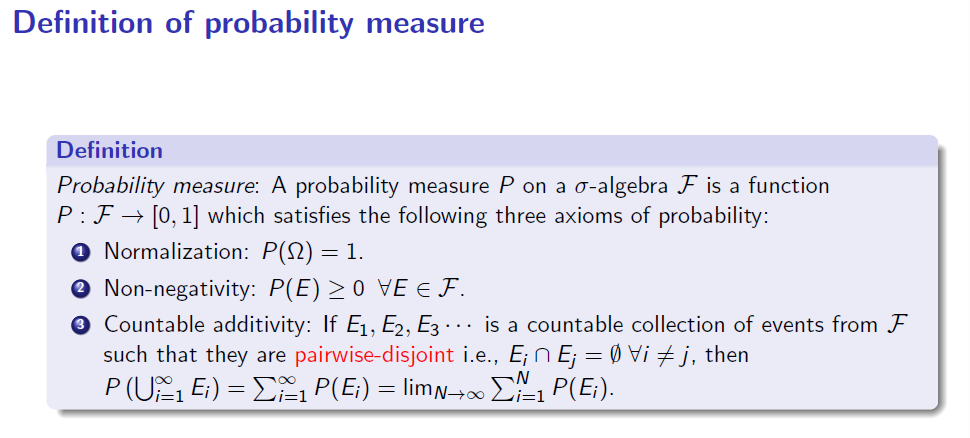
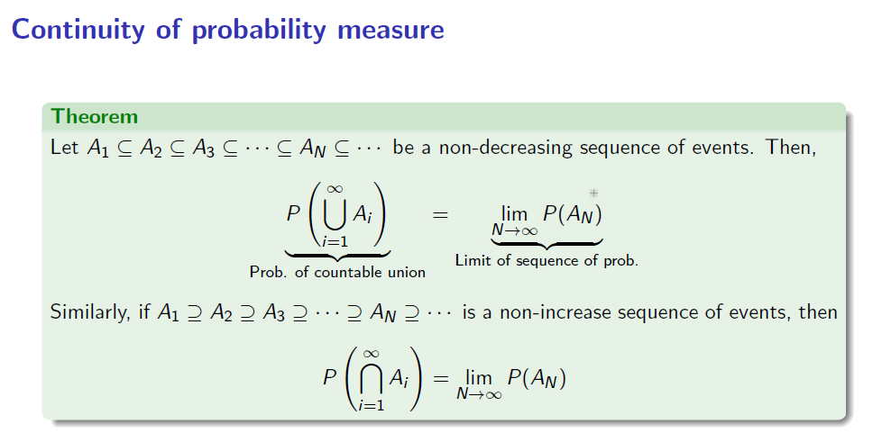
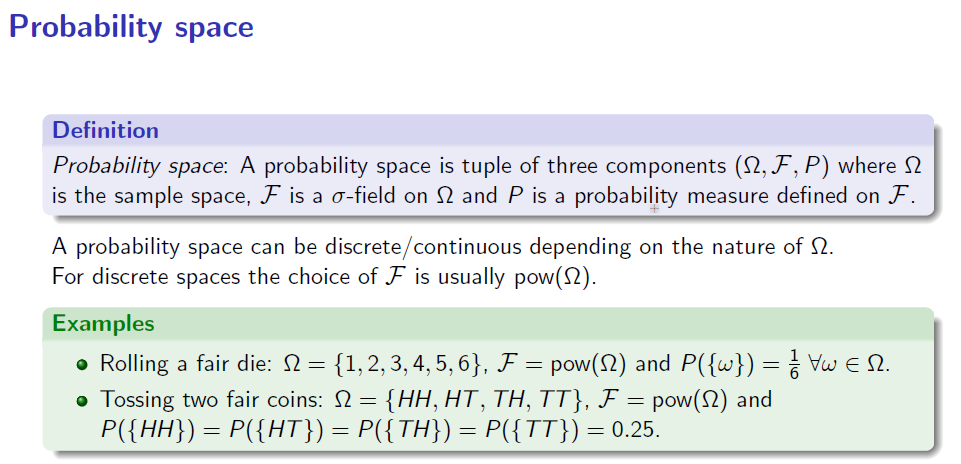
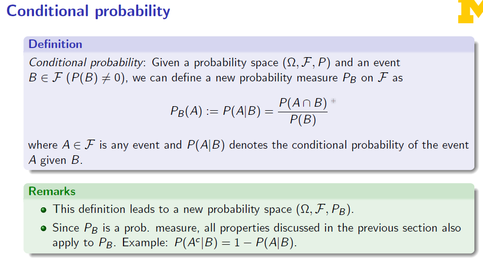

### Why event

We are also interested in measuring the chance of a particular set of outcomes,

So we define a power set based on the sample space $\Omega$.

And we get the event set $E\subseteq \Omega$.

### $\sigma$-algebra

F, $\sigma$-algebra, also called a $\sigma$-field, is a non-empty collection of events that is:

1. closed under complementation
2. countable

Proposition:

empty set and sample space are a part of any $\sigma$-algebra;

A $\sigma$-algebra is also closed under countable intersections.

Note:

It's a set of events. A set of sets of outcomes. $E\in pow(\Omega), F\subseteq pow(\Omega), F\in pow(pow(\Omega))$

### Probability measure

Note:

When discrete, we can assume $F=pow(\Omega)$

Properties:

1. law of complements: $P(E^C)=1-P(E)$
2. $P(A\cup B)=P(A) + P(B)-P(A\cap B)$
3. union bound: $P(A\cup B)\leq P(A)+P(B)$

### Conditional probability

Note: B is an event, which is always a subset of the power($\Omega$)

