### Useful Notations

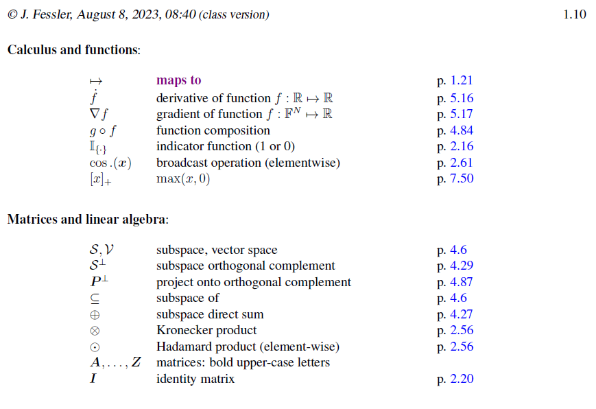

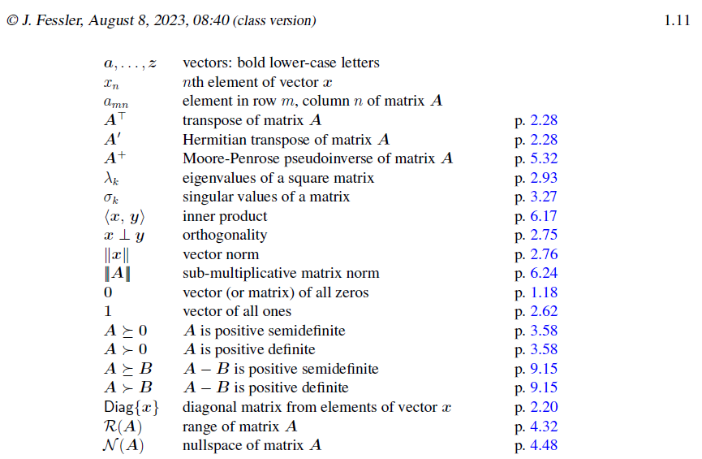

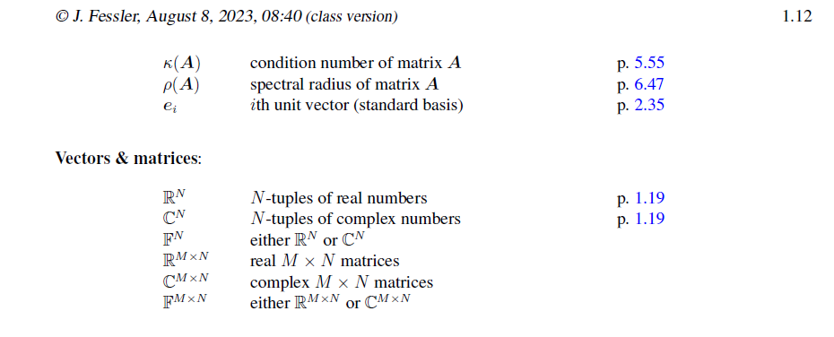

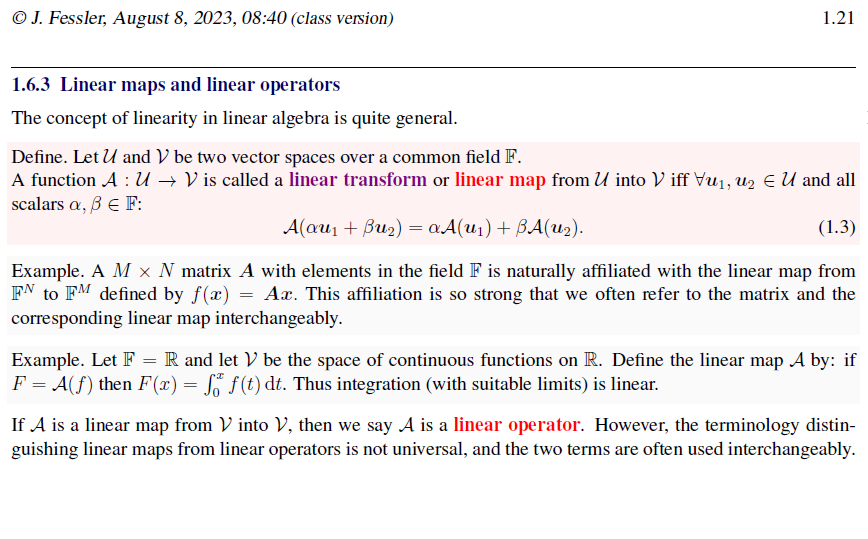

### Matrix: intro

#### View from operator

#### Examples

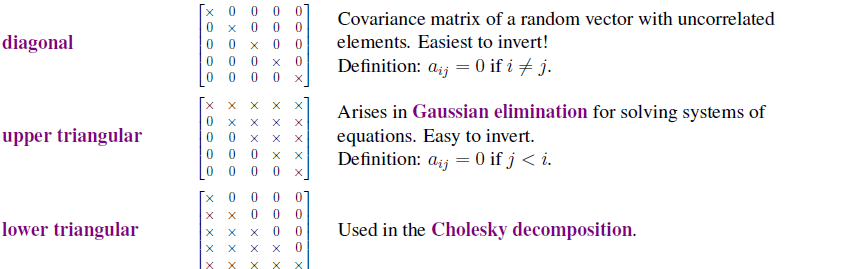

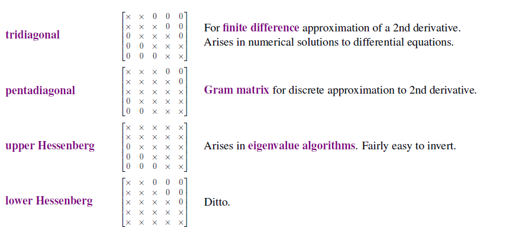

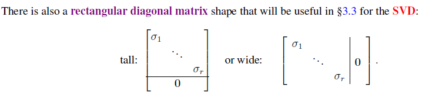

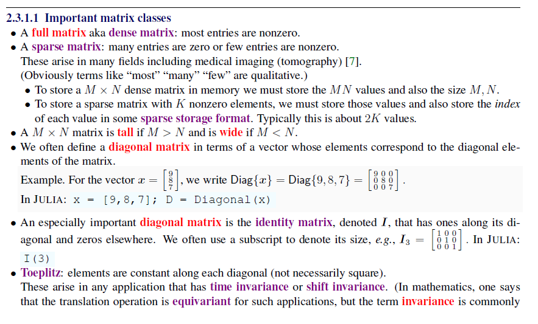

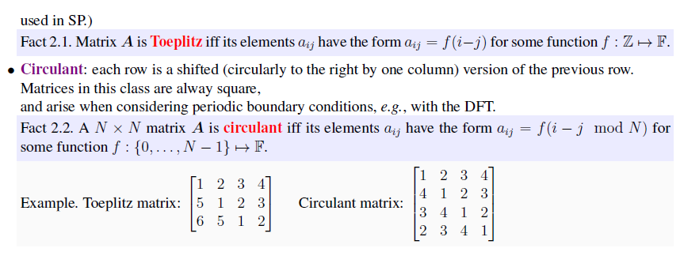

#### Views of matrix multiplication

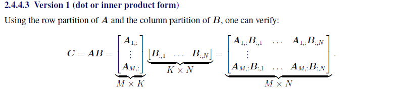

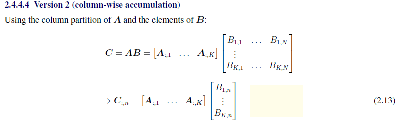

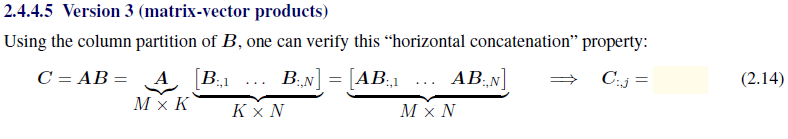

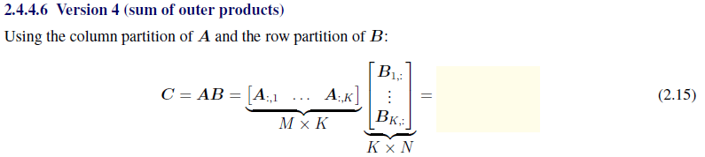

### Matrix: essentials

#### Invertibility

We should try to avoid the matrix inversion since it's time-consuming. Even computing the inverse of the blocked matrix is hard:

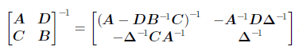

And there is another important inversion lemma:

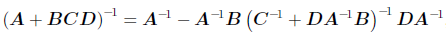

If the C is an identity matrix, this equation could be simplified a lot.

And other properties:

1. For unitary matrix A, we have $A^{-1}=A'$.
2. $det(A) = \frac{1}{det(A')}.$

### Orthogonality

orthonormal of vectors: $<x,y>=y'x=1$.

orthonormal vectors: $x'x=1$.

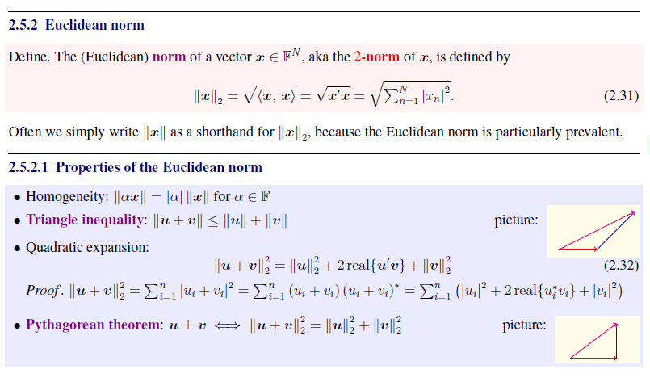

And we have Cauchy-Schwarz inequality.

Orthogonal matrix: $Q^TQ=QQ^T=I$.

#### determinant

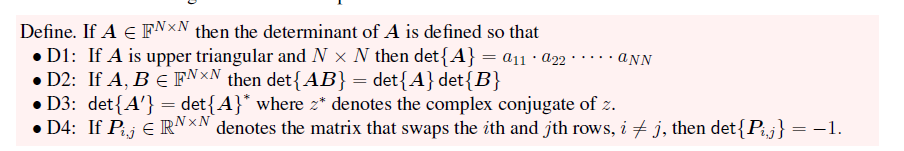

The determinant is for the square matrix.

The determinant is non-zero -> the matrix is invertible.

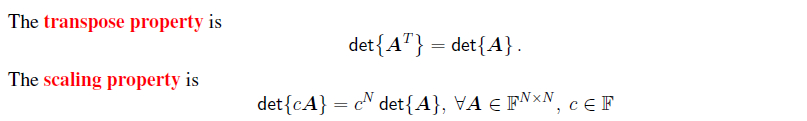

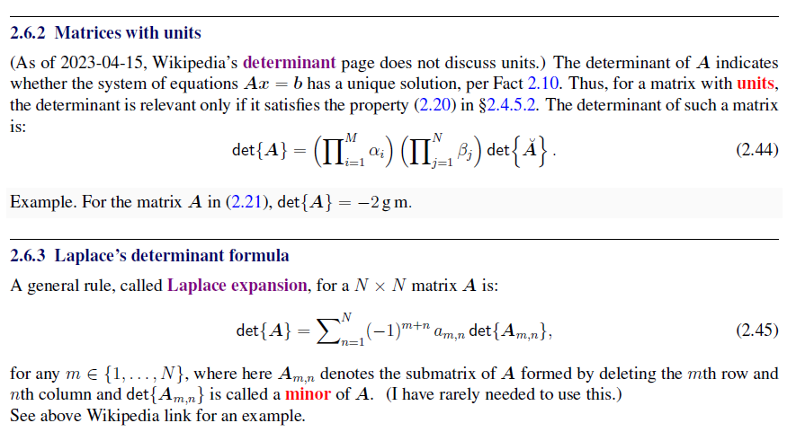

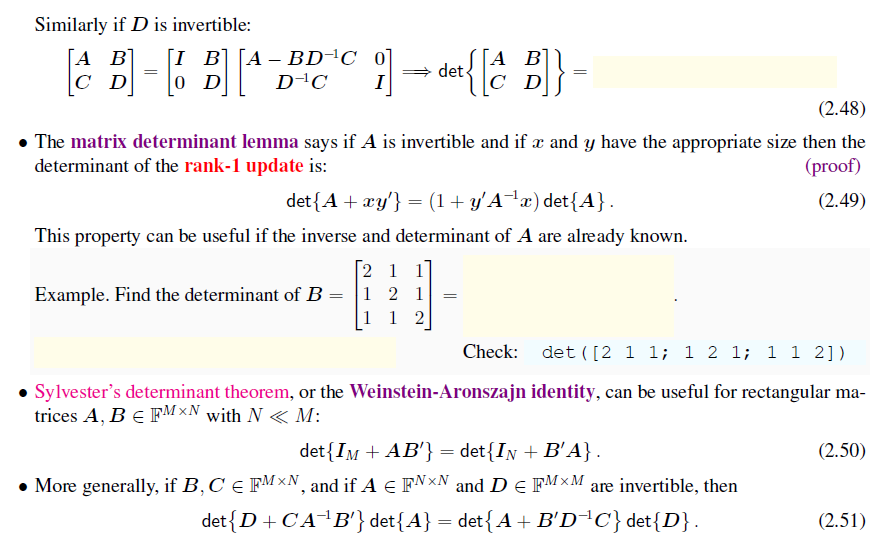

### Eigenvalue

Motivation: convenient for computing: $Av=\lambda v$.

Background: invariant sub-space.

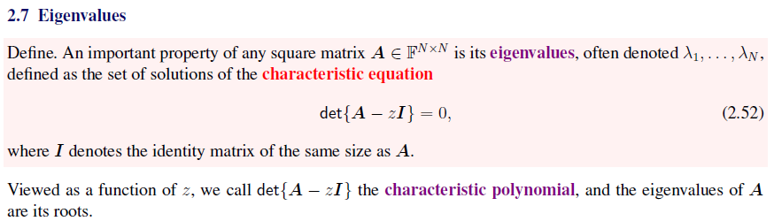

Gram Matrix: Given $X\in F^{M\times N}, X'X$ is the Gram matrix and $XX'$ (outer-product) is the covariance matrix or scatter matrix.

 For a matrix, vector  V that satisfies $Av=\lambda v$ is called an eigenvector.

And there comes a good property: $AV=V\Lambda$, where $\Lambda=Diag\{\lambda_1,...,\lambda_N\}$.

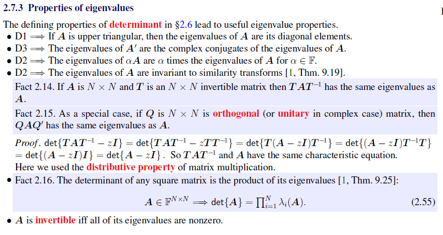

 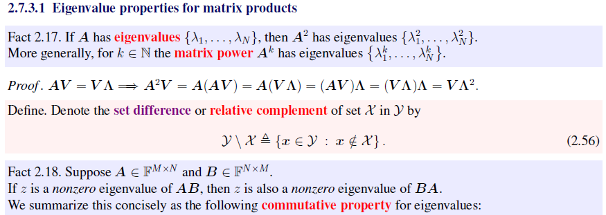

It's convenient for computing.

### Trace

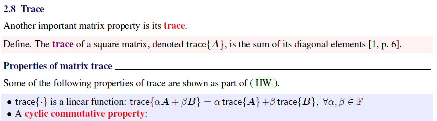
