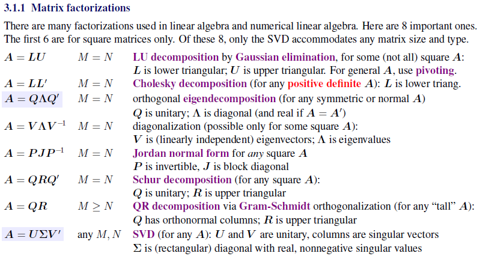

## Essential Points for Chap 2 & 3

### Use the property

We can try to replace a given condition with properties that are related to it. 

For example, when we talk about an orthonormal matrix, we might like to assume a matrix A, where 

$$AA'=I,(U\Sigma V')(U\Sigma V')'=I$$,

Then we can manage to create some new equations or conditions.

And inversely, we can create a $AA'$ sometimes, instead of using $AA'=I$ to remove the $A$.

Sometimes, when we consider a property of A, we can introduce some other properties of A that are related to this property, for example, when we consider the eigenvalue of a matrix A, we could import its eigenvector for convenience of analysis.

### Matrix determinant lemma

The lemma $det(A+xy')=(1+y'A^{-1}x)det(A)$ is essential.

It illustrates the idea that we can always consider dividing an $N\times N$ matrix into 4 parts: left_up: 1, right_down: $(N-1)\times(N-1)$, and other two $(N-1)$ vectors.

For block matrix:

$$U=\begin{pmatrix}A&B\\C&D \end{pmatrix}$$

We have the equation $det(U)=det(A)det(D-CA^{-1}B)$, its specific form is the lemma we have mentioned before.

### Use simple examples

We can consider simple examples to help us think through the problems.

For example, we can consider $N\times N$ matrix as a special case.

And we might like to consider 0 matrix and 0 vectors for counter-examples.

The diagonal matrix and the permutation matrix will help us when it comes to topics related to eigenvalues and singular values.

### Be familiar with matrix factorizations

### Transform the problem and conditions into equations

It's always useful to translate the known staff into equations and find out the relationships between them.

For example, when we consider the relationship between SVD and eigendecomposition, we can first consider an eigendecomposition.

But how to import "positive singular values"?

We might like to import a semi-positive matrix with $AA'$.

Hence we have $AA'=U\Lambda U'=U\Sigma\Sigma'U'$, which is convenient for the following steps.

We might like to consider the relation $R(A,x)$ between a matrix A and a vector x with convenient quality instead of considering the property of A itself for some analysis.