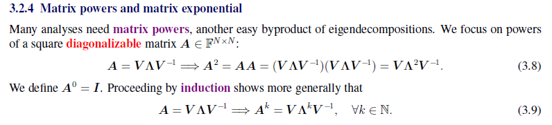
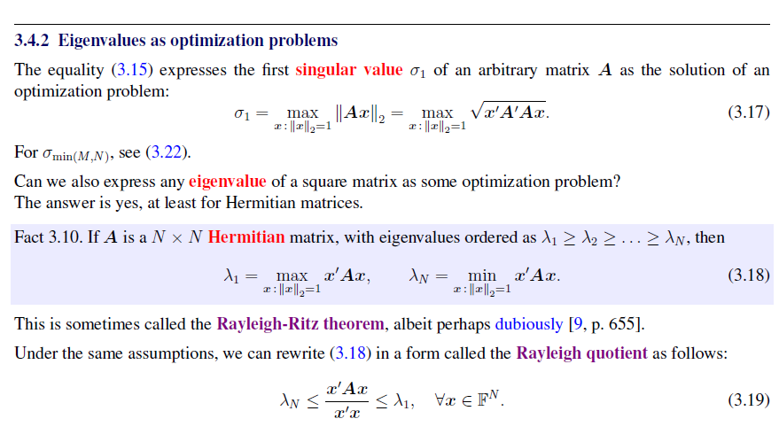
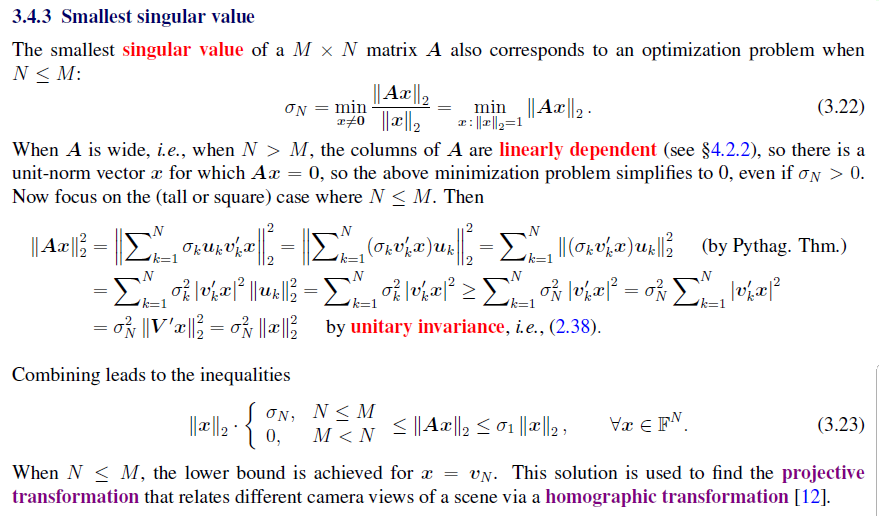
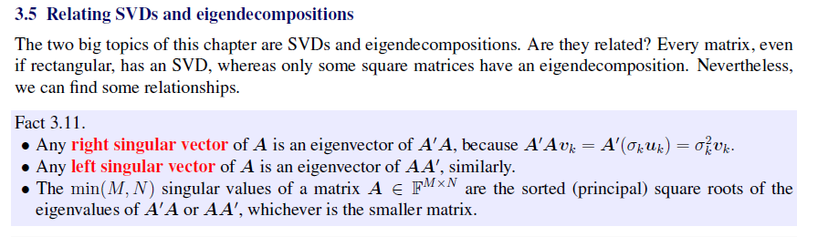
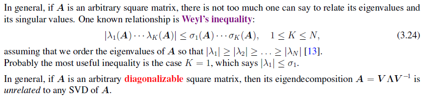
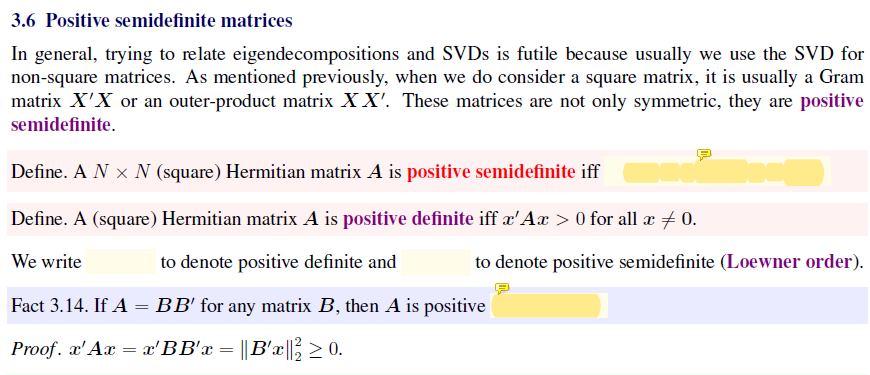

## Introduction

### Common Matrix Factorization

## Spectral theorem

### Normal matrices

Motivation for SVD: We want a diagonalization operation to simplify computation.

However, not every matrix is diagonalizable.

Hence we need a decomposition for each matrix, even the non-square matrix.

For more general eigenvalue decomposition and diagonalization, there comes the Jordan normal form.

A matrix is diagonalizable iff each Jordan block is a 1by1 matrix.

### Geometry Explanation from Linear Operation

## Intro to SVD

## Norms, Eigenvalues and Optimization Problems

