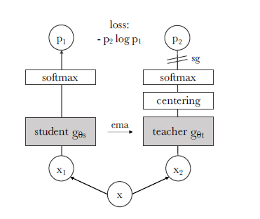

## Paper Review

By Zitao Shuai (ztshuai@umich.edu) 

### Basic Information

Title: Emerging Properties in Self-Supervised Vision Transformers

Source: ICCV

Institute: FAIR

### Brief Summary

This paper proposes a new way to implement self-supervised learning in CV. As we have seen in many approaches, self-supervised learning might utilize the encoder-decoder structure as its key component. In that way, the supervision from images can be imported by adding reconstruction loss. However, the decoder might be hard to be well-trained. One solution is MAE which design lightweight decoders and masked mechalism to force image to learn global and generalizable representations.

However, based on their findings on the architectures of the CV models, this paper chooses another efficient way, that is, to consider using a distillation-based approach. The method they propose is simple but efficient. 

**Note:**

This paper proposes two observations as their main motivation, and I think the last one: "Second, these features are also excellent k-NN classifiers, reaching 78.3% top-1 on ImageNet with a small ViT." is more important.

Like the phenomenon shown in the neural collapse, we might expect the output of the encoder to show the clustering property. If the representations of similar semantics can be clustered, then we might be able to use this well-learned space to guide the training process of another module. 

(In papers that apply the neural collapse, the ETF might be used as guides and exemplar points in the latent space of the second-last layer)

Starting from this observation, we might understand why this paper proposes this method.

### Distillation with Centering Operation

The proposed approach is easy to implement as illustrated in the paper, and the overview of the method is:

Note that the teacher model has a centering module. I think the technique contribution of this paper should be: momentum distillation for self-supervised learning using VIT, as well as utilizing this centering technique.

The paper claims that they use this method to avoid collapse because centering prevents one dimension from dominating but encourages collapse to the uniform distribution, while the sharpening has the opposite effect.

This satisfies the intuition. If a dimension is dominated, the student model might not be able to distill integral information for self-supervised learning. And adding bias is to restrict the degradation directly.
