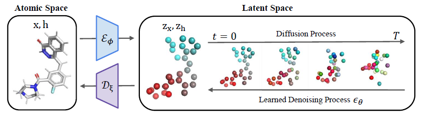
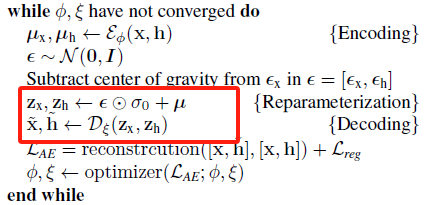
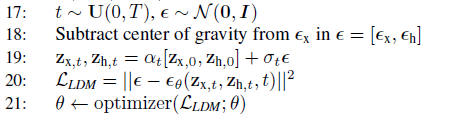

## Paper Review

By Zitao Shuai (ztshuai@umich.edu) 

### Basic Information

Title: Geometric Latent Diffusion Models for 3D Molecule Generation

Source: PMLR

Institute: Stanford University

### Overview

This paper proposes to use the latent diffusion model to solve the 3-D molecule generation problem. The problem is interesting and their method has strong theoretical background and clear motivations. Different from other imaging tasks, an additional challenge in geometric reconstruction is that some molecules might be the same even though they look different, and they are in the same structure. The paper utilizes both the feature info. h and the coordinate x to learn latent representation space with invariance and equivalence.

Note: 

At first glance, I think their method has weak technical contribution since they just use a latent diffusion model for tackling a geometric task.  However, we can notice that there are 2 types of information while in traditional image xxx tasks, the input is only image, and we have no requirement on the qualities of the latent space. How should we change the learning strategy if we require the latent space to capture the invariance and equivalence properties? If we don't look into the appendix C we might wonder if they are trying to find a theoretical foundation for their idea of merging. However, they might first have the intuition to combine x and h together, and then they form their model and build the theoretical basis for it.

### Method

The pipeline of the method is shown as:

It looks like a classical latent diffusion model. However, there still exist some technical contributions:

1. A new aspect in the 3-D geometric generation domain: the point is that they use the latent representation for the diffusion process.
2. Different from other latent diffusion models, this paper uses GNN as an encoder which is different from the CNN/VIT that are frequently used as backbones.

Note:

Why I think 1. is a contribution is that directly using atomic space for the diffusion model might avoid the problem of modeling equivalence and invariance like rotations. However, to use the latent space diffusion model to generate large-scale 3-D molecular and decrease the computation, we might need to deal with the two properties in an explicit way.

### A New Storyline based on GNN

Sometimes we might like to model some interaction with invariance and equivalence between several variables. So far we have seen several technique approaches:

1. modality fusion for multi-modal interaction.
2. feature disentanglement for learning representations with different types of semantics

However, **these methods don't model the desired interaction of the variable**, instead, they learn an end-to-end mapping from input to the latent space, we don't know how the interactions are utilized.

In this paper, the authors first introduce how they consider the invariance and equivalence, then they propose a theorem that can give support for using the GNN as a backbone.

### Why did they choose the two-stage training strategy

I think their method is wired in this part: conventional latent diffusion models are 1-stage models, but the authors choose to use a two-stage approach and just claim it works. Let's look through it.

First, we can check the pseudo-code:

It's a natural question to ask: where do the z_t, z_x come from?

Here the authors sample **the noise for the last layer** and add up to the output embedding of the encoder.

Since the noise might be small, the AE framework can optimize the loss function successfully without collapse. And they might **aim to use the AE to learn some coarse information in the simpler task** (I think it's due to the small sigma), and then learn the fine-grained diffusion process in the latent space in the second stage.

And there is other details to support the idea:

In the second stage, t is sampled from a uniform distribution, and we optimize the L-2 norm, which is different from the iterative way that is shown in DDPM. This might be based on the assumption that  the AE has learned some semantics and the latent diffusion model is just focus on learning the fine-grained features. 
