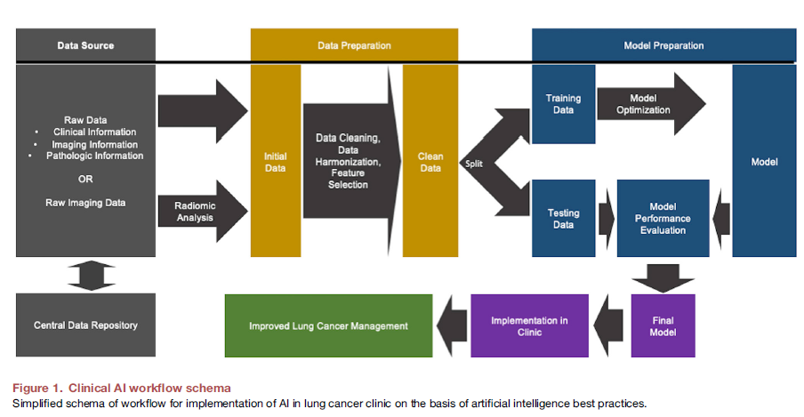

## Paper Review

By Zitao Shuai (ztshuai@umich.edu) 

### Basic Information

Title: Integration of artificial intelligence in lung cancer: Rise of the machine

Source: Cell: Reports Medicine (Feb 21, 2023)

Institute: City of Hope National Medical Center

### Overview

In this paper titled **Integration of artificial intelligence in lung cancer: Rise of the machine**,  the authors conduct comprehensive surveys in the Healthcare AI, specifically, using AI to enhance the treatment of lung cancer. It summarizes the current literature in this area, and provides a valuable review of it.

### For the content of the paper:

#### Insights 1:  Overview of the Lung Cancer Management task

Firstly, this paper introduces some basic information about **the task of cancer management**.

1. It introduces the pipeline of lug cancer management: including screening, diagnosis, treatment, and follow-up.
2. It introduces the type of data used in lung cancer management: clinical presentation, tumor stage, pathology, radiologic features, tumor genomics, liquid biopsies, treatment options, treatment response assessment, and overall outcomes.
3. It introduces the data source: electronic medical record (EMR)
4. The workflow of the Clinical AI.

**My notes:**

I believe most of the interesting topics in AI lie in the characteristics of the dataset and the task. That's why I note the points mentioned in this section. It is clear that there are many things to do with the Lung Cancer AI.

In short, take the source of the data as an example:

1. Federated Learning: Different hospitals have datasets with different distributions which are non-iid. However, due to the privacy problem, they have to utilize these datasets using federated learning.
2. Additionally, since the datasets are always non-i.i.d., the imbalance problem, the generalization problem might hinder the performance of the model on the real-time diagnosis. Besides, there exist fairness issues for federated learning. 
3. Heterogeneity: The datasets might come from different sources with different quality, and might be full of noise. How can we utilize them more efficiently?

Based on my experience, I think those O.O.D. issues would be future problems in the Digital Health-Care and Medical AI in a high probability.

#### Insight 2: Multi-Modality Challenges

For imaging tasks, there are many types of images: Magnetic Resonance Imaging (MRI), Computed Tomography(CT), and Positron Emission Tomography (PET). All of them can be viewed as different modalities in AI.

Problem 1: How to combine different modalities.

And screening is also an important part, including National Lung Screening Trial (NLST) and Low-dose Computed Tomography (LDCT). But there might exist many **spurious correlations and noisy data** (for example, some uncertain nodules would be misclassified).

#### Insight 3: Staffs related to Tabular data

1. Outcome Prediction: Predicting outcomes including locoregional and distant
   recurrence, progression-free survival, and overall survival (OS). The imaging features are no doubt highly relevant, but **these must be combined with patient and tumor characteristics to produce accurate radiomic models**.
2. Deep learning can **incorporate multi-time-point imaging to improve clinical outcome prediction**. (I think it's not surprising since many theoretical works have verified the capability of AI models to capture time-relevant information.)

Note:

To be honest, I don't think AI or other statistical methods can truly address the problem of prediction based on tabular data. Images are different from tabular data. From a Bayesian perspective, images H are generated by treatment X and covariate Z and the label Y is determined by X and the effect of Z could be reflected in H. But in tabular data, Y is determined by some of the observed X as well as some unobserved variables. As a result, the tabular data sometimes is not a good dataset for AI models. 

Hence I think the tabular data should be combined with the images due to these reasons, which is similar to the conclusion that the article has proposed.

*For other parts: Surgery and Treatment, I'm not so familiar with these problems so I prefer to comment less on these topics.*

#### Challenge 1: Data, Data and Data

1. AI relies on large datasets but sometimes it's not idealistic

"AI relies heavily on data, and data acquisition and organization continue to be a challenge that AI will need to overcome."

And in some outcome-based research, the number of data points is not enough. Besides, the potential covariates might not be taken into the dataset.

Note:

From my own experience in one of my work in my previous group, the health-care tabular data is sensitive to hyper-parameters, and we believe this phenomenon is due to the limited number of data since our methods work well on image datasets.

2. Datasets sometimes are not open to public.

I think the reproducibility problem mainly results from this instead of the hyperparameters. Many papers won't share their data due to privacy reasons.

3. Trustworthy Problems

Note:

It's a wide topic. Trustworthy problems are highly valued in medical AI and that's why I transfer to this domain. I think there are many interesting problems to be paid attention to. For example, fairness problems, generalization problems, and data efficiency problems. In technical details, data imbalance, data noise, and Out-of-Distribution problems.

### From the perspective of the reviewer:

#### Strength:

1. The authors have done comprehensive surveys and illustrated which problems in Lung Cancer Management should be tackled using AI in detail. 
2. This paper analyzes the opportunity to adapt AI methods to different tasks of Lung Cancer Management. 

#### Weakness:

1. I think their view of AI is somehow misleading. In the new era of AI, I think it's not reasonable to use a backbone model to categorize the research landscape. For example, the author claimed: "CNNs are a subclass of
   DL in which the images are input into the predictive algorithm
   directly".
2. This paper focuses more on introducing the topics, items, and traditional methods in health care. Hence, I think it should provide more insights into how AI method should be used to tackle practical challenges in Lung Cancer Management. Therefore, I think this paper mostly successfully lists the problems waiting to be solved by AI.