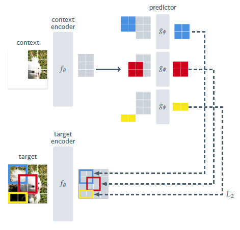
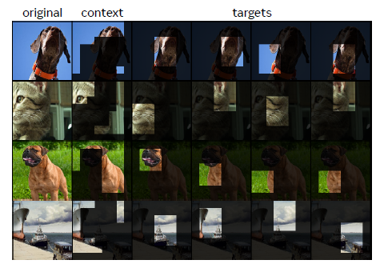

## Paper Review

By Zitao Shuai (ztshuai@umich.edu) 

### Basic Information

Title: Block-NeRF: Scalable Large Scene Neural View Synthesis

Source: CVPR2023

Institute: Meta, MiGill U

### Overview

This paper focuses on how to make self-supervised learning like mask-based strategies more generalizable. Current methods focus on adding various types of augmentations to the raw image. However, these kinds of methods can't be adapted to other modalities easily. Hence, it raises the question of whether we can augment the data in an automatic way. Inspired by mask-based strategies, this paper proposes a method to better utilize masked information and learn representations that are more informative.

Note:

Their motivation is simple but meaningful and has a high position. In the existing work, we use masking strategies to force the model to learn stable semantics, but it seems that we waste the information contained in the masked tokens. 

Hence, since the masked tokens are only used for reconstruction tasks jointly, there might be a question can we use this type of information to guide our training process in a more flexible way? (Like given a condition representation, the model should learn how to reconstruct the corresponding masked part.)

### Two-stage information extraction

We always assume the network will learn some task-irrelevant information in the shallow layers and learn semantic representations in the deep layers. But we don't know how to curve this process.

If we assume this holds, then we might like to image the network first extract some general information, and then we can extract a particular type of information from it.

> Cognitive learning theories have suggested that a driving mechanism behind representation learning in biological systems is the adaptation of an internal model to predict sensory input responses.

I think it's also one of the motivations of this paper as shown above.

We can model this process as:

1. an encoder will generate some coarse representations.
2. a projector might be utilized to extract fine-grained representations.
3. down-stream tasks will utilize this information

The key point is how to extract the fine-grained information.

One way is to use restrictions on the latent space (always different latent spaces) to force the model to learn representations with different levels of task-relevant information. Another way is to use condition information to guide the model. 
I think the condition representation acts as a query to select the corresponding projection stored in the network.

Based on this intuition, we might like to design a projector with condition representation as inputs, so we can select our desired type of information. Since we import a training loss using supervise information and the selected information, the selected part could learn the projection we want it to learn. 

This paper therefore proposes the following strategy based on this observation:

 The key part is to use conditional representations (the masked target part of the image) and guide the predictor to reconstruct the representation of the target part using the given representations (coarse information of the context part of the image and the conditional representation).

### Inspirations

Even though the mask of this work is randomly chosen, we might be able to import some supervision here to guide the information focus on the things we want them to focus on.

Consider the following task:

Given a dataset $D\{(img,text,Z)\}$ where Z is an additional supervision, how can we utilize the Z for guiding our training process?

If Z is something like additional labels, then it looks like a  multi-label problem, and we still need to combine it with our prior knowledge.

However, if the $Z\in R^{H\times W}$ gives information at the pixel level, then we might be able to utilize them similarly to how this paper does.

**If the information Z is given at the pixel level, then we have supervision on where to mask and can force the model to learn the information contained in supervision Z.** 

An intuitive approach could be:

1. random choice -> using supervision to choose

This can be interpreted as: 

"focus on the given region" and "extracting information of the local region from the global embedding"

If we use the supervision information in the old way, like predicting the area of Z, then the goal sounds like "predict where we want to focus". In some cases, it's our goal. But when we consider aligning two modalities, "focus on area Z" might highlight the area Z and align the desiring area with the corresponding text in a high probability, while "predict where we want to focus" might align the text with the supervision Z.
