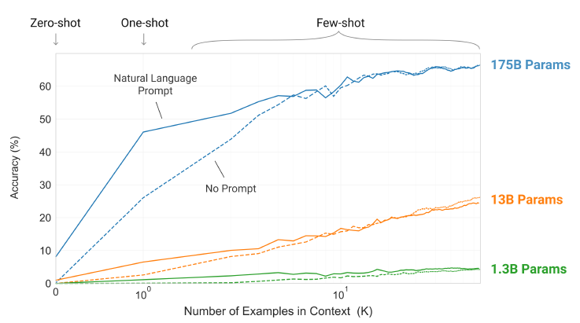
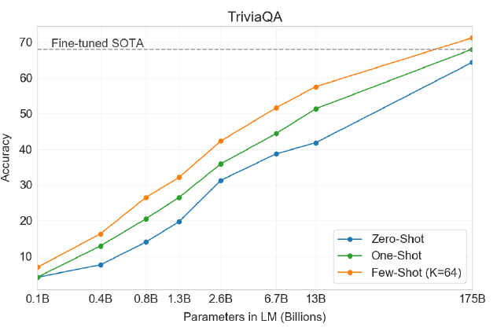
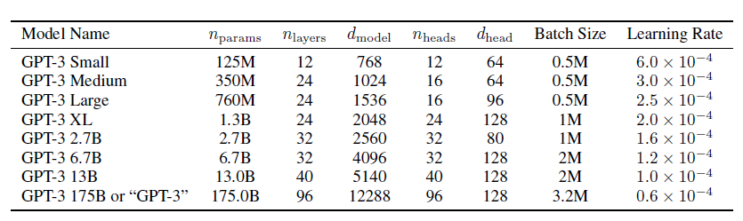

## Paper Review

By Zitao Shuai (ztshuai@umich.edu) 

### Basic Information

Title: Language Models are Few-Shot Learners

Source: NIPS2020

Institute: OpenAI

### Overview

This paper introduces the remarkable advancements in NLP through using large-scale language models. It highlights the conventional approach of pre-training on extensive text data and fine-tuning on specific tasks, which still necessitates substantial task-specific training examples. Based on the motivation that humans can adapt to new language tasks with minimal examples or simple instructions, an area where current NLP systems struggle. The paper demonstrates that scaling up language models, exemplified by GPT-3 with 175 billion parameters, substantially enhances task-agnostic, few-shot performance. GPT-3 outperforms prior fine-tuning methods on various NLP tasks, including translation, question-answering, and creative tasks like unscrambling words or novel sentence word usage. 

Note:

I think this paper provides many valuable results which can help us better understand the NLP and pre-training. This paper has verified that the larger the scale is, the better performance the model has. Therefore, AI researchers keep increasing the parameters of the model to get higher performance, system researchers focus on how to make AI systems more scalable and efficient. Let's look through the experiment results briefly.

### Larger parameters bring better performances

We might have some insights:

1. if we increase the size of the model, the model might overfit on the small dataset
2. if the model is so small, the model might not be able to fit the complex dataset
3. enlarging the parameter size might make the training process harder
4. larger model and larger datasets might have more diverse information for learning better models

However, the experiment results of this paper all show the relationship: the performance of large size model > the performance of middle size model > the performance of small size model

For example:

And sometimes the performance looks like a linear function to the model size:

### Insights on pretraining setting

The summary of the hyper-parameters they use is also useful for our experiment implementation:

When the number of parameters increases, we should have:

1. larger batch size
2. smaller learning rate

I think the motivation is to gradually learning general information and better utilize the pre-training dataset. 

