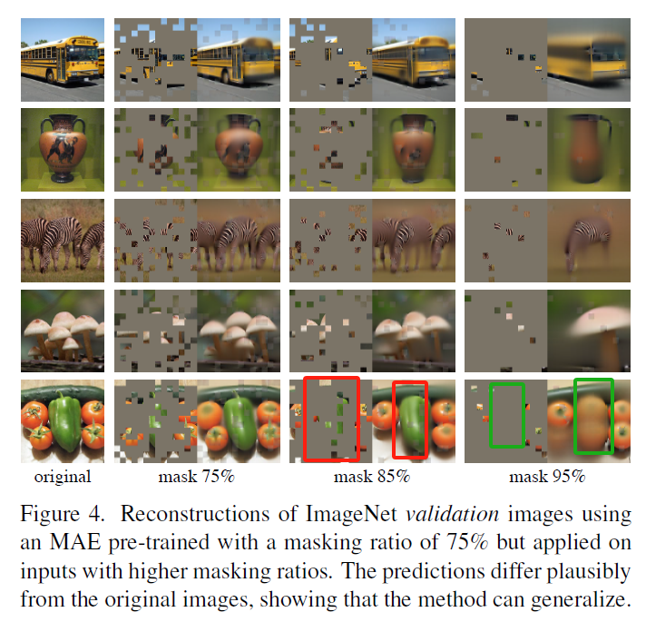

## Paper Review

By Zitao Shuai (ztshuai@umich.edu) 

### Basic Information

Title: Masked Autoencoders Are Scalable Vision Learners

Source: CVPR

Institute: FAIR

### Overview

This paper proposes to use the Masked Auto-encoders (MAE) for self-supervised learning. MAE utilizes a simple strategy: masking random image patches and then recovering the missing parts. The authors introduce two essential elements. Firstly, they design an encoder-decoder architecture where the encoder works solely on visible patches, and a lightweight decoder reconstructs the original image using the latent representation and mask tokens. Secondly, they discover that substantial masking creates a meaningful self-supervised task that can enhance image understanding.

**Note:**

We have seen many interesting applications of the idea of masking the input in NLP, e.g. MLM. I think the key problem that hinders adapting this idea to the CV domain is we didn't have VIT in the past. Since VIT treats the input image as words and divides them into patches, which makes masking techniques can be adopted in a natural way. 

This method can efficiently train large models, speeding up training and enhancing accuracy.  The MAE structure is widely used in many latest works and is viewed as a fundamental loss term.

We might ask two questions:

1. Why MAE works? How to understand the role of the mask?
2. Why do previous image-masking approaches using CNN not work?

### Visible Images as Queries

Let's look at the following graph at first:

The red rectangular notes the pepper, when some of the patches of the pepper are visible, the pepper will show up in the reconstructed image, even though the number of visible patches is limited.

However, when the pepper does not exist in the visible patches, the pepper can't be recovered. What's more interesting, the pepper is replaced by the nearby tomatoes. And the replaced parts are blurring.

We can draw some conclusions from these phenomenons:

1. the MAE only needs fewer pieces of information to reconstruct
2. even though some parts are not visible, the spatial information of visible parts is not affected.
3. for patches that are not visible, the MAE might behave like guessing using information from visible patches. 

Therefore, the visible patches might look like queries, the MAE will generate spatial neighbors of these patches, while using these queries and the learned knowledge to guess the invisible patches. 

**Note:**

The learned knowledge might be something like "A and B should always be together" since this relationship is always held in the training data.

Based on this idea, reconstructing the spatial neighbors can still be viewed as guessing. The difference is, that the spatial relationship held in the testing data as well.

This can result from the spatial locality which is an ordinary phenomenon in the CV domain.

And finally, we can understand the input visible patches $P$ as queries, to get relationship $K$ and the model will use both of them to reconstruct the image.

So why the MAE can learn this property?

### Force the model to learn global info.

From the invariant learning aspect, we might like to learn global representations that can be shared across different domains, different environments, and even different input images.

And we might like to avoid learning spurious correlation, especially in the pre-training stage.

From the design of the network structure and the mask ratio, the author might motivated by this intuition.

1. Large encoders might reserve comprehensive semantics, small decoders might avoid reconstructing with image-special information that is not generalizable
2. A large mask ratio might result in incomplete information, which might make the model unable to complete the reconstruction task, hence it might force the model to use global information.

Since the weights are shared across different patches, the information learned by MAE can not only be used for reconstructing visible patches but also for that of the invisible patches. 

Note:

I think the success of the MAE doesn't only mean the image is pretty information-redundant and we only need some patches of the raw data to reconstruct it.

Some global information is stored in the VIT, so when a input patches come, the model can provide some reference for them, and help generate the whole image.

### Why does masked CNN not work compared to Vit

I think an intuitive idea is:

The CNN relies on some prior knowledge like spatial-locality, which makes it perform well on small datasets. Vit has verified that over-focusing on this property might be not efficient on large datasets, and the transformer might learn more generalizable information.

Pixels that are remote from each other couldn't get early interactions, which might result in the problem that some invisible patches can't learn to utilize information learned from other parts.
