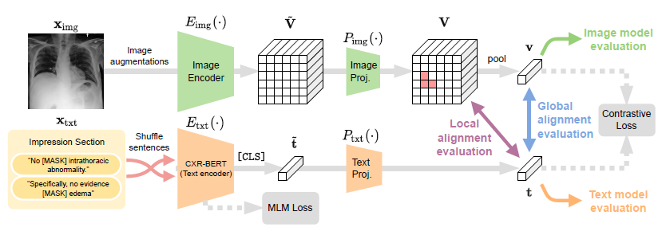
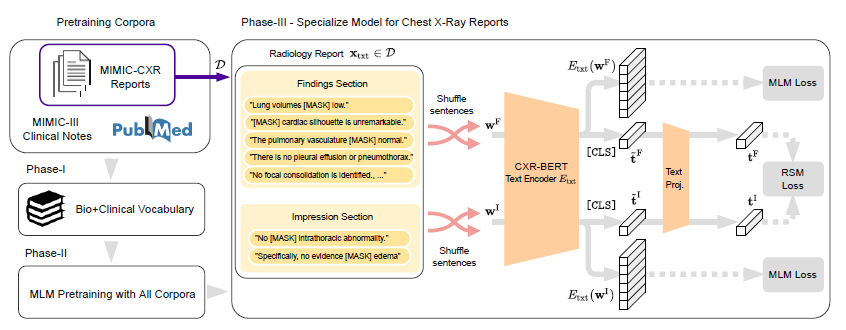

## Paper Review

By Zitao Shuai (ztshuai@umich.edu) 

### Basic Information

Title: Making the Most of Text Semantics to Improve Biomedical Vision–Language Processing

Source: ECCV2022

Institute: Microsoft

### Brief Summary

This paper addresses multi-modal data challenges in biomedicine, including radiology images and reports. Analyzing such data at scale is crucial for healthcare and research. The biomedical text presents complexities in vision-language modeling. It demonstrates that principled textual semantic modeling significantly enhances self-supervised vision-language learning.  Following this, this paper proposes a self-supervised joint vision-language approach with improved text modeling, achieving new benchmarks by leveraging our domain-specific language model. And it also releases a dataset with radiologist-annotated phrase grounding annotations to facilitate biomedical vision-language modeling study. 

Note:

The method of this paper is simple and vision-language pretraining in biomedical AI is not a new topic, but this work proposes a new benchmark, a new backbone, and points out that domain-specific language prior knowledge is important for aligning biomedical multi-modal data. Therefore, this paper still has a high position. 

This paper focuses on the efficiency of the text-side backbone and proposes the idea that the text encoder should be pre-trained before aligning text-image pairs. This point sounds weird today because we all accept the fact that the more domain-specific modalities we use, the better performance we will have. But in 2021, the medical AI domain might still deal with images and text separately, and follow the contrastive-learning-based self-supervised learning on images. So it's not surprising to see this paper view the domain-specific text encoder as their main contribution.

### Method & Benchmark

The overview of the network:

I think the method is nothing different, we have seen the local loss and the global loss, and the idea of the method of this paper looks like[1]:

[1] Shih-Cheng Huang, Liyue Shen, Matthew P Lungren, and Serena Yeung. GLoRIA: A multimodal global-local representation learning framework for label-efficient medical image recognition. In Proceedings of the IEEE/CVF International Conference on Computer Vision, pages 3942–3951, 2021.

And the pretraining method for the CXR-BERT, which is utilized as prior knowledge. It is pre-trained with various types of text information:

Note:

Since we are busy with CVPR and this paper is benchmark-oriented work, so I just write a short summary.
