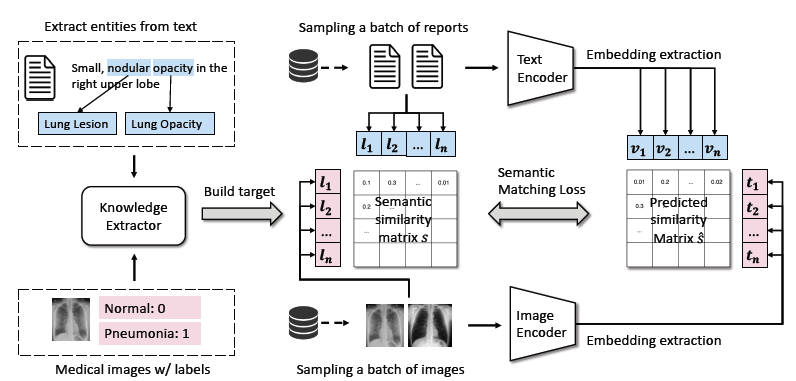

## Paper Review

By Zitao Shuai (ztshuai@umich.edu) 

### Basic Information

Title: MedCLIP: Contrastive Learning from Unpaired Medical Images and Text

Source: arxiv

Institute: UIUC

### Brief comments

It's a pretty interesting work. In the natural image and natural language domains, we expect more paired data for pretraining since we can gain models that perform well on the downstream tasks by aligning the image and text embeddings. Even though some papers have shown that the noisy image-text pairs that are collected from websites should be removed, we still view the paired data as an essential component for training a foundation model. However, this paper starts from a novel perspective, they consider a contrary way: decouple the paired data, which is quite amazing.

I think the main challenge they want to address is: misalignment.

To address this problem, there are many existing work with different assumptions:

1. Gloria claims the text is related to small parts of the image, so it proposes a local contrastive loss.
2. BioVILT claims the temporal-spatial relationship should be better handled or there would be some misalignments, so they introduce the idea of temporal fusion

The authors think the misalignment comes from the noisy paired data. But this single point is not sufficient and it's not convincing to propose a different framework due to this reason. So they claim that paired data is not sufficient in the biomedical domain.

I think the last point is meaningful to me since the lack of data is a practical problem and that's why many learning scenarios and problems would be proposed. 

And for the method, in brief, I think they utilize the information(similarities) of the input (before being projected by encoders) as a supervision:

