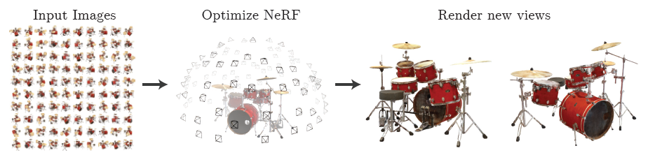

## Paper Review

By Zitao Shuai (ztshuai@umich.edu) 

### Basic Information

Title: NeRF: representing scenes as neural radiance fields for view synthesis

Source: [Communications of the ACM](https://dl.acm.org/toc/cacm/2022/65/1)

Institute: UCB, Google, UCSD

### Overview

This paper titled **NeRF: representing scenes as neural radiance fields for view synthesis** proposes a view-synthesizing method based on optimizing an underlying continuous volumetric scene function using a sparse set of input views. It considers the 5-D position information as input and output volume density and view-dependent emitted radiance at that spatial location, which is novel and verified efficient.

### Introduction

#### Background

**Problem**: View Synthesis.

**Technique Overview**: Optimizing parameters of a continuous 5-D scene representation directly to minimize the error of rendering a set of captured images.

**In-Out formulation**: 

For a given object $O_i$: the input is a set of 5-D points $(x_{i,j},y_{i,j},z_{i,j},\theta_{i,j},\phi_{i,j}),j\in [1,...,N]$.

The output is a set of (color and volume density) (each point in the 3-D space should have a tuple like this) in the 3-D space.

The ground truth $image_{j}$ is taken in the location shown in the input 5-D point with the angle shown in the input point, and compared to the image transformed from the fitted color and volume density based on volume rendering techniques (this is a traditional CG method). 

#### Challenge

Main challenge: prohibitive storage costs of discretized voxel grids when modeling
complex scenes at high-resolutions.

**Note:**

It's not a challenge that hinders the rending results of the traditional CG model. It's a novel method that uses deep learning to *successfully* **tackle the problem in an efficient way**. (There do exist related works that aim to use deep learning to address this problem.)

They don't mention others. However, they have achieved an incredible improvement in view synthesizing, it's a great success.

#### Position

**Upstream work**: volumetric representations that can represent complex real-world geometry and appearance and are well-suited for gradient-based optimization using projected images.

**Downstream work**: Any domain that needs to transform a set of 2-D inputs into a 3-D scene in an efficient way. Hence, it's quite suitable for medical image reconstruction.

**Related work**: 

1. Neural 3D shape representations
2. View synthesis and image-based rendering

**Note:**

Recall other previous work on using deep learning to synthesize views, **there are not fully end-to-end.** Many methods explicitly consider graphics functions such as textured materials, and indirect illumination values. 

**I think the key to designing a model successfully is to fuse/align information in a proper way.** Firstly, we might like to form an abstract function, and figure out the input elements, output elements, corresponding elements, and our goal. Then we might propose some properties and use loss terms to achieve these properties. **Importing prior knowledge or considering a part of our abstract function explicitly might decrease the ability(**might be generalization ability in a high probability) of the model. 

#### Motivation

They claim:

1. "Minimizing the error across multiple views encourages the network to predict a coherent model of the scene by assigning high volume densities and accurate colors to the locations that contain the true underlying scene content."

Note:

I think it's pretty insightful! The main idea is to **import different kinds of knowledge in an end-to-end way**. Recall how we model the rendering problem in CG. We might need light, angles, facial materials, and positions. However, light, materials could be attributed to color and volume densities, since these items influence the rendering result by influencing the color received by the camera. And the different angles and positions could be represented as 5-D input. **In this way, we have abstractly formed a function $R(f(x,y,z,\theta,\phi|\Psi)$ to project the viewpoint to an image for the camera, where $\Psi$ is the learned model from the sample $(x,y,z,\theta,\phi,image)$.**

2. Use position encodes to help the model render high-resolution images.

Note:

From a view of representation space, it looks like importing conditional information or augmenting data in the latent space. It's reasonable that this technique can help construct representations that are much easier for MLP to classify(project them to ground truth).

### Method

#### Motivation of the method

### Network structure and loss function

$F_{\Theta}:(x,d)\to(c,\sigma)$

It's a simple MLP, which maps the input to the output.

The key point of the method is the optimization function.

The loss function of the rendering is simple (it considers the pixel color):

I don't want to delve into math, because I have struggled in CG in my undergraduate. But the final implementation of the method seems to be very easy, and the result is pretty good, it's amazing!

### Experiment

Firstly we look into the parameters:

1. 100-300k iteration, I think it's really huge.
2. batchsize 4096, which means we need much computing resources.
3. training on V100 in 1-2 days.

I think the efficiency should be optimized. In medical AI, if we spend a day reconstructing the image for one patient with a GPU, it's pretty consuming.

Even though the medical image is not as complex as the natural image, we still need high resolution, which means we might not be able to decrease the rays and coordinates in the coarse volume. Maybe we can choose a smaller number of iterations, or maybe we can use a pre-trained model and just fine-tune the backbone model. I think the training pipeline should be compressed to 15 minutes or it's not worth training NeRF to reconstruct the medical image.

