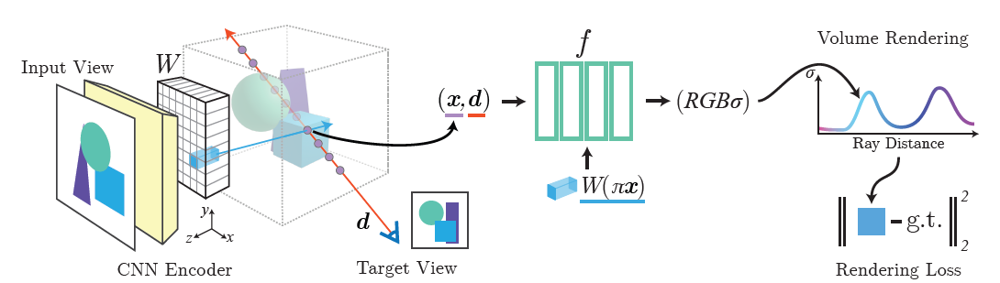
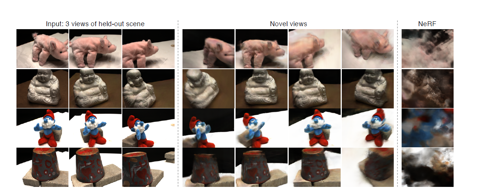

## Paper Review

By Zitao Shuai (ztshuai@umich.edu) 

### Basic Information

Title: pixelNeRF: Neural Radiance Fields from One or Few Images

Source: CVPR2021

Institute: UCB

### Overview

When I first learned about NeRF, I thought the wired point was that the model should be re-trained for different scenes. This paper considers this problem: **if we can train a NeRF model that could render different objects and scenes while avoiding retraining in the testing time?** This paper proposes to learn a prior model that contains shared knowledge across scenes and use a few views of the testing scene to generate novel views of the scene.

Note:

I think this method can be viewed as latent NeRF. Since this paper is novel in 2021 and achieves great performance, they don't need to tell a good story and analyze why their model works. I think we can decompose their model into two parts: the first part is **the encoder that is used to learn the mapping from a given view of a scene to the latent semantics of this view of the scene** and the NeRF model **takes the semantics as the conditions to generate the novel view of the given scene**.

In the following part, I will first go through the pipeline and then illustrate why I think there should be this explanation. Finally, I will talk about the insight from this paper on how to utilize prior knowledge to instruct the training on downstream objectives.

### Analysis of the framework

The pipeline of the method is:

The data is a set of scenes with a set of views and its x,d. The difference compared to traditional NeRF is they use the image as input to get a latent representation.

The latent representation is generated by a CNN-based encoder and it will be input into the NeRF module combined with x and d which are the traditional input of the NeRF model.

Note:

The pipeline seems clear to understand, but we are interested in the role of the latent representation. It can help us understand the motivation and why this method has a better performance in the multiple-view setting compared to the single-view setting.

We can consider some cases:

1. case 1: the input samples are from the same scene + testing samples are also from this scene. The CNN-encoder looks like an extra part since traditional NeRF has told us that we only need x and d for this setting.

2. case 2: the input samples are from the same scene + testing samples are from other scenes. The example shown in the paper tells us that the traditional NeRF will generate bad rendering results, **we might like to believe that it only learns specific mapping of the training scene**. Since in this setting, the pixelNeRF looks like a NeRF+redundant encoder, **if we believe the CNN-encoder learns specific semantics of the training scene, then the pixelNeRF will output similar results**.

   Note: I think this setting is interesting. I don't remember I have seen analysis experiments about it in this paper.

3. case 3: the input samples are from multiple scenes + the input samples are from the unseen scenes. This is the case shown in the paper, and pixelNeRF achieves great performance. I**f the encoder still learns mappings to the specific semantics of training scenes and just remembers them, the results on unseen scenes couldn't be that good**. Hence the encoder should learn some common semantics.

Now we might like to believe the output of the encoder should be some common semantics of the scene, but we still don't know how general they are.

### Analysis based on comparison of the results of single-multiple views

If the common semantics contains of the input scene, it's contrary to common sense. And the experiment results have shown that using multiple views in the testing time achieves better performance when the novel view is quite different from the single input view.

A possible explanation for the failure of the single view case is that t**he input view might be quite different from the target novel view**: the front side of the object is black and the back side is white.

If this idiosyncratic example has not been shown in training scenes, based on the experiment results we can believe that **the encoder learns the common mapping from the input view to the semantics of the given view**.

Based on this understanding, given multiple input views in the testing time, **the encoder will output a set of the semantics of different views, and the NeRF model has learned how to match the semantics from different views to the x and d in the training time**, hence the pixelNeRF will generate better target view finally.

Note:

By the way, there is something not quite relevant to the topics. The results have shown that, if the O.O.D degree is significant, ML models will fail. Let's look at this graph:

For example, from the second row, the first graph of the novel views is blurry.

It's reasonable since **this view is quite different from the input views and we have fewer semantics of this view.** (There does exist some since there are overlaps in the semantics of this view and those of the input views.)

And the authors don't release the results of the view from the backside. I think it will be much worse.

### Insights on utilizing prior information

Consider three dimensions of information in NeRF: 

Training and testing on the same scene: (x,d) (traditional setting)

**That's because the NeRF network has remembered the mapping from (x,d) to sigma and c, conditioned on the given scene.**

Training and testing on different scenes: a set of the semantics of different views, mapping from semantics to target view, (x,d).

That's because we haven't conditioned on a single scene in the training time, **we need to tell the model which scene it is dealing with. The conditioning information is the output of the encoder**.

**Since the testing scenes are unseen, the mapping to get conditioning information should be generalizable**. 

Even though we have conditioned the NeRF model, t**he condition information is determined by views and scenes, hence we need multiple views to approximate the condition information only corresponding to the scene**.

Hence we can draw the following insights:

1. If we need information A,B,C for a task, the union of information provided by prior model and testing input should cover them.
2. We still want to avoid the O.O.D. cases. Sometimes more samples might remove the O.O.D. effects. Simply we can recall $E[Y]=\sum E[Y|X]P(X)$.  We might like to have more conditioned examples: N sets of the semantics of different views might cover the whole semantics of the scene.

