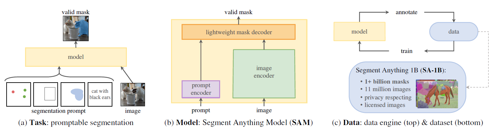
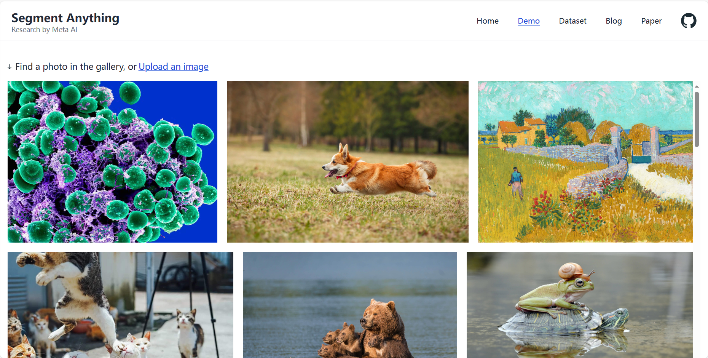
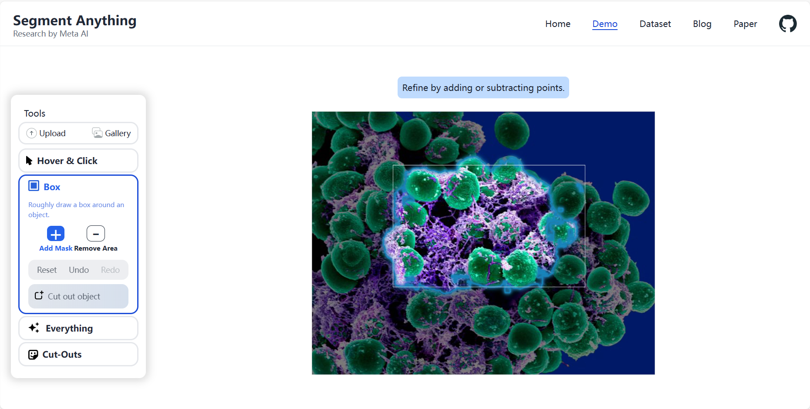

## Paper Review

By Zitao Shuai (ztshuai@umich.edu) 

### Basic Information

Title: Segment Anything

Source: arXiv 2023 04

Institute: Meta AI Research, FAIR

### Overview

This paper introduces a new large foundation model that can achieve comparable performance to the supervised method in a zero-shot way on segmentation tasks. It utilizes 11M images and 1B masks, which is a large amount in the high-resolution scene.

Note:

It's quite amazing to see this model in early time this year, even though we have expected that vision foundation models will be trained and applied to the industry in the near future.

We might have three questions:

1. Is there still any valuable problem to work on in the traditional CV domain?
2. How do they achieve such significant progression?
3. Will the long-tailed domains be influenced?

### Generalizable training schema

This paper claims that the key to their success falls on three components:

1. tasks
2. model
3. data

#### Task

For the training task or learning objective, they define a promotable segmentation task that is general enough to provide a powerful pretraining objective and to enable a wide range of downstream applications.

It can be summarized as: input: prompts + output: masks

Note: I think this brings us more flexibility and generalization ability to the training process, and make the learned representation space more transferrable. And this text to image approach also brings more diverse information or supervision to the model.

Another thing need to be noticed is that: similar to BLIP, they also have a data-generate-collect process to keep increasing the quality of the training data.

#### Model

> a powerful image encoder computes an image embedding, a prompt encoder embeds prompts, and then the two information sources are combined in a lightweight mask decoder that predicts segmentation masks.

It is still a CLIP-like simple structure.

But here they focus on learning fine-grained visual representations, and I think the output of text encoder is just like a query for vision output.

And the text-side encoder looks like is smaller than that of the image encoder, which is similar to the design in multi-modal learning.

### Does this model solve the segmentation problem in general CV domain in a unified way?

I think the answer is yes, to some degree. But I still wish medical image segmentation problem has not been solved due to the complex semantics, so that I have more problems to work on.

But the demo of the FAIR shows that some non-natural images can be segmented as well:

Some examples:

Even though it looks like that they are trying to capture the edge information, I still think they have solved the segmentation problem partially in the medical image domain in a zero-shot way.

Maybe something can be modified: can we import some semantics into it?

At least from my own knowledge, the purple-like cells should be segmented since they look not normal.
