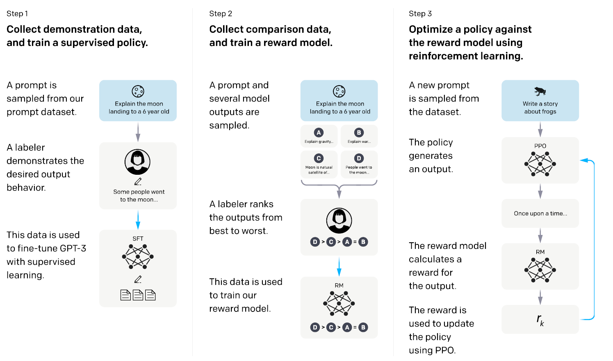

## Paper Review

By Zitao Shuai (ztshuai@umich.edu) 

### Basic Information

Title: Language Models are Few-Shot Learners

Source: NIPS2022

Institute: OpenAI

### Overview

I think this paper is really insightful and important, just use the method illustration graph to summarize.

### Some pieces of thoughts

The development of the transformer is a significant breakthrough. Before 2018, computer vision dominated the AI application domain. I think the reason is simple: we have achieved super performance in many CV tasks using CNN.

Someone might claim that it is the success of hardware and development in computation resources that brings the bloom of the computer vision and deep learning domain.

But how to make the deep learning model scalable, if larger models can bring higher performance was undetermined in the early times.

For computer vision, CNN ensures the efficiency and parallel ability of the deep learning model in the computer vision domain. However, it was not scalable until the ResNet was developed. Then we can try to solve more challenging CV tasks using larger model, larger datasets with larger computation resources.

For the NLP domain, I think this path still exists:

1. first, we should have a parallel network to process the language.
2. then we need to make the network scalable
3. then we need to develop efficient loss objectives to help the model learn better representation

Fortunately, the transformer not only tackled the parallel problem but also has been verified to be scalable. As a result, more data is thrown into the transformers to train a larger model.

To address the problem of lack of labeled data, researchers consider self-supervised learning and pretraining to learn better foundation models.

However, the alignment might not be good, even though the metrics look good.

This might result from the misalignment in the learning objectives and human preferences. So this paper proposes to use human supervision for learning better language models.
