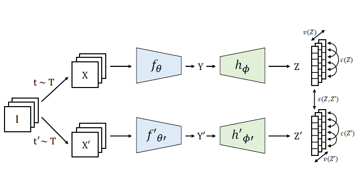

## Paper Review

By Zitao Shuai (ztshuai@umich.edu) 

### Basic Information

Title: VICREG: VARIANCE-INVARIANCE-COVARIANCE REGULARIZATION
FOR SELF-SUPERVISED LEARNING

Source: ICLR2022

Institute: Meta, NYU

### Overview

I think it's a stable-learning-like paper, it doesn't look like a paper in the multi-modal domain since it focuses on some statistics properties and uses 2-order statistics to deal with representation alignment problems.

It is pretty surprising to see that regularization-based problems can be adapted to self-supervised learning scenarios, and I'm looking forward to seeing more applications of it in pre-training problems. 

Note:

Something irrelevant to the content: the writing style is very casual, and the introduction part is different from conventional AI conference papers. It looks like a social science paper. It tries to illustrate their motivation for solving the collapse problem of self-supervised learning by comparing different works of it.

The experiment setting verifies my guess: this paper just uses small datasets for experiments, and it doesn't focus on the pre-training task while self-supervised learning is widely adopted in pre-training tasks. This paper might illustrate the feasibility of their method in high-level, if it can be adapted to scenarios of larger datasets, larger models is unknown.

### Maximize similarity while maintaining diversity

The network structure is an ordinary one:

The three parts of the loss function should be:

- Invariance: the mean square distance between the embedding vectors.
- Variance: a hinge loss to maintain the standard deviation (over a batch) of each variable of the embedding above a given threshold. This term forces the embedding vectors of samples within a batch to be different.
- Covariance: a term that attracts the covariances (over a batch) between every pair of
- (centered) embedding variables towards zero. This term decorrelates the variables of each embedding and prevents an informational collapse in which the variables would vary together or be highly correlated

Intuitively, we can try to understand each part of the loss function as:

1. the invariance term aims to align representations from different transformations (if we have paired data from different modalities, this term can help the model align information from the two).
2. the variance and covariance terms focus on avoiding collapse in different ways. The variance term ensures the diversity of value in each dimension so that the representation will be dispersed on the latent space instead of collapsing to a single point resulting from the invariance term. 

Details:

They avoid using batch norms and many other normalizations, and its loss is not based on contrastive loss, just some MSE and 2-order statistics.

Since no contrastive objective is in their loss function, they don't need to maintain a large memory bank to store exemplar data points.

Note:

It's easy to understand why they can remove the normalization structures: they explicitly take the variance and covariance into consideration, which is similar to what the normalization layer does.

