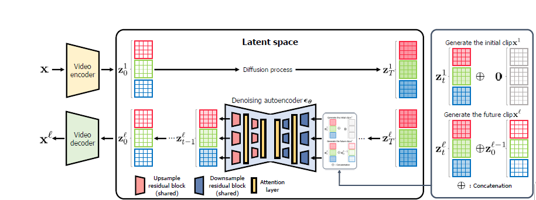
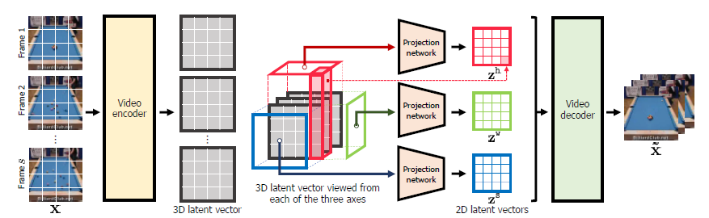

## Paper Review

By Zitao Shuai (ztshuai@umich.edu) 

### Basic Information

Video Probabilistic Diffusion Models in Projected Latent Space

Source: CVPR2023

Institute: KAIST; Google

### Overview

(This paper is really good at delivering and has shared great ideas, so I'd like to gather its thoughts by myself.)

Generating video is a challenging task. Previous models like GANs can't generate high-resolution samples. To address this problem, current works focus on adapting the diffusion model for video generation. However, although these attempts are successful in generating high-quality videos, they need more computing resources. This paper proposes to project the 3-D video into the 2-D space and learn the mapping from 2-D latent vectors to the complex cubic structure of video pixels. This method achieves SOTA and needs fewer computing resources.

Note:

1. Their "3-D" refers to time \times Image
2. Even though they focus on computing efficiency for video generation using the (latent) diffusion model, I think the most interesting point is the disentanglement of the 3-D representation. And I think it's insightful for multi-modal learning where we also like to fuse and decompose information.

In the following part, I will first talk about their motivation and then focus on analyzing their disentanglement strategy.

### Motivation: decompose and fuse for less computation

Video is a modality that has an extra dimension t which makes the training process harder. There are some potential challenges:

1. the extra dimension t **amplifies the total length of the representation**, **hence the model, training data, and computing resources should be larger**.
2. larger representation might be harder to learn, and **we might fail to capture the temporal information due to this reason** (which is significant in video modality).
3. **How to deal with the case that the video is quite long? Since the dimension t would be really large**.

The first point is claimed by the authors and I think the second and the third one are also important issues.

A feasible approach could be: **to directly project the 3-D information into a latent representation. However, from intuition, this might result in a decrease in the generation quality**.

Recall a basic idea in probability: $P(X,Y,Z)=P(X)P(Y)P(Z)$ when X,Y, Z are mutually independent.

And a basic idea in matrix computation: $B(A\times v)$ is faster than $(BA)v$ when A, B are n-d tensors and v is (n-1)-d tensors.

And I think these are there basic ideas for dealing the video generation problem efficiently.

### Towards Designing Better Disentanglement

#### Overview of the network

It's the overview of the network structure, it looks like a traditional latent diffusion model. However, there are three decomposed representations, and here are some details about the framework:

1. Firstly, **a single encoder generates a 3-D latent vector** we can **slice the 3-D representation from different axes** to get 3 groups of 2-D vectors.
2. the sliced 3 groups of vectors are input to different projection networks to generate different representations.
3. These 3 groups of vectors are input to a **shared diffusion module**, and we add **attention operations in the diffusion module**.

Note:

I think there is something interesting in "shared" and "not shared'':

1. the authors may think the three groups of representations are independent of each other to some degree, hence they use different projection networks to distinguish them. (and they believe this operation will help the model learn 3 kinds of different semantics)
2. the shared diffusion module might represent the idea that the noisy information is shared by these 3 kinds of semantics, and the attention layers are used to fuse the decomposed information contained in the 3 groups of vectors.

#### Insights for designing a good disentanglement strategy

I think this paper gives me lots of insight especially in the disentanglement strategy even though they are not focusing on this point. (They might think efficiency is more important and just view this as a technique.)

I also think this work **raises a question**: how to implement better disentanglement strategies for efficiently generating videos using the diffusion model? This point is worth at least 3-5 papers.

**I think one reason that the disentanglement is feasible is the input is 3-D, hence we naturally have a feasible way to decompose it into 3 parts without loss of information**.

##### Basic idea 1: learn disentangled features through different modules

Before we use the disentangled features for other tasks/losses/objections, we need to input the sliced/decomposed vectors into specific modules.

In this work, they slice the 3-D input and then input then into different projectors.

##### Basic idea 2: remained information integrity

The sliced inputs haven't changed the product of dimensions, therefore we can suppose it contains total information and the corresponding projector learns the mapping from the slice to the semantics we want the model to learn.

In the following parts, we try to fuse these components to avoid losing information.

##### Basic idea 3: design strategies based on the characteristics of data instead of imaginary

To illustrate it, we take a bad example:

We get two representations from two encoders using the same image and combine them to reconstruct the input and use one of them to predict the task y. **We claim 1 is the main encoder that learns predictive semantics and the other one learns noises.** This simple results from we only input the output of the main encoder to the classifier to get predicted y and calculate the classification loss.

It sounds not so good. Because there is no regularization here, how to guarantee the main encoder only learns the predictive semantics?

However, in this paper, their assumption is solid:

1. there should be some common information across each frame of the video. Hence they can decompose a component to capture the cross-time background information.
2. for temporal relationships, there might be two kinds of movement, x-axis and y-axis, hence we can have another two components to capture the temporal moving information in x-axis and y-axis.

Therefore, their corresponding disentanglement is reasonable.
