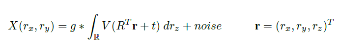
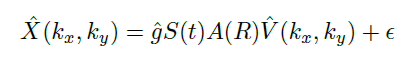
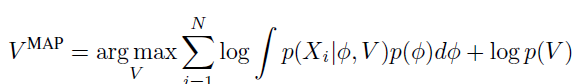
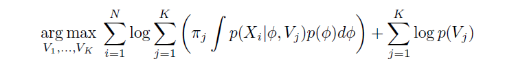
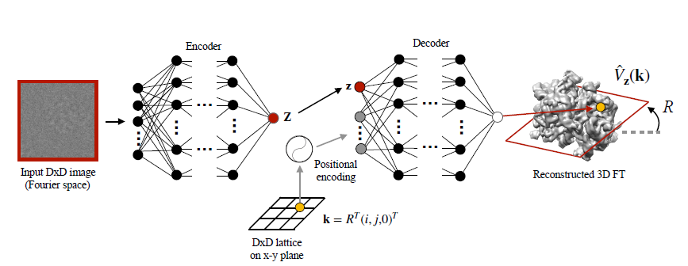

## Paper Review

By Zitao Shuai (ztshuai@umich.edu) 

### Basic Information

RECONSTRUCTING CONTINUOUS DISTRIBUTIONS OF 3D PROTEIN STRUCTURE FROM CRYO-EM IMAGES

Source: ICLR2020

Institute: MIT

### Overview

This paper focuses on the Cryo-electron microscopy (cryo-EM) task in determining the structure of the protein. To address the structural heterogeneity, they propose to encode structures in Fourier space using a coordinate-based neural network. The results have shown the efficiency of the method.

**Note:**

I think this paper focuses more on the foundation of the imaging process. It first illustrates the image formation model and analyzes the potential drawbacks based on these formations. Even though it takes more time for people who are not familiar with Fourier techniques to go through the content,  this approach can better illustrate their motivation and the practical disadvantages of the traditional models. Therefore, it will be appreciated by the specialists in the bio-engineering domain.

In the following parts, I will summarize how to write a convincing paper in AI4Sci domain based on this paper.

### Toward telling a good story in AI4Sci

This paper gives an example for people who are working on AI on how to adapt an AI technique to the AI4Sci domain:

1. formulate the problem and list the pipeline of traditional methods.
2. find out the current drawbacks of the traditional model.
3. list some properties the modified method should satisfy.
4. propose an AI method for this task based on them

#### formulate the problem and list the pipeline of traditional methods

This paper first introduces the objective of the Cryo-EM task high-levelly:

#####  Point 1: describe the task in the ideal condition

This step might aim to provide a view on how the ground truth is formed. For example, in this paper, the generation process of the image is shown as:

**However, there are always something that are hard to handle (e.g. we can't get an accurate value of a variable). Specifically, in this task, the t is unknown.**

#####  Point 2: describe the theoretical base of the traditional model

This paper then introduces how traditional methods model the task and its optimization goal:

There they utilize a EM-based method to solve the Cryo-EM problem.

#### find out the current drawbacks of the traditional model

This paper targets on "heterogeneity", hence they describe this point and how it influences the results:

1. Description:

> "Given sample heterogeneity, the standard approach in the cryo-EM field is to simultaneously reconstruct K independent volumes. Termed multiclass refinement, the image formation model is extended to assume images are generated from V_1,..., V_K independent volumes."

2. Influence on the model:

3. resulting challenge:

> "It suffers when the heterogeneity is complex or when conformations lie along a continuum of states. In practice, resolving such heterogeneity is handled through a hierarchical approach refining subsets of the imaging dataset with manual choices for the number of classes and the initial models for refinement."

**Note:**

More detailedly, the difference between the two formulations is **the second one is a combination of heterogeneous components**.

**And this might bring some problems or stories we can tell:**

1. complexity/number of subsets/high-dimension/
2. data accessibility/heterogeneous data is hard to handle by linear model
3. etc.

#### list some properties the modified method should satisfy.

However, they haven't listed the properties explicitly. But they have shown why they choose the VAE:

> "A standard VAE assumes all sources of image heterogeneity are entangled in the latent variable, we propose an architecture that enables modeling the intrinsic heterogeneity of the volume separately from the extrinsic orientation of the volume during imaging."

I think it combines the motivation with the model weakly. Since the VAE doesn't have a particular model to deal with heterogeneity.

**I think the following statements might make more sense:**

**From the perspective of the latent space model, the encoder of VAE projects the input into a set of latent Gaussians and the decoder reconstructs images based on them. Hence it can learn a robust mapping from heterogeneous training X to a shared latent space, where we can better align the predicting semantics**. 

#### propose an AI method for this task based on them

The pipeline proposed by this paper is:

It looks like a conditional VAE.

Given an object(protein), the input might be N (image, position). The encoder use image to generate latent representations and concat position embeddings to reconstruct the 3D FT. It's a simple framework but coordinates matches the challenges claimed in their motivation. 
