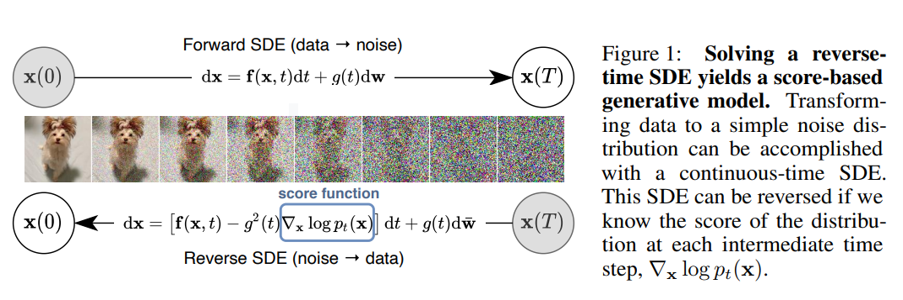
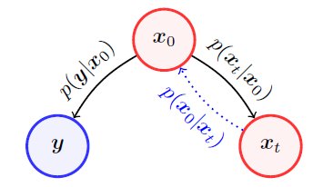
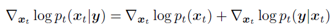
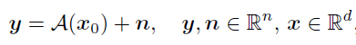
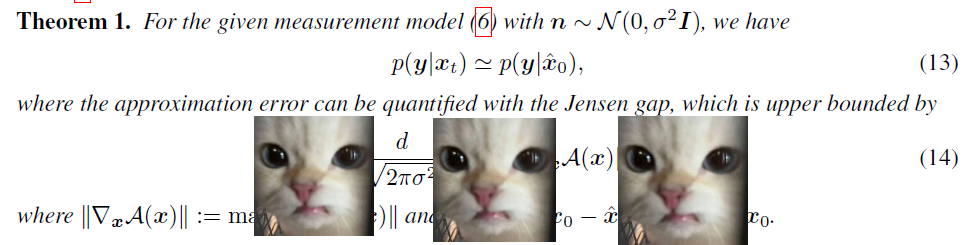
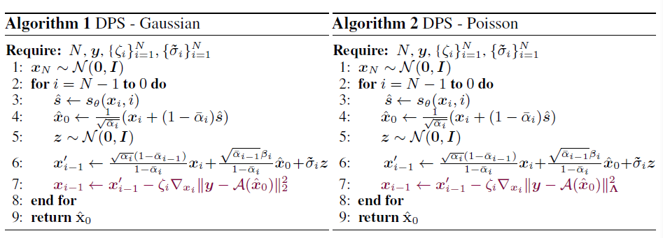

## Paper Review

By Zitao Shuai (ztshuai@umich.edu) 

### Basic Information

Title: DIFFUSION POSTERIOR SAMPLING FOR GENERAL NOISY INVERSE PROBLEMS

Source: arXiv2022

Institute: KAIST

### Position & Contribution

This paper focuses on a more hard setting: recovering images in nosier scenes. Before this work, there wasn't any work has studied this challenge problem. The paper claims that they can handle Fourier phase retrieval and non-uniform deblurring problems. It is similar to the inverse imaging problem in the medical image domain, where we should also deal with images with non-linear noises. 

**Note:**

I think the problem they want to solve is: given an input y that can be derived by x, we aim to use the diffusion model to solve the inverse problem where we **input y to get an output x(inverse results) through the trained diffusion model/score-function**. 

**The points are:**

1. **we use the diffusion model as a prior.**
2. **the prior might have been trained on images/data that are not relevant to our y**
3. **from the input x to y, there exists a large gap(non-linear noise as claimed)**
4. we need to use the forward function $A(\cdot)$ (how y )as well even though it's an inverse solving problem

And the challenge is:

1. $x\to y$ might be many to one
2. from $x\to y$, the noise is non-linear.

**The insight might be:**

**Previously, we recovered the $x_0$ from $x_t$ iteratively, and it's natural.**

**Now, we calibrate x iteratively to achieve: $A(x**)=Y$.

I'm not familiar with the notations and theorems used in this paper. I think the DDPM paper is easier for me to grasp the main idea of the paper. Before we read this paper, we'd better read the following paper first. https://arxiv.org/pdf/2011.13456.pdf

### Background Knowledge

In this paper, the perspective of the generative model is based on continuous-time SDE. I'm not good at math, and I think this graph from the paper [Score-Based Generative Modeling through Stochastic Differential Equations](https://arxiv.org/abs/2011.13456) can help us understand the score-based diffusion model.

And when we see the equations look like these two ones in this paper, we can simply imagine them to be two processes: gradually adding noise and gradually denoising.

And when we see the score function, we can view it as an output of a trained network/noise-predictor.

### Motivation

#### Importing an Extra Variable 

Since we want to use the diffusion model to solve the inverse problem (or other scientific problems), we need to import the target y.

In the DDPM, we only consider the $x_0,x_t$, and their corresponding 2 processes. 

When we utilize the diffusion model for other goals like inverse problem-solving, we might use y to get $x_0$. 

When we consider the forward problem, we get $x_0$ from $x_t$ to and then get the target y, as shown in this paper:

Hence, there comes the first gap.

However, it can be addressed by Beyesian's theorem: $p(x_t|y)=\frac{p(y|x_t)p(x_t)}{p(y)}$ 

And

> We have fact that: 
>
> 

Hence we care about $p(y|x_t)=\int p(y|x_0)p(x_0|x_t)dx_0$. (see the arrows from x_t to x_0 then to y).

#### Leverage the diffusion model as the prior

They define a function that transforms the input $x_0$ to y, and consider the noise n explicitly:

#### Theoretical guarantee 

After some definitions, propositions, and heavy proofs they have derived this conclusion:

It means we can focus on $\gradient_{x_t}log(y|\hat{x_0})$ which is tractable.

And with the theorem, the score function can be written as:

### Method

The final method is easier to understand:

Note:

**Here are some personal understandings of the pseudo-code that might be incorrect:**

1. **$\hat{x_0}$ can be viewed as a cleaned support vector, while $x_i$s contain noises.**
2. **each iteration we get an approximation of $x_0$ based on the noisy $x_i$ and compute the distance between $y$ and $A(x)$ to see if the noise is removed.**
3. **We reweigh the fitted $x_0$ and $x_i$ each time and modify the $x_i$ based on the distance, which might help us calibrate the $x_i,\h**at{x_0}$.  

