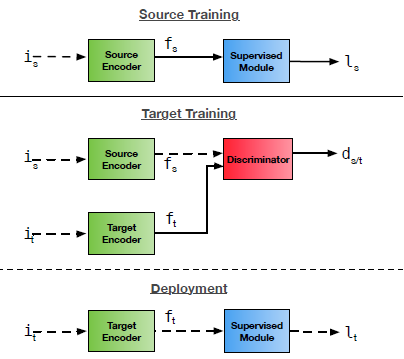
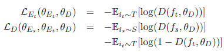
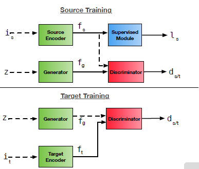
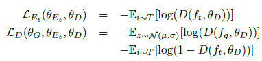
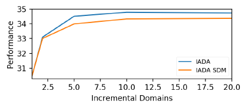

## Domain Adaptation - methods - 1

`category`: incremental domain adaptation 

[`Zi-tao Shuai`'s comments](#`Zi-tao Shuai`'s comments)

## Overview

`Title`:  Incremental Adversarial Domain Adaptation for Continually Changing Environments

`Links`: https://arxiv.org/pdf/1712.07436.pdf

`contribution`: presents an **adversarial** approach for incremental domain adaptation which benefits from **unsupervised** alignment to a **series of intermediate domains** with **minor** shifts.

`source`: `IEEE International Conference on Robotics and Automation (ICRA)`

`institution`: Applied Artificial Intelligence Lab, Oxford Robotics Institute, University of Oxford

## Background

### introduction

`scenarios & setting` : 

1. Domain Adaptation: labeled data of source domain + unlabeled data in the target domain
2. Incremental: the covariate shift is **incremental** and at a **relatively slow** pace

`SOTA`: Well, in 2017~2018, it's domain adversarial adaptation framework.

reason (**just I suppose**):

1. GAN + has achieved a great success
2. At that age, the viewpoint of `DA` is transfer learning. As a result, it's natural to think about the point "can the model **identify** which samples are from the target domain, then we can focus on these ones"

### motivation

**The idea comes from the consideration of the defects of the current models.**

`Current models' Defects`:

Based on a balanced distribution of source and target data to prevent over-fitting to the target domain.

`ZT's note`: 

The reason why I don't think the idea is truly generated from the perspective of `incremental learning` is that the motivation is based on the restriction of storing data, instead of `catastrophic forgetting`. In fact, given the source domain data and target domain data, you don't have to worry about the Forgetting-problem too much.  For model, they just adapted a newly come GAN model `WGAN` to the adversarial domain adaptation framework. 

And you see what, they didn't consider the techniques used in incremental learning. It's the current defect and the challenging application scenarios that inspired them to consider the online approaches.  

So the **storyline** should be:

various environments -> tiny shift -> frequent & slight update -> more data

more data -> couldn't support a balanced (for the size of the datasets) dataset -> **divide** the DA into an **online-iterating approach** + **modify the model** 

### related work

( -- 2017)

1. feature transformation 
2. feature invariant representation
3. adversarial domain adaptation

## Methods

`Steps`:

|              | update                            | data      | online  |
| ------------ | --------------------------------- | --------- | ------- |
| source train | source encoder; supervised module | labeled   | offline |
| adaptation   | target encoder                    | unlabeled | online  |

`Loss function`:

`modification`:

Then they add a confusion part or GAN module in the source training step:

 

`Loss function` :

## Experiment

Their model was a `SOTA` at that time.

But I think the most interesting result is this graph:

If they divide the adaptation process into `N` intermediate processes, the larger the number of processes is, the better the performance is.

## `Zi-tao Shuai`'s comments

Besides the motivation of this paper I've discussed in the previous section, In this section, I'd like to say something about the experiment results.

`Q1: why the incremental approach is better?`

In 2020, contrastive learning was proposed. And contrastive learning is faced with the problem of the collapse of the model. In `MoCo`, researchers use the momentum method to update a twin branch slowly. And that achieved great success. 

So what the point is, updating the model or one of the branches of the model in a slower way might avoid over-fitting. In `MoCo`, they use a tiny momentum for gradient descent, and in this DA paper, the authors use a smaller dataset and update the model in an incremental way.

`Q2: incremental approach will ignore the global information?`

While in `MoCo`'s paper, the author also claims that it's the limitation of the negative sample causes the collapse of the model or the overfitting. Splitting the dataset seems isn't a good way of anti-overfitting.

But remember that, in `MoCo`'s setting, the negative samples are totally different samples, while in this paper, the split datasets are highly correlated, so we can view them as data augmentation, to some degree.

