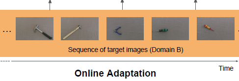
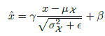
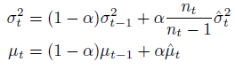
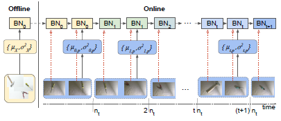
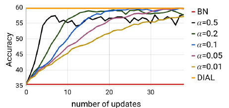

## Domain Adaptation - methods - 2

[`Zi-tao Shuai`'s comments](#`Zi-tao Shuai`'s comments)

## Overview

`Title`:  Kitting in the Wild through Online Domain Adaptation

`Links`: https://arxiv.org/pdf/1807.01028.pdf

`contribution`: 

Provide images of the same objects acquired under various conditions where camera, illumination and background are changed;

Propose an **online adaptation algorithm** for deep models, based on the **batch-norm** layers.

`source`: **2018 IEEE/RSJ International Conference on Intelligent Robots and Systems (IROS)**

`institution`: `Sapienza University of Rome`

## Background

### introduction

`scenarios & setting` : 

1. mainly about object detection in CV + robotic
2. no data available at the training time
3. Domain Adaptation: labeled data of source domain + unlabeled data in the target domain
4. Incremental: data collection process is limited, so a feasible solution is to update the model online
5. robustness: they claim `our algorithm can adapt a deep model to any target domain on the fly, without requiring any target domain data before-hand`

`My comment`:

Anyway, the framework has many defects, though their method works and doesn't need to use the target domain's data during the training time.

Firstly, they use their datasets. I'm wondering if their dataset could represent `any target domain on the fly`.

Second, I **don't think the domain shift is large enough**:

### motivation

To some degree, it's a start point paper maybe. So their contribution is proposing a method for a new setting: domain adaptation + no target data + online.

`My comment`:

I think it provides a bridge between `Domain adaptation` and `Domain generalization`: because in the `domain adaptation` task, the target domain is unseen, while in this paper's setting, the target domain is unseen in the training process. If we remove the "online" ingredient, I think this paper just propose a `Domain generalization` method. But if we get the data continuously, the target domain's data could be seen in the later round.

And I think it can be viewed as "`testing time Domain adaptation`". 

### related work

`kitting task`

`online domain adaptation`:

( -- 2018)

1. Bridge the gap between the two different distributions generating the data of different domains
2. Use the `BN` layers to match the source and target data distributions by applying different `BN` layers for each domain

## Methods

For the network, they just use two strategies:

1. BN layer: normalize the input features to a fixed, target distribution
2. momentum SGD

Their adaptation about the BN layer is:

And they update a global statistic based on the historical data:

And they calculate the local statistic based on the newly come data.

Both of the statistics will be used to update the BN layers.

So the **pipeline** is as follows:

For each timestamp when a new dataset comes:

**step 1**: use the historical statistic to update the BN layers

**step 2**: use the newly comes dataset to calculate the local statistics and update the BN layers

`My comment`:

Well, I should say, everyone knows the influence function of the `BN` layer on decreasing the internal covariate shift problems. But when it comes to covariate shift, is there exists a method that can efficiently adapt the `BN`-layer-method?

This paper just tells us the answer.

And this is a journal paper, so I guess it has been accomplished before 2017, two years later than when the `BN layer`'s function was proposed.  So I think they just successfully took a good position. 

## Experiment

And the following result is about their hyper-parameters:

Conclusion:

Lower momentum with more rounds of the online update is better.

## `Zi-tao Shuai`'s comments

`Latent assumption`

Besides the points I've discussed before, I think their model has a latent assumption: the covariate shift is small so that the target domain (or target distribution) could be softly fixed, to some degree. If not, their claims about BN's function is invalid. 

`Understanding of the results`

If we acclaim the latent assumption, and their `testing time DA` has a good performance on adjusting the covariate shift, then the updating processes just provide more data, so it's not surprising to see the increasing points.

And the momentum, I think the function of it is to anti-overfitting. 
