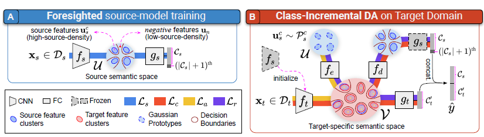

## Domain Adaptation - methods - 3

`In this survey, my comments are placed in the end of the sections.`

## Overview

`Title`:  Class-Incremental Domain Adaptation

`Links`: https://arxiv.org/pdf/2008.01389.pdf

`contribution`: propose a method that enables the classification of target samples into both shared and novel (one-shot) target classes or under a domain shift

`source`: [European Conference on Computer Vision 2020](https://link.springer.com/conference/eccv eccv)

`institution`: Indian Institute of Science

## Background

### introduction

`setting and problem statement`

1. (incremental setting) the labeled source dataset may not be readily available to perform a model upgrade, we consider the adaptation step to be **source-free**.
2. (**Feasibility**) we can obtain a single labeled target sample, or we couldn't even know what the new labels are. So it's a **one-shot** setting.
3. (domain adaptation setting) labeled source + unlabeled target

`Ideas`:

Their training process could be divided into two parts:

**Foresighted source-model training**: To augment the model with the capability of out-of-distribution detection. And the source model is shipped along with prototypes as
meta-data, for performing a future source-free upgrade.

**Class-Incremental DA**: align the target samples from shared classes with the high-source-density regions in the latent space.  Accommodate new target classes in the latent space while preserving the semantic granularity.

`My comment`:

The "source free" has defined one of the settings of this problem in a proper way. Since the class incremental learning couldn't use the previous data, at least couldn't see most of the previous data.

Their incremental domain adaptation is a two-stage one but can be exploited to n-stage ones.

And the idea of `Accommodating new target classes in the latent space while preserving the semantic granularity` reminds me of some paper in the class incremental learning domain, they just use the "space-spare" and "dynamic compressing" strategy to deal with newly come labels.

### motivation

Current works on `domain adaptation` don't consider the source data as **a combination of data from different domains**.  And the online/incremental domain adaptation community hasn't **considered the incremental of the "label"**. As a result, this paper might have considered the work of the incremental learning community and **proposed a solution in that domain's setting**. 

`My comment`

In fact, only a few papers in incremental learning and domain adaptation have given clear definitions from the mathematical perspective. And this paper seems to have given a good example.

One of the obstacles to solving this problem is how to avoid `catastrophic forgetting`. Since the different label space causes a larger covariate shift, compared to the classical `DA` setting.

| setting           | problem                                |
| ----------------- | -------------------------------------- |
| domain adaptation | covariate shift                        |
| class-incremental | different label space                  |
| CIDA              | covariate shift; different label space |

### related work

(Anyway, I suppose they have forgotten adversarial learning. And I don't agree with their statements about why the CIL methods do not work.)

#### Unsupervised domain adaptation

`Goal`: learn a feature extractor `f` to extract the invariant domain-agnostic feature and a classifier `g`, so that it can minimize the upper bound of the target risk by minimizing the distribution shift in the latent space `f(.)`, while preserving a low source risk.

`Defects`:

1. The shared feature extractor f acts as a bottleneck to the performance on the target domain
2. The shared feature extractor enforces a common semantic granularity in the latent space

`Explanation`:

`UDA methods tackle negative transfer by detecting the presence of target-private samples and discarding them during domain alignment, and these samples get clustered into a single unknown category. `

Though this improves the performance of the shared classes, it disturbs the semantic granularity of the latent space

## Methods

#### Overview

( I believe this framework should be typical. )

1. **quantify the upgrade** that is to be performed
2. **collecting** unlabeled target domain samples -> what domain shift is to
   be tackled
3. obtaining **one-shot target-private** samples ->  what new classes are to be added

#### Foresighted source-model training

（I think it's of great meaning.）

`Problem proposal`:

`Q 1`: Why we can't use the classifier loss singlely?

`A 1`:  biases the model towards source domain characteristics

`My comment`: yet from the perspective of fairness AI, I think it's not hard to understand. this restriction just gives the source domain a large weight. However, if we're dealing with the `Domain generalization` problem, since we use labeled data from different domains in that scene, the classifier loss couldn't cause a catastrophic bias.

##### Methods

`Gaussian Prototypes`

Use a (mu, std) pair to represent **each class in the source domain**. In fact, **these pairs are the output of the encoder**,

The additional loss function:

This loss function is used to enforce well-separated feature clusters.

`My comment`:

They just import the **idea of VAE**, use the thought of **"sampling" and "distribution"**. In this scene, their calculated source distributions just act as a prior. I once consider this approach, to use the features as priors and iterate them. 

About the loss function, I think it's a little bit similar to the loss function of contrastive learning. Yes, they also claim **"drives the latent space to form well-separated,** **compact clusters for each class"**, which are compatible to my speculation.

`Negative sampling`

And in order to avoid the over-confident problem, we should put lower weights on the `OOD samples`. And we use the negative samples to  model the low-source-density (`OOD`) region

Every time we could get an embedding of an input X, and from the perspective of this prototype, it should be a distribution. And we can **calculate its distance to the source domain's distribution**. And if the distance is large, we should classify them as negative samples.

 

`My comment`:

It's just like the reweight methods, and it gives the OOD samples higher weights. And the second part is just like giving restriction on the classifier.

`detail`

They update the `Gaussian Prototypes` and `negative samples` at the end of each epoch.

#### Class-Incremental DA

`main idea`: 

1. Gradually rearrange the **feature clusters** in the `V-space` to learn suitable target semantics. They froze the parameters of the classifier in the adaptation step.
2. establish a **transit mechanism between the U-space** (capturing the semantics
   of the learned classes Cs) and the V-space (where Ct must be learned).

And this part's loss function can be decomposed into two components:

1. they use an encoder to encode the latent embedding u into an embedding v, and that's the latent embedding for the target domain.
2. we use a decoder to reconstruct the embedding u.
3. then the first part is the classify loss based on the reconstructed u.
4. and the second part is the reconstruction loss

`alignment`:

The alignment is used for the `V space`.

For clustering centers:

|                | target-shared | target private     |
| -------------- | ------------- | ------------------ |
| guides' center | from U        | from one-shot data |
| is rearrange   | 1             | 1                  |

For loss function:

For each data, we can calculate their minimized distance to each of the centers. We align them to the **nearest center**. And we could **select N samples** that have lower minimized distances. Then calculate the loss:

The first part is to **separate the centers**. And the second part is to **steer the condent target samples towards the corresponding guides**.

To give the predicting ability to the N nearest embeddings, we need a classify loss too:

`My comments`:

So it's the similarity. And because of the transferring step, I should say the main idea is still **based on "transfer" and "adaptation"**.

They just use projection modules to deal with the task. So their main work should be on how to transfer correctly, that is, modify the loss function.

The most inspiring point is that they use a latent space: V. I think that's because they want to **divide the space into the source domain's specific space and that of the target**. And the projector just acts as a mapper.  I think this design is intuition-motivated.

The first part of the loss function is just like the contrastive loss, and the total method sounds like clustering. And they successfully give us an approach to understand this effect.

`optimization`:

step 1: train the encoder and decoder

step 2: get different components of losses.

step 3: backward in the order: 
$$
L_{a1},L_{a2},L_{c},L_{r1},L_{r2}
$$
`My comment`:

When it comes to the cases where there are multiple stages and there are various loss functions, only backward the loss in a proper way can give a better performance.

## Experiment

They compared two kinds of models:

1. `UDA`

2. `CI`

Their evaluation metric is the accuracy in the target domain.

I think their experiments are supportive, and they have drawn some useful conclusions:

- Trainable guides allow the rearrangement of features which effectively minimizes the distance between classes
- The loss: Lr plays a role in mitigating the catastrophic forgetting.
- Need compact clusters to preserve the semantic granularity across the target classes
- The Gaussian Prototypes do well in modeling the source distribution

## `Zi-tao Shuai`'s comments

Well, this paper's main contribution is apparent. They consider how to distinguish the different domains, and how to make use of the unlabeled data and one-shot data.

Their inspirational ideas are: constructing a latent space for the target domain based on the latent features of the source domain; using the idea of the prior distribution. 

So, how should we adapt these ideas to the domain of domain generalization? It's still a hard problem. But I suppose there are some points worth keeping an eye on:

1. maybe we need an extra encoder-decoder pair to construct a latent space for the target domain
2. Domain Adaptation's methods can easily deal with cases where the testing data come from unknown domains, but it's hard for DG methods because, in the DG settings, the testing domains are unseen. So we could just use the testing-time techniques if we want the model to be more robust.

