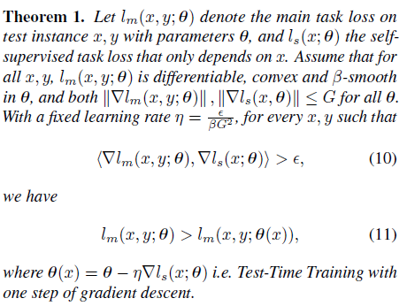
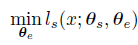
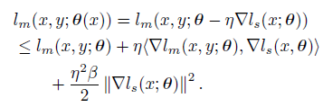
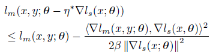
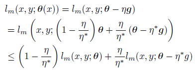
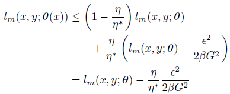
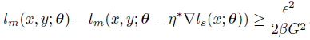
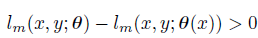

## Domain generalization - methods - 1

[`Zi-tao Shuai`'s comments](#`Zi-tao Shuai`'s comments)

## Overview

`Title`:  Test-Time Training with Self-Supervision for Generalization under Distribution Shifts

`Links`:http://proceedings.mlr.press/v119/sun20b/sun20b.pdf

`contribution`: They turn a single unlabeled test sample into a self-supervised learning problem, on which we update the model parameters before making a prediction.

`source`: `ICML 2020`

`institution`:  `UCB`

## Background

### Introduction & Motivation

Their intuition is very clear and reasonable!

See, if we want to solve the `OOD` problem, especially the domain generalization problem, we need to know the distributions. As a result, it's natural to think of **utilizing the input testing data to give us some hints on the distribution** so that we can achieve some adjustments before we make a prediction. 

`My comment`:

Anyway, since the testing data doesn't have labels,  that would be self-supervised learning. Besides, when we aim to get to learn about the distribution through self-supervised training, we need to avoid catastrophic forgetting problems.

### related work

Their related work covers nearly all of the learning algorithms in the `OOD` domain.

1. Learning on test instances
2. Self-supervised learning
3. Adversarial robustness
4. Non-adversarial robustness
5. Unsupervised domain adaptation
6. Domain generalization
7. One (few)-shot learning
8. Online learning

## Theoretical Results

In this section, the authors use a toy example to illustrate an Important conclusion: To summarize, if the **gradients have positive correlations, Test-Time Training is guaranteed to reduce the main task loss**.

`My comment`:

About the function of the expression about the restriction of the product.

See, gradients are vectors. And in which cases the gradients' product will turn into zero? Orthogonality! So this expression just **guarantees the gradient in the shared part is correlated to that in the unshared part**. 

So there might exist a latent assumption that the **domain shift causes changes both in the shared part and in the unshared part**.

## Methods

They divide the network into two parts: 

1. the shared part
2. the unshared part, which is task-specific (self-supervised task branch)

The whole network is in a Y-part structure.

And their test-Time Training fine-tunes the **shared feature extractor** by minimizing the auxiliary task loss on x. So their goal is to:

After updating the shared part in the testing time, they use the model to predict.

`My comment`:

Sounds like multi-task learning, doesn't it? But the multi-task learning adds up the loss from all of the heads. 

Partly modifying models and fine-tuning are very natural ideas for this detect-adjust-predict pipeline.  

Even though this paper doesn't tell us a practical network prototype, they've proposed a very useful principle for design the network. And they give a supportive proof.

## Experiment & Analysis

To further understand this paper, we just list their implementing details:

`data augmentation`: random crop and random horizontal flip

`network`: based on plain `ResNet` model

(seems there is nothing special)

Some analysis:

`Comparison with unsupervised domain adaptation`

They claim that `UDA`-based models have to find an invariant representation for both distributions, while `TTT-Online` only adapts the representation to be good for the current test distribution.

`Gradually changing distribution shifts`

They relax their assumption from sample testing data from the single domain to sampling from multiple domains which varies gradually.

`My comment`:

Gradually shift sounds like the scene of "online domain adaptation". In fact, this setting is not similar to that of the `HRM`. 

## `Zi-tao Shuai`'s comments

In this part, I will help explain the proof of the theorem claimed in this paper.

Key points:

1. from **motivation**: the **correlation of the gradients**. So there should be a **product**.
2. from the terms in the Taylor decomposition result.

To satisfy these two points, the proof could be:

As a common startup, they use the Taylor decomposition with the consideration of the gradients:

Then they might assume  the  `n` to be:
$$
k<\part l_m(x,y;\theta),\part l_s(x;\theta)>
$$
They put it into the expression and might calculate the form of the  `n`  should be:

$$
\frac{<\part l_m(x,y;\theta),\part l_s(x;\theta)>}{\beta ||\part l_s(x;\theta)||^2}
$$
Then put it into the expression, they get:

Based on intuition, they might suppose the lower bound is negatively related to `G` and `beta`.

And then they consider the gradient descent on the shared part:

So there should be:

And then the result could be:

