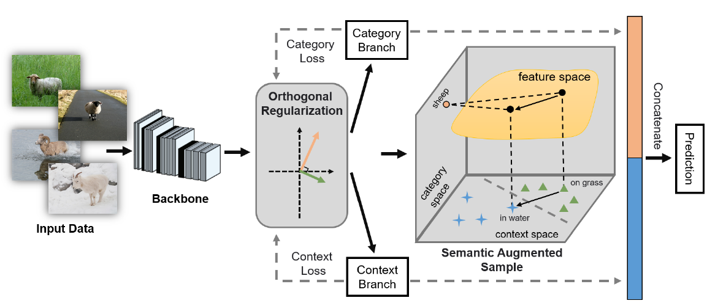
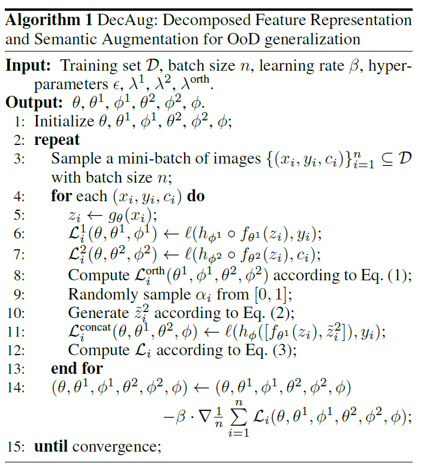

## Domain generalization - methods - 10

[`Zi-tao Shuai`'s comments](#`Zi-tao Shuai`'s comments)

## Overview

`Title`:  DecAug: Out-of-Distribution Generalization via
Decomposed Feature Representation and Semantic Augmentation

`Links`: https://ojs.aaai.org/index.php/AAAI/article/view/16829

`contribution`: 

`source`: `AAAI2021`

`institution`: `HKUST`; `Huawei`

## Background

### introduction

`problem`:  `OOD` 

`setting`: `domain label + category label`

### motivation

There are two levels of `OOD`:

- diversity shift
- correlation shift

`My comment`:

In fact, according to their detailed introduction, the `diversity` can be viewed as a set of distributions, while the `correlation shift` can be viewed as the variance of covariates' distribution. From the perspective of covariates shift, the twos are equal.

In their experiments, they use each domain to represent each `diversity`. 

### related work

`Domain Generalization`

`stable learning`

`Data augmentation`

`Feature disentanglement `

## Methods

`Overview`

The method is gradient-based but found on a two-branch network.

`detail`:

They use the domain label to represent the so-called `diversity` .

`My comment`:

Some papers have proved that the domain-private embeddings can help increase the accuracy, under the setting that the domain labels are accessible.

And data from the same domain is very similar while data from different domains are dissimilar to each other.

So, we can just view `diversity` as:

domain / set of distributions that are similar to each other / n-dimension space's clustering centers

Maybe for heterogeneous conditions, we can run a clustering based on the consideration of `pure & diverse`

By the way, the network structure is widely used, and the author's viewpoint is not inspiring nowadays (while new enough at that time) but there still exist some spotlights: use a gradient-based operation to disperse the invariant semantics and the domain-specific semantics.

`Algorithm`:

## Experiment

`Data`:

with domain-labels

## `Zi-tao Shuai`'s comments

Orthogonality is just one item of the properties that the desired invariant-variant embeddings should have. Maybe there exists more modifying space. 
