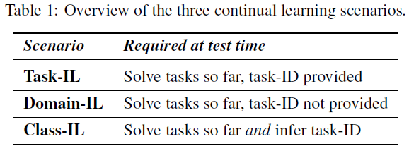
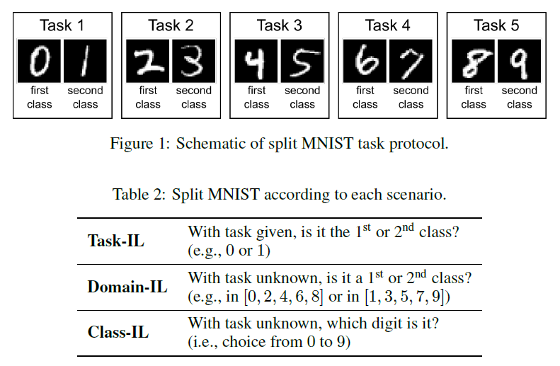

## Domain generalization - methods - 12

[`Zi-tao Shuai`'s comments](#`Zi-tao Shuai`'s comments)

## Overview

`Title`:  Three scenarios for continual learning

`Links`: https://arxiv.org/pdf/1904.07734.pdf

`contribution`: describe three continual learning scenarios **based on whether at test time**; they find that regularization-based approaches fail in these scenarios and that replaying representations of **previous experiences** seems required for solving this scenario.

`source`: `NIPS2018`

`institution`: `Cambridge`

## Background

### introduction

`Three Continual Learning Scenarios`:

`Basic ideas`:

`Task-IL`: train models with task-specific components (or to some extent, in the training time we have domain IDs)

natural idea: distribute different heads to different tasks

`Domain-IL`: we only have class IDs

natural idea: (from my view) use the domain generalization techniques

`class incremental learning`: the class IDs or labels are unseen

natural idea: (from my view) use the few-shot learning techniques or use some kernel techniques

`My comment`：

the label just provides extra information, so the fewer labels we have, the harder the questions would be. And a heuristic solution is, to act as likely as the conditions that we have more labels, or in other words, we need to **get as much information that can be drawn from unseen labels as possible from the training or testing process**.

### motivation

propose a theory or explanation about the continual learning / incremental learning.

### related work

## Methods

`model`:

Testing regularized-based methods, task-specific-component-based methods, data-modify-based methods, and data-replaying-based methods in three scenarios.

`regularized-based`: only change part of the networks but use the entire networks to predict at the testing time.

`task-specific-component-based`: assign different heads to different tasks

`data-replaying-based `: store data from previous tasks, eg. nearest-class-mean rule, data distillation.

`data-modify-based`: take the input data of the current task, label them using the model trained on the previous tasks, and use the resulting input-target pairs as pseudo-data; generate pseudo data.

## Experiment

`Data & design`:

`Result`:

data storing / replaying-based methods will be better.

## `Zi-tao Shuai`'s comm ents

I've read this paper several months ago, however, there come more interesting ideas. 

1. for class 1: **0,2,4 is totally different**, from the perspective of domain generalization, if the model is trained on datasets where there only 0s are labeled class 1, **then they should be a distribution-unseen problem.** And the class seems to be defined arbitrarily, **so there might not invariable relationship between class labels and the input data**.
2. incremental learning relies on the newly input data to **acquire the new relationships between the data and the label**, and try to retain the old relationships, and due to the **unlikeness of these relationships**, it's very hard.
3. the result - data-replaying-based methods perform well in the class incremental and domain-incremental settings - shows that using **data replaying methods that could provide more information**, or in the perspective of domain generalization and distribution invariant learning, we need the **replayed data to provide the old joint distributions or relationships**.

