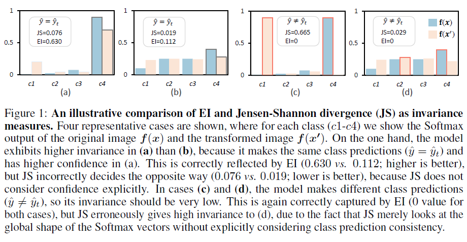
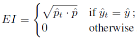
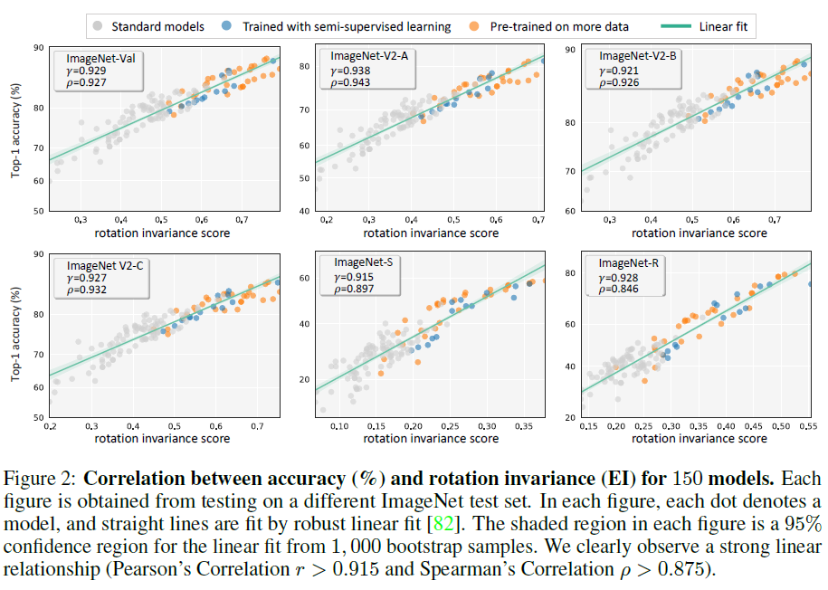

## Domain generalization - methods - 13

[`Zi-tao Shuai`'s comments](#`Zi-tao Shuai`'s comments)

## Overview

`Title`: On the Strong Correlation Between Model Invariance and Generalization

`Links`: https://arxiv.org/abs/2207.07065

`contribution`: propose a new method to measure model invariance called `EI score`; run a series of experiments that reveal: 1. there is a strong correlation between their accuracy and invariance on both in-distribution and out-of-distribution datasets; 2. model’s accuracy and `EI score`s are also strongly correlated when encountering various out-of-distribution datasets; 3. Compared with data augmentation, training with more data seems more effective to improve
invariance and generalization.

`source`: `NIPS2022`

`institution`: Australian National University

## Background

### introduction

`settings`:

input space: $$X\in R^d$$

label space $$y = {1,2,3,...,K}$$

unknown distribution: $$X\times Y$$

And for `x` on `K` class, a neural network classifier `f` provides a `probability distribution` that can be viewed as a softmax vector. As usual, we'll take the $$\hat y = argmax_i f_i(x)$$, and $$\hat p = max_i f_i(x)$$. Besides, since we might have a transformed image $$x' = T(x)$$, we might have the predicted class of this image, that is, $$\hat y_t = argmax_if_i(x')$$ and the corresponding confidence score $$\hat p_t = max_i f_i (x')$$.

### motivation

There lacks quantitative and systematic analysis of the relationship between generalization and invariance.

`metric`

`drawback`: the current methods aim to exploit the distance between the Softmax vectors of two predictions as a measure of invariance, and this kind of approach leverage the global similarity between two Softmax vectors without an explicit consideration of prediction class consistency and confidence.

`Illustration`:

`Inspiration`:

 When a model predicts the same class for the two images, if either of the two predictions is of low confidence, we should not consider it as highly invariant but give a penalty.

### related work

- Predicting generalization gap: a model-centric view
- Predicting generalization gap: a dataset-centric view
- Improving robustness with data augmentation

## Methods

`Definition of EI`:

consider the settings we've proposed, for the $$\hat p$$ for the initial data and the transformed data, we could calculate the `EI scores ` as: 

`My comment`:

The transformed data could be data from the same class but from different "domains" or "environments".

I think it's plausible since it can measure the correctness of two predictions as well as the probability of giving correct predictions, from which the similarity of a pair of vectors is not simply determined by the distance of the vector.

## Experiment

`Transformed data`

They use three transformation angles (90; 180; 270), and for each rotation angle, the authors compute an overall invariance score by comparing the predictions of the original data.

`Tested model`:

- Standard neural networks
- Semi-supervised learning
- Pretraining on more data

`constructing shifts for datasets`:

`Dataset reproduction shift`: three versions resulting from different data sampling strategies

`Natural adversarial shift`: ImageNet-Adv(ersarial) is adversarially selected to be misclassified by ResNet-50 which has been shown to be hard for other models to classify.

- Sketch shift
- Blur shift
- Style shift

Those are other shifted datasets, but I suppose they are not so largely shifted.

`Observation`:

- strong Correlation Between Model’s Rotation Invariance and Accuracy
- Strong Correlation Between Model’s Grayscale Invariance and Accuracy
- Correlation Exists on Very Hard Test Sets

## `Zi-tao Shuai`'s comments

