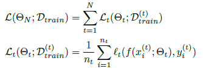

## Domain generalization - methods - 15

[`Zi-tao Shuai`'s comments](#`Zi-tao Shuai`'s comments)

## Overview

`Title`:  Learn to Grow: A Continual Structure Learning Framework for Overcoming Catastrophic Forgetting

`Links`: [Learn to Grow: A Continual Structure Learning Framework for Overcoming Catastrophic Forgetting (mlr.press)](http://proceedings.mlr.press/v97/li19m/li19m.pdf)

`contribution`: Proposes a method for continual learning with a neural structure optimization component and a parameter learning and/or fine-tuning component.

`source`: `ICML2019`

`institution`: `North Carolina State University`

## Background

### introduction

Several approaches to solving catastrophic forgetting:

- utilizing the retained data
- control parameter changes
- use extra structures
- add extra structures /  expand the networks

### motivation

#### `current problem`:

`Extra structure`: computational efficiency and accuracy performance of new tasks are traded-off.

`control parameter changes`: the accuracy performance of new tasks are usually suffered from the constrained parameter space and well-designed initial models; the effectiveness of the parameter change control functions is often unknown as the number of tasks increases at scale.

#### Observations

`DNN`s' lower-level layers (features) required for the two different tasks are likely to be
drastically different, as a result, adjusting the lower layers (or fine-tuning) will be helpful.

----> Speculations:

- forcing the same structure for these tasks is likely to cause catastrophic
  forgetting for one task
- learning to explore different structures and growing their specific components accordingly, could share common feature layers while maximizing the performance for new tasks.

### related work

continual learning

neural architecture search (previous: might not flexible)

**Note: their idea may come from:**

`two phases – progress and compress`

- During the progress phase, the model makes use of the previous model for learning the new task
- In the compress phase, the newly learned model is distilled into the old model using`EWC` (elastic weight consolidation) to alleviate forgetting

## Methods

**main idea**: separates the learning of model structures and the estimation of model parameters. (**two-stage**)

`setting`:

$$T = \{T_1 ,T_2, ..., T_N\}, T_t: D_{train}^{(t)},for\ timestep\ t: T_{test}: \cup D_{train}^{(t)}$$

Or in other words:

where $$l_t$$ is the loss function for task $$t$$.

`overview`:

Loss function:

$$R_t^s$$ and $$R_t^p$$ represent the regularizers for the network structure and model parameters

`Details`:

Three operations :

for each layer $$l$$, the $$\alpha_l$$ is a vector for each choice (acts like weight vector)

- reuse (without operations) blocks
- adapt existing blocks
- create new blocks

`View`:

There exists a `super model`, testing-time: select; training time: operate (with three operations mentioned above)

For each layer with n blocks: $$2n+1$$ cases: add 1 or adapt n or reuse n.

For all possible choices: the ultimate output is the softmax of each choice's output:

`My comment`:

Their method is based on the idea that there exists a superset of parameters and this set is determined by the training data. In the continual setting, since the testing dataset is the union of the training dataset, it will work. They just extend the parameter space to remember the data. But they can't provide generalization ability.

However, we can **utilize this approach to remember the invariant variables**.

This paper is system-style I suppose.

`Pipeline`:

for each incoming dataset:

stage 0: divide the set into: validation part + training part

stage 1: search and optimize the weights for network structure by using validation part to update the $$alpha$$.

stage 2: using the training part to update the model's parameters.

stage 3: after training, we update/add the created and tuned layers, task-specific adapters and classifiers in the maintained super network.

## Experiment

`Setting`:

Divide a dataset's classes into several disjoint sets as different tasks.

