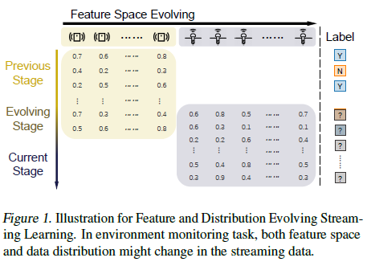
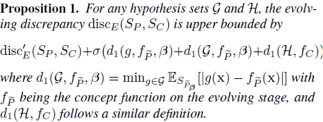
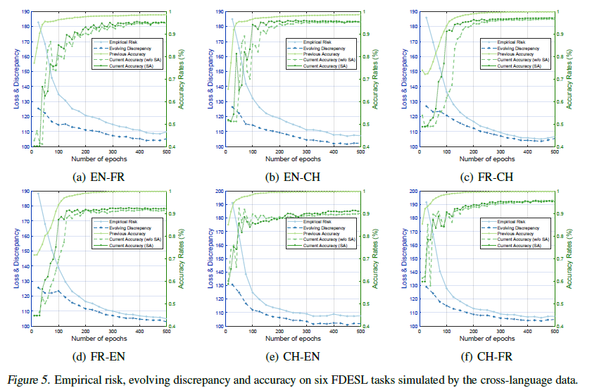

## Domain generalization - methods - 16

[`Zi-tao Shuai`'s comments](#`Zi-tao Shuai`'s comments)

## Overview

`Title`:  Learning with Feature and Distribution Evolvable Streams

`Links`: [Learning with Feature and Distribution Evolvable Streams (mlr.press)](http://proceedings.mlr.press/v119/zhang20ad/zhang20ad.pdf)

`contribution`: bridge the gap between the current feature space and the previous one: propose a problem, then define the **discrepancy measure** for the feature space and distribution of evolvable streams and then develop a generalization technique.

`source`:  `ICML 2020`

`institution`: `NJU`

## Background

### introduction

`illustration`:

The inputting features are varying.

But there exists a period of time when the two feature spaces are existing together.

`setting`:

Assume there exists an evolving batch (or dataset) between two batches. That is, there exist a mixed batch between them. 

Exist hypothesis functions $$g$$ for each batch/dataset. (they are learned) And $$f$$ is the ground truth.

`about distribution`:

The data distribution within each stage is supposed stationary, while distribution can change across the stages.

### motivation

`main point`: 

- They believe the aligned unlabeled data can act as a bridge to link the two batches with different feature spaces.
- distribution will be varying, hence the strategy of learning the mapping function between two different feature spaces is no longer reliable when the distribution is changing

`assumption`: the evolving stage where both previous and current features are available

### related work

**Feature Space Change**

exploit the relationship between the previous feature space and the current one, so that the historical data can be further leveraged

**Distribution Change**

view: there is no hope to exploit the historical data to provide a meaningful prediction if the data distribution can arbitrarily change

## Methods

And there they use the Y-discrepancy:

The Y-discrepancy is defined on two distributions $$(D_P,f_P),(D_Q,f_Q)$$ with the same feature space:

`My comment 1` :

They found a mediate for their estimation of the discrepancy.

It looks really like the process of proving a math problem. And they just break the discrepancy into three parts (two mediate processes) to solve the problem of the difference in feature spaces and the data distributions.

`My comment 2` :

Why there needs a `family function`:

Their view is that for each dataset, there exists a feature space to which it belongs and the corresponding projections/functions. 

And consider these family sets might help illustrate the upper bound or other properties of their focused questions.

`My comment 3`：

based on their proof, I suppose the so-called evolving stage is created for the convenience of the proof.

### Network Implementation

optimization objective:

And the second term could be:

And it's a min-max process. This above optimization problem can be regarded as a minimax game, where the min-player minimizes the generalization error while the max-player searches for the worst case of the evolving discrepancy.

`overview`

## Experiment

