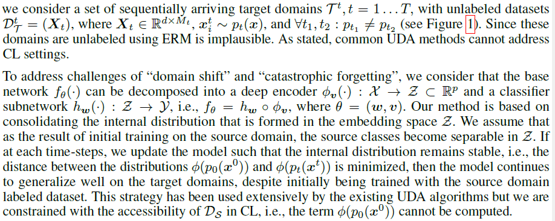
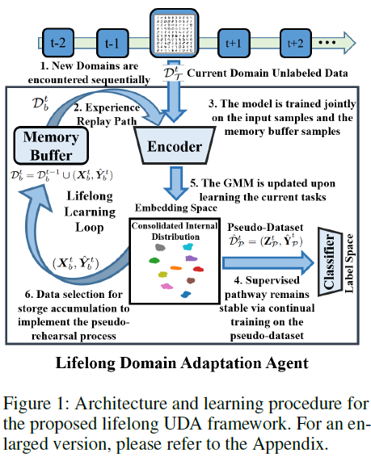
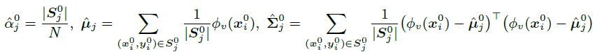
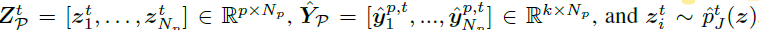
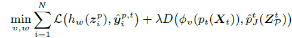
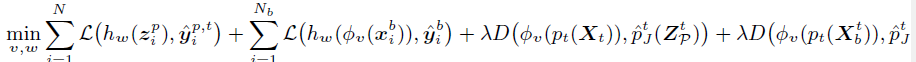
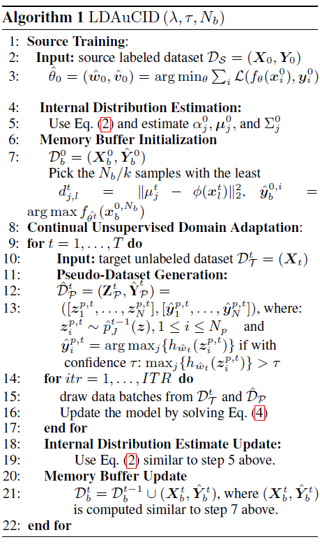
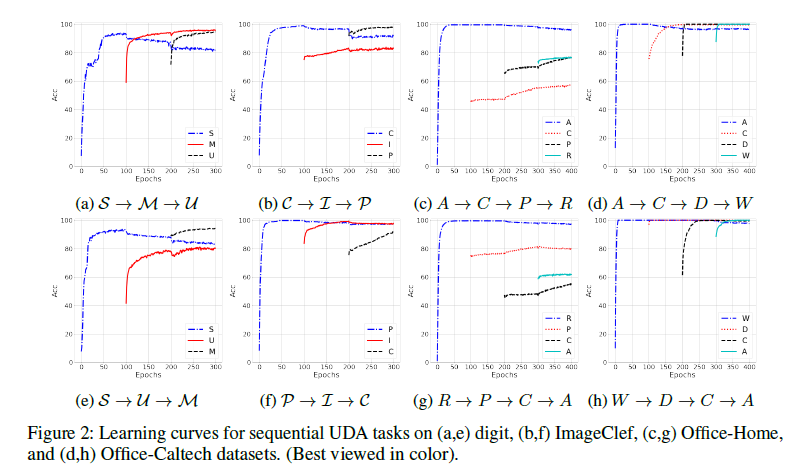
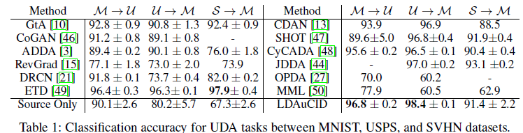
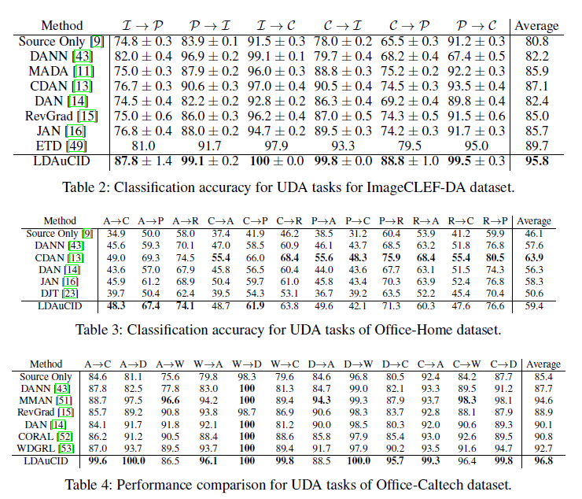

## Domain generalization - methods - 17

## Overview

`Title`:  Lifelong Domain Adaptation via Consolidated Internal Distribution

`Links`:

`contribution`: new setting `CL` + `UDA`: develop an algorithm for lifelong unsupervised adaptation of a model on new domains using solely unannotated data

`source`: `NIPS2021`

`institution`: `USC`

## Background

### introduction

`Setting`: update a model continually to learn distributional shifts across sequentially arriving tasks with unlabeled data while retaining the knowledge about the past learned tasks

### motivation

`Scene`:New distribution for new datasets. To adapt to these distribution, we need to retrain the model and learn the distribution

`Chanllege`: existing DA methods couldn't be used to solve this problem since the data from the source domain is inaccessible.

`My comment`

Different from our motivation in continual DG, where we aim to using additive data to enhance our generalization ability constantly, instead of adapt to the target domain.

### related work

- continual learning
- domain adaptation

**The literature worth focusing:**

- Incremental adversarial domain adaptation for continually changing environments (`ICRA2018`)
- Adapting to continuously shifting domains
- Ace: Adapting to changing environments for semantic segmentation `ICCV2019`
- Don’t worry about the weather: Unsupervised condition dependent domain adaptation (`ITSC2019`)

## Methods

### `Viewpoint`

minimize the distance between two distributions.

They use `GMM` to estimate a parametric model to represent the internal distribution.

### `overview`

### Main idea

1. **In the first turn with labeled data**: estimate the parameter of the supposed `GMM` model **using the up-stream embedding after training** for each class:

Consolidate this distribution to retain model generalization. And just **update the encoder in the following steps**.

(They claim that this model will retain generalization ability)

2. For the time t, use the unlabeled data and the `GMM` model to generate internal distributions $$p(z)$$, then randomly select some Z, then use the Zs as input of the downstream model, and get predictions Y. Then we construct the pseudo-dataset (Z,Y).

3. use the pseudo-dataset's classification loss and the discrepancy loss of the distribution constructed by Z's records and the distribution constructed by embedding $$\phi (X)$$. 

`loss function`

The first term is used to preserve its generalizability on the internal distribution

The second term enforces alignment of the target domain distribution with the internally learned distribution in the embedding space.

4. use data replay. They simply select a small subset of the training data points as representative samples, to be stored in a memory buffer, **using mean of features (MoF).**

Then they get the modified loss function:

### `Pipeline`

## Experiment

