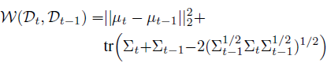

## Domain generalization - methods - 18

## Overview

`Title`:  AdaXpert: Adapting Neural Architecture for Growing Data

`Links`: [AdaXpert: Adapting Neural Architecture for Growing Data (mlr.press)](http://proceedings.mlr.press/v139/niu21a/niu21a.pdf)

`contribution`: Focusing on the growing nature of data and efficiently adjust previous architectures on the growing data.

`source`: `ICML2021`

`institution`: `Tencent AI Lab`

## Background

### introduction

`setting`:

- real-world: growing data and changing distributions
- datasets could be similar(with a degree), so we should measure the difference between the current and previous data. (so there need an adaptation condition to determine the necessity of architecture adjustment)

`current defects`:

ignore the usefulness of the previous networks, and tend not to transfer these structures. When arrived data are very similar to previous data, this could be time-consuming. 

`My comment`:

This "similar" is from a distribution approach for analysis.

### motivation

1. growing distribution cases:

2. find a new **optimal architecture for current data** rather than simply expand the previous architecture to a larger one

### related work

- Continual learning
- Progressive neural networks

## Methods

`overview`:

`main idea`:

adjust the network based on the distribution difference between $$D_{t-1}$$ and $$D_t$$

consider using the embedding to calculate the difference. (from the viewpoint that they are sampled from two distributions)

main task:

1) how to measure the difference between the current data $$D_t$$ and the previous data $$D_{t-1}$$
2)  how to design the architecture adjuster.

`main measurements`:

current:

KL divergence

`Wasserstein distance`

this paper:

use the matrices of embeddings from datasets $$D_{t-1},D_t$$ as two multi variate Gaussian distributions $$P_t ~ N(\mu_t,\sigma_t ),P_{t-1}~N(\mu_{t-1},\sigma_{t-1})$$, then use `Wasserstein distance` as follows:

`pipeline`:

## Experiment

