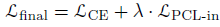

## Domain Adaptation - methods - 2

[`Zi-tao Shuai`'s comments](#`Zi-tao Shuai`'s comments)

## Overview

`Title`:  `PCL: Proxy-based Contrastive Learning for Domain Generalization`

`Links`: https://openaccess.thecvf.com/content/CVPR2022/papers/Yao_PCL_Proxy-Based_Contrastive_Learning_for_Domain_Generalization_CVPR_2022_paper.pdf

`contribution`: 

`source`:  `CVPR 2022`

`institution`:  `CUHK`

## Background

### introduction

`setting`: Given data sampled from multiple domains, we need to train a model that performs well on the unseen domains, while the domains share the same label space.

`My note`:

They don't give more details about their consideration and assumption about the domains. **So I have no idea about their practical thoughts and motivation through their settings**. I might **view this paper as a paper from the contrastive learning domain**, rather than from the domain generalization domain.

`contrastive loss`:

a. self-contrastive: use the augmented data from the same sample

b. supervised-contrastive: use the samples from the same label to construct a pair

c. softmax-loss: consider the proxy-to-sample

d. proxy-based contrastive loss: consider the proxy-based contrastive loss associates each proxy with all data samples

### motivation

1. `Since most contrastive-based losses consider both positive pairs and negative pairs, we first introduce a loss function inspired by that only considers multi-positive sample-to-sample pairs to verify our hypothesis.`
2. `some conventional contrastive-based approaches do not contribute to domain generalization task, so we conjecture that there exists a positive alignment problem where complex pairs may hamper the model generalization.`

`My comment`:

I think the motivation is not clear, they **just tell us a phenomenon**, I want to know why they think of the `proxy`. So I still want to criticize them on this point though this idea has eventually attracted me.

They claim that the positive pairs are formed from the data come from different distributions which lead to the difficulty to align. But in contrastive-based loss, each positive sample pair has to push other negative sample pairs away. So there exists a dilemma.

### related work

`Domain Generalization`:

1. data augmentation
2. learning strategy: ensemble learning and meta-learning
3. Domain-invariant representation learning: minimize some statistic metrics like the `MMD` and the `Wasserstein distance`.

`Contrastive learning`

problem: model collapse

solution: the larger size of batches; maintain a queue to record global information

`Hard pair mining`:

Function: help the network learn a better decision boundary, as well as preventing the network from getting stuck in trivial solution

`My comment`:

But it seems to need much data records.

## Methods

`Network structure`:

The overview of the network is as follows:

note: `v = p_1(encoder(x)) ` ; `e = p_2(x)`; 

`Loss function`:

`My comment`:

Since it's a motivation-less paper, we just analyze the network.

First, the `Proxy (e)`, as well as the `v`, could be seen as an embedding extracted from the hidden embedding. And the `Proxy(e) ` **could be viewed as the embedding used for the downstream task**. 

Second, the `PCL-loss` just minimizes the distance between the `proxies` and the distance between the extracted `vs` and the `proxies`. So we can just view the `Proxy` as domain-specific embeddings. 

So why does this paper's model works?

Well, in my opinion, their method is based on **feature disentanglement**.  In some previous work, people use different encoders to extract the invariant representation and the variant representation. But in this paper, they simply use a projector to generate different embedding.

So that's the problem.

In the twin-encoder-decoder system, they need a generative model and reconstructed loss to help guarantee the integrity of the representation. But here, since b**oth the loss-backward process of the Proxy's `CLF-loss` and the loss-backward process of the `PCL` update the encoder's gradient**, so we don't need decoders to give some restriction on the embeddings.

## Experiment

Nothing special.

## `Zi-tao Shuai`'s comments

Their paper might have provided something about the feasibility of using the projector to generate some useful semantics. And their approach seems to propose a different viewpoint of the feature disentanglement used for `Domain generalization`.

But I still hold the view that there is something missing.

