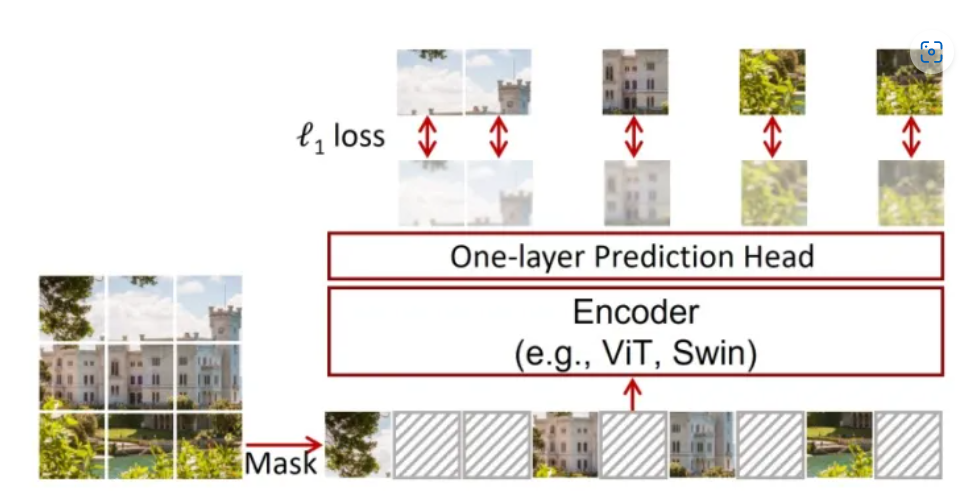
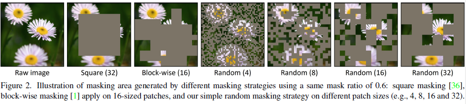

## Domain generalization - methods - 20

[`Zi-tao Shuai`'s comments](#`Zi-tao Shuai`'s comments)

## Overview

`Title`:  SimMIM: a Simple Framework for Masked Image Modeling

`Links`: [SimMIM: A Simple Framework for Masked Image Modeling (thecvf.com)](https://openaccess.thecvf.com/content/CVPR2022/papers/Xie_SimMIM_A_Simple_Framework_for_Masked_Image_Modeling_CVPR_2022_paper.pdf)

`contribution`: propose a simple approach of masking learning: **random masking** of input image patches, using a **linear layer to regress the raw**
**pixel values of the masked area** with an `L1 loss`.

`source`: `CVPR2022`

`institution`: `MSRA`; `THU`;

## Background

### introduction

`Q1`: why `CV` couldn't use the masking strategy?

1. images exhibit stronger locality: pixels that are close to each other tend to be highly correlated
2. visual signals are raw and low-level
3. self-supervised in `CV`: contrastive-learning-based methods are pretty well

### motivation

### related work

- Masked language modeling (MLM)
- Masked image modeling (MIM)
- Reconstruction based methods
- Compressed sensing

## Methods

### Overview

Architecture:

1. masking strategy: select the area to mask
2. Encoder architecture: extracts a latent feature representation for the masked image (up-stream encoder)
3. Prediction head: this will be applied on the latent feature representation to produce one form of the original signals at the masked area (downstream classifier)
4.  Prediction target: This component defines the form of original signals to predict

### masking strategy

- random masking
- central region masking strategy
- block-wise masking strategy

## Experiment

