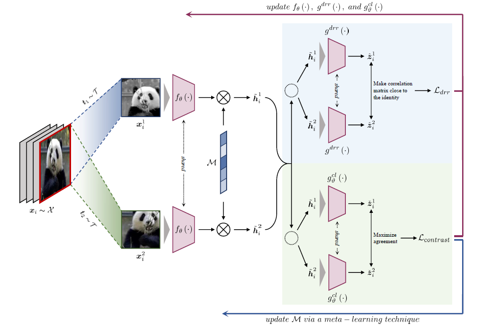

## Domain generalization - methods - 23

## Overview

`Title`:  MetaMask: Revisiting Dimensional Confounder for Self-Supervised Learning

`Links`: [2209.07902.pdf (arxiv.org)](https://arxiv.org/pdf/2209.07902.pdf)

`contribution`: 

`source`: `2022NIPS`

`institution`: `Renmin University`

## Background

### introduction

To use the mask mechanism to increase the performance of self-supervised learning using the meta-learning method.

### motivation

Some dimensions of the representation are not essential:

- some dimensions are redundant for smaller tasks 
- there exist dimensional confounders which will affect the classifier

`My comment`:

The redundancy might be explained by VC bound theory, but they don't mention that.

### related work

- Self-supervised learning
- mask technique
- meta-learning

## Methods

`Network structure`:

- data augmentation: get a multi-view dataset for contrastive learning
- run meta-learning approach to mask the representation
- the main contribution to its performance is the contrastive loss

