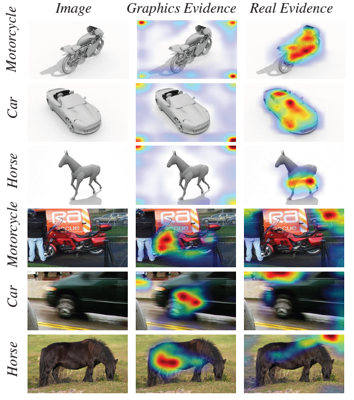
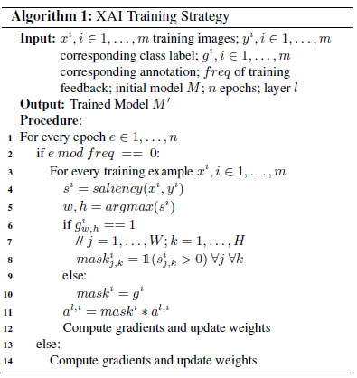

## Domain generalization - methods - 24

## Overview

`Title`:  Explainable Deep Classification Models for Domain Generalization

`Links`: [Explainable Deep Classification Models for Domain Generalization (thecvf.com)](https://openaccess.thecvf.com/content/CVPR2021W/TCV/papers/Zunino_Explainable_Deep_Classification_Models_for_Domain_Generalization_CVPRW_2021_paper.pdf)

`contribution`: Propose explainability as a means for bridging the visual-semantic
gap between different domains and get the disentangled representation.

`source`: `CVPR2021`

`institution`: Boston university

## Background

### introduction

`Intuition`:

increasing the explainability of a deep classifier can improve its generalization.

`Setting`:

Single-source domain generalization setting. (Focus on data augmentation approaches which are the most popular methods in this direction.)

### motivation

Drawbacks of current models:

- some biases do not depend on color features but are more structured or context-dependent
- algorithms should better mimic the way humans reason, or “explain”
- some activations should guide the models to focus on regions in the image that directly correspond to the ground-truth (GT) class label

### related work

- Robustness to Domain Shift
- Saliency for Explainability

## Methods

`Goal`: explicitly disentangle domain-specific information in the way of training models to produce saliency maps that are more explainable,

`Approach`:

- **How to guide?** At training time, periodically force the model to focus on the objects corresponding to the GT label using the GT spatial annotation
- **What's the guiding technique?** The annotation is a 2D binary map that has 1 in locations within the GT segmentation and 0 otherwise.
- **How to implement it?** We generate a multiplicative binary mask for guiding the focus of the network in the layer in which we are enforcing XAI. The points that are considered to need to be improved the explainability will be set to 1.

Note: they enforce explainability by utilizing the GT spatial annotation as an improved explanation.

`Illustration`:

`overview for the algorithm`:

`My comment`:

Need many people to annotate the pictures. (And different from labeling the class, annotating the important area is harder.)

