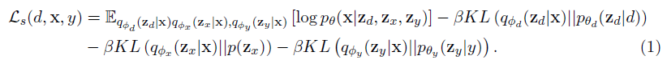
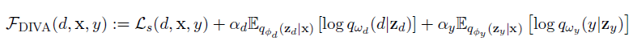

## Domain generalization - methods - 25

## Overview

`Title`:  DIVA: Domain Invariant Variational Autoencoders

`Links`: [ilse20a.pdf (mlr.press)](http://proceedings.mlr.press/v121/ilse20a/ilse20a.pdf)

`contribution`: Disentangle the representation into three parts: one for the domain, one for the class, and one for any residual variations to achieve high domain generalization performance.

`source`: **Proceedings of Machine Learning Research**

`institution`: `Boston university`

## Background

### introduction

DG in medical: 

- domain label is easy to obtain and each person could be viewed as a domain
- staining and scanning processes vary between hospitals: domain shifts

### motivation

`sources of variation`: domain label, class label, and other residual variations.

Introduce independent latent representations for a domain label d, a class label
y, and any residual variations in the input x to encourage and guide the model to disentangle these sources of variation.

### related work

- domain generalization

- semi-supervised learning

## Methods

**Hypothesis:**

A latent subspace that is invariant to changes in d (it is domain invariant)

Three parts of the representations:

$z_d$: domain-specific part;

$z_y$: class-specific part;

$z_x$: residual part

**Principles:**

- $z_x$ keeps an independent Gaussian prior $p(z_x)$, $z_d$ and $z_y$ have conditional
  priors $p_{\theta_d}(z_d|d),p_{\theta_y}(z_y|y)$. 
- $z_d$ and $z_y$ are marginally independent by construction.

**Network structures:**

- Three different encoders for corresponding parts of the variables
- A shared decoder for all three components

**Learning goal:**

Their goal is to learn a domain invariant classifier, as a result, during the inference stage they only use the encoder $q_{\phi_y}(z_y|x)$ and the auxiliary classifier $q_{\omega_y}(y|z_y)$.

**Main equation:**

goal 1: maximize the variational lower bound as shown:

goal 2: encourage separation of $z_d$ and $z_y$ into domain and class-specific information
respectively:

**Challenge:**

learning disentangled  in an unsupervised way is hard for a generative model

solution:

- Introduce some supervision and constraints on the latent space.
- This paper uses domain labels and class labels in addition to input data x.

`My comment`:

It's a different way of disentangling representation. Current methods usually view the representation as a domain-specific part and a domain-invariant part. 

However, in this paper, they utilize the information from the domain label directly, while considering the domain label and class label separately. Besides, considering the residual part looks like a traditional regression or BioStats-like approach.

