## Domain Adaptation - methods - 1

[`Zi-tao Shuai`'s comments](#`Zi-tao Shuai`'s comments)

## Overview

`Title`:  `Towards Principled Disentanglement for Domain Generalization`

`Links`: https://openaccess.thecvf.com/content/CVPR2022/papers/Lv_Causality_Inspired_Representation_Learning_for_Domain_Generalization_CVPR_2022_paper.pdf

`contribution`: 

`source`: `CVPR2022`

`institution`:  `CMU`

## Background

### introduction

`view point`: feature disentanglement

`setting`: 

- large domain shift (main challenge)
- no domain labels (main challenge)
- invariant - variant feature
- heterogeneous dataset (but the meta domain is seen) (new setting)

#### Key points

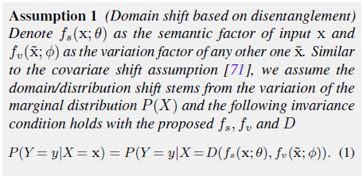

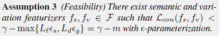

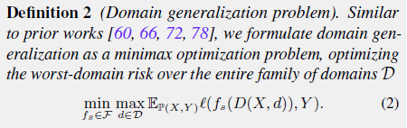

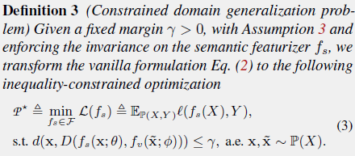

### motivation

`setting-layer`: in most cases, domain labels are unseen (generate problems)

`model-layer`: adversarial learning methods are hard to converge (why we use the feature disentanglement)

`large domain shift`: in more challenge cases, the domain shifts are very large

**`Intuition`**:

**Stage 1: formalize distribution shifts and invariance based on disentanglement**

First, diversify the inter-class variation by modeling potential seen or unseen variations, and then minimize the discrepancy of the inter-class variation on a representation space. **(find invariant representations)**

(constrained optimization problem)

**Stage 2: formulate the disentanglement between class semantics and both intra- and inter-domain variations as constraints to the DG problem.**

(primal-dual iterations)

#### Analysis

`High performance`: well approximate some of the intrinsic intra- and inter-domain variations

`identify`: well identify the variations 

`feature removal`: use specific variation factor to remove the spurious correlations

`Their analysis`:

`"Moreover, the increased diversity of source domain data improves the likelihood that an unseen distribution lies within the convex hull of source domains"`

`My comment`:

That's a pretty interesting phenomenon. **Based on our experiments, at least the `ERM` performs less good in Heterogeneous setting.(if the target domains are consisted of totally unseen meta domains)** 

`Their analysis`:

`"The original dataset can be augmented via a learned manipulator by composing a diverse combination of semantic and variation factors"`

### related work

- `data augmentation`: **increase data diversity** and it can therefore improve `OOD generalization` as well as robustness to spurious correlations. (however, some manual augmentations just cause slight covariate shifts)
- `fairness`: all of the fields/domains are **optimizing similar statistics** for common goals
- `disentangled representation learning`
- `domain generelization`

## Methods

`Theory`

About the connection between the `Latent space` and `network`.

It's natural for us to assume the latent space as a Hilbert space. But the neural networks are `selector` or `resembler`. So the authors give an assumption about the projection from representations/embeddings to latent space based on current theory. [1] [2]

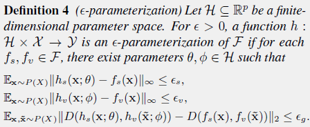

`My comment`:

They assume there are two functions which can project the `X`s into semantic embeddings and variant embeddings.

But the functions need a map from the Hilbert space to that of the neural networks'. So we need a **re-construction loss to avoid losing the information.**

(**However we only have `D(f_s(x),f_v(x))`, so we can only use the re-construction loss**)

Sometimes **we can add some loss function for `h_s(x;\theta)`, but it need more prior information.**

`loss function & param update`:

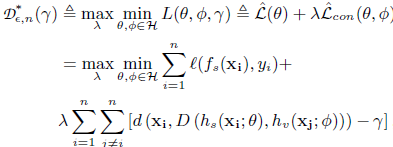

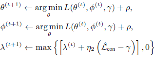

`Network structure`

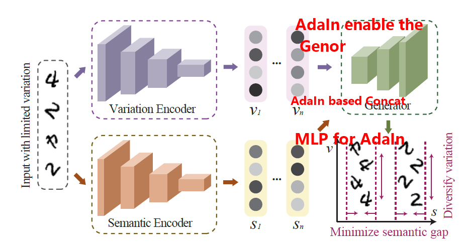

`My comment`

Different from other methods, they use the `AdaIn` prototype to model the `concat` process and use the information between these semantic embeddings and variant embeddings.

These operations don't require users have prior knowledge to design the loss function for the hidden embeddings.

## Experiment

Besides the graph about their `SOTA` performance, this graph can help us better understand their idea and what the variant and semantic components are:

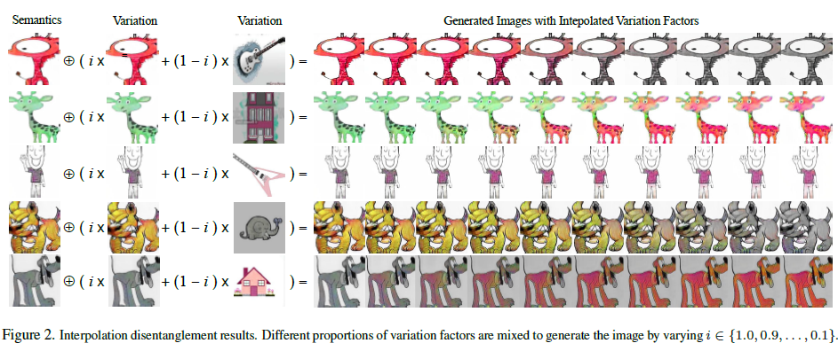

## `Zi-tao Shuai`'s comments

`About theory`

Their theorem mainly talks about the upper bound of their algorithm.

Since they've discussed the conversion from statistic optimization to parameterized latent space. They have to give bounds for these conversions:

conversion 1: from the estimation based on ground truth to the estimation based on the sampled n data

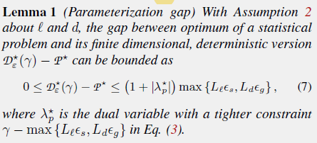

conversion 2: from the estimation based on the sampled n data to the to parameterized learnable components

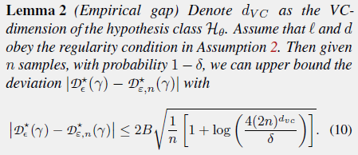

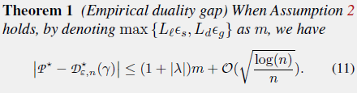

## References

[1] Berlinet, Alain, and Christine Thomas-Agnan. *Reproducing kernel Hilbert spaces in probability and statistics*. Springer Science & Business Media, 2011.

[2] Hornik, Kurt, Maxwell Stinchcombe, and Halbert White. "Multilayer feedforward networks are universal approximators." *Neural networks* 2.5 (1989): 359-366.
