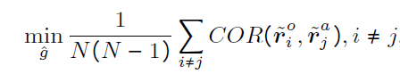

## Domain Adaptation - methods - 1

[`Zi-tao Shuai`'s comments](#`Zi-tao Shuai`'s comments)

## Overview

`Title`:  Causality Inspired Representation Learning for Domain Generalization

`Links`: [Causality Inspired Representation Learning for Domain Generalization (thecvf.com)](https://openaccess.thecvf.com/content/CVPR2022/papers/Lv_Causality_Inspired_Representation_Learning_for_Domain_Generalization_CVPR_2022_paper.pdf)

`contribution`: import `structural causal model` to `DG` problems based on the reconstructing approach.

`source`: `CVPR2022`

`institution`: `Alibaba` ; `Beijing Institute of Technology`

## Background

### introduction

`viewpoint`: they focus on `methods` and `model` , rather than `theory`. So they just argue that current methods always focusing on the statistic

`setting & assumption`: there are three types of variables:

|      | meaning       | X    | Y    |
| ---- | ------------- | ---- | ---- |
| S    | causal factor | have | have |
| U    | only impact X | have |      |
| V    | noise         | have | have |

 `My commeny`:

Instead of considering the `X` as a set of variables that determine the `Y`, we assume `X` is determined by other variables which might determine the `Y` as well. 

Thoughts: **find** **the invariant** factors in `X` -> find the causal factors which **determine both** `X` and `Y`.

`their prototype`:

encoder -> downstream

`their assumptions`:

- causal factors S should be separated from the non-causal factors U
- The factorizations should be jointly independent,none of which entails information of others
- causal factors S should be causally sufficient to the classification task X -> Y

`My comment`:

These three assumptions are strong for `DG` problem in the `CV` domain, but weaker than that in the `ML` domain.

It's reasonable that the causal factors are perpendicular to the non-causal factors. 

But it's hard to implement the second principle in the networks. So we just need more methods or loss functions.

For the third one, we might need to use the reconstruction loss.

So there might be at least two loss functions.

(And we need another one for classification loss too.)

However, the second assumption is necessary. That's because they consider the causal mechanism, but unlike using the causal invariant approach, causal inference requires consideration for the structural causal map. So we need to discuss the property each of the variables.

### motivation

`Their claims`:

`"These efforts merely try to make up for the problems caused by OOD data and model the statistical dependence between data and labels without explaining the underlying causal mechanisms."`

`My comment`:

In fact, the feature disentanglement-based methods reflect the idea of causal invariant. (But the authors don't mention them.)

Both of these two methods are very similar. But this paper's method use the **causal inference** which are not ever considered in other papers.

And their modularity are smaller: they consider the variable-layer problem while in most current works, they just divide the variables into two groups.

So their motivation are:

**separate** the causal factors from the mixture using **causal inference** (instead of simply encoder-decoder)

### related work

- Domain generalization
- Causal mechanism

## Methods

### How to implement the causal intervention

1. We firstly use a reversible approach to get a medium "representation":

2. We can get a "augmented"  data from this approach (sampling from different domains): [`My comment 1`]

3. use the **encoder** based on`CNN` or other models to get representation `r`s
4. to **simulate the causal factors** that remain invariant to the intervention upon U, they **optimize  the encoder to enforce the representations to keep unchanged dimension-wisely** to the above intervention:

This sounds like "data-layer heterogeneous" according to the Trust-worthy group in the`Tshinghua University`.

So in this way they can get the **data-level augmented data** based on Fourier transformation, thus they can **do some "interventions"**. 

The intervention could be "change"

`My comment 1` :

I think it's model-agnostic and just like the preprocessing or re-weighting to some degree.

But I still should say, they are lack of some analysis on the `do-operation`, since they haven't shown the causal graph and the edges, so I'm concerning about that if their operations have pruned the edges that should be pruned?

`My comment 2`:

This just like the contrastive learning. The `a` is augmented and the `o` is the initial one. We expect the extracted causal factors are similar.

### Causal Factorization Module

This is a smaller modularity factorization:

they expect the causal factors `s1,...,sN` are jointly independent, because none of them should entails information of others.

Thus they construct the matrix:

And the Ideal condition should be the unit matrix `I`.

### Adversarial Mask Module

`motivation`: 

Although the classification loss can retain the sufficient information for prediction, but there may be some factors that contain less information or overlapped information, so we need to remove them.

So, they build a neural-network-based masker, denoted by ^ w to learn the **contribution of each dimension**.

For each dimension:

use the `softmax` to get their probabilities.

And they use the thoughts of negative-sampling

There overall loss functions are:

`My comment`:

It looks like the distribution-level or data-level operations.

We want to find the dimensions that have less contribution through learning `m` to select dimensions for maximizing the classification loss of the negative samples.

`Prototype`:

## Experiment

Their ablation results (attention maps)

I think the highly focused areas are important and causal. But it's a little  bit of unfairness since their baselines are not `disentangle` based or  causal based.

`My comment`:

And since the highly focused areas looks pretty similar, **if we can focus on the last layer's (covariate or representation) shift?**

## `Zi-tao Shuai`'s comments

`**And since the highly focused areas looks pretty similar, if we can focus on the last layer's (covariate or representation) shift?**`

So what can this intuition tell us?

If we don't know the unseen domain's distribution, can we just modify the last part or last layer of the network based on the input unseen and unlabeled data? (like the testing-time techniques)

