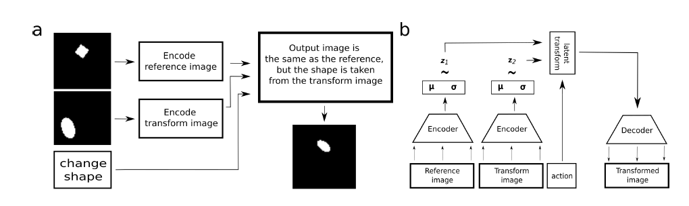

## Domain Adaptation - methods - 5

[`Zi-tao Shuai`'s comments](#`Zi-tao Shuai`'s comments)

## Overview

`Title`:  `THE ROLE OF DISENTANGLEMENT IN GENERALISATION`

`Links`: https://openreview.net/pdf?id=qbH974jKUVy

`contribution`:  propose the problem that While learning disentangled representations does improve interpretability and sample efficiency in some downstream tasks, and their results suggest that they are not sufficient for supporting more difficult forms of generalization.

`source`: `ICLR2021`

`institution`: `University of Bristol`

## Background

### introduction

`Problem background`:

It has been proposed that generalization in neural networks can be improved by extracting disentangled representations from data using (variational) generative models.

`Intuition`:

When the ground truths in the unseen domains are determined by more factors, the model might lose their predicting ability.

### motivation

`"if a person has learnt to recognize squares and circles in context where all squares are blue and all circles are red,they can nevertheless also recognise red squares, even though they have never seen these in the training data."`

`My comment`:

So the `DG` need some extra assumption and more subtle modularity. If we just consider the environment, then the true covariate shifts that are caused by `unseen latent factors` might bring lots of problems.

So we need to consider the `DG` problem from the perspective of  `distribution-level` and  `factor-level`.

### related work

- Domain generalization
- Feature disentanglement
- generative learning

## Methods

`main idea`

They just designed a series of experiments which can support their ideas.

Their main idea is to consider two sets of data, both of them are determined by `M` same factors. But the first set's data's first dimension is fixed, in other words, they have the same value on the first dimension.

**So the first are only determined by `M-1` latent factors, so we can assert that the first dimension is unseen.**   

`detail`

The feasible value of each dimensions is finite, and non-continuous or discrete. So the jointly distribution of these dimensions has a finite set of values. Though the value of some dimensions are not discrete, like the rotated angle, but they just divide them into 4 parts.

`My comment`:

I think it's reasonable because the world should be viewed in a discrete approach. **And if the variables are continuous, we can divide them into several groups based on some principles.** And in this way, we will have **finite number of the feasible conditions of the jointly distribution.**

`view of unseen latent factors` 

1. `Recombination-to-Element`

The model has never been trained on some combinations of some of the factors, but the values of each dimensions are not fixed. Or in our setting, some jointly distributions are unseen.

e.g. if there is an unseen combination `A = 1,B = 2`, then  there should have combinations like`A = k1,B = 2` , `A = k2, B = 2`,and `A = 1,B = m`

And these combinations will appear in the testing datasets.

e.g. 

| A\B  | b1     | b2   | b3   |
| ---- | ------ | ---- | ---- |
| a1   |        |      |      |
| a2   | unseen |      |      |
| a3   |        |      |      |

2. `Recombination-to-Range`

The model has never been trained on all combinations of some of the factors.

e.g. There could have unseen combinations `A = 1,2,...,B = 2`, but there should have `A = k1, B = m` and  `A = k2, B = m`

e.g.

| A\B  | b1     | b2     | b3     |
| ---- | ------ | ------ | ------ |
| a1   | 1      | 1      | 1      |
| a2   | unseen | unseen | unseen |
| a3   | 1      | 1      | 1      |

3. `Extrapolation`

Some factors are totally unseen, which means they only have a single value in the training dataset, but have multiple different values in the testing datasets.

e.g.

| A\C  | c1     | c2     | c3     |
| ---- | ------ | ------ | ------ |
| a1   | unseen | unseen | unseen |
| a2   | unseen | unseen | unseen |
| a3   | 1      | 1      | 1      |

## Experiment

`pipeline`:

1. they removed the encoder and directly gave disentangled latents as inputs to the decoder.
2. use the latent representations generated for each image to predict the true generative factors using a regression model

`My comment`:

They must be some problems if they just simply move the encoder!

Firstly, they **only focus on the reconstruction** but not for the classifying ability. But in most cases, we just use the representations for downstream works. **So the key point is that our representations should have high performance on the downstream work. The model might not perform as bad as they've claimed in the downstream tasks.**

See, this contains an assumption that the encoder **always get a correct embedding**. Admittedly, when I consider questions in the `DG` domain, I always consider this scene. **But that's not always a ideal condition, because our embedding might not correctly get the embedding and they might just emphasis the predictive components**, so when the true latent factors shift, the **"not so correct"** embeddings or representations would **suffer less**.

`Result`

Recombination-to-Element condition was solved by all the models.

But in the complex scene they perform bad.

`Supplement exps`

Since some of the feature disentanglement approaches aren't simple use the generative learning, and they import some other loss functions to guarantee their model to learn the useful representations. The authors have done some supplement experiments to prove their viewpoints.

`Design`: The goal of the task is to take the first (reference) image and modify it so that it matches the second (transform) image along the dimension specified by the action.

`My comment`:

They are trying to mimic the thoughts of other researchers and try to prove their models can't work in the unseen-factor setting.

## `Zi-tao Shuai`'s comments

They just provide us some new perspectives about the domain generalization problems. **But there still exist some questions: maybe we should consider the encoder; or what about the performance on the downstream task?**

