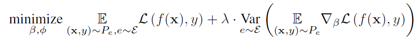
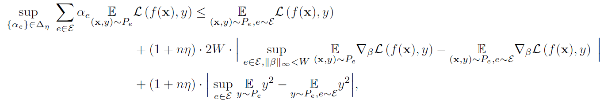
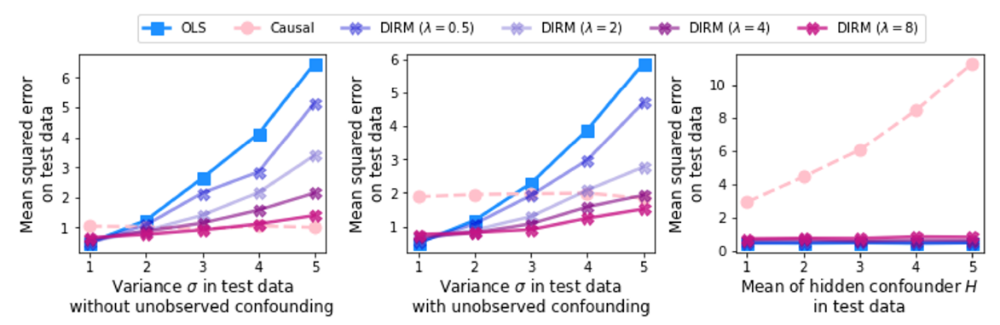

## Domain Adaptation - methods - 6

[`Zi-tao Shuai`'s comments](#`Zi-tao Shuai`'s comments)

## Overview

`Title`: `Accounting for Unobserved Confounding in Domain
Generalization` 

`Links`: https://arxiv.org/pdf/2007.10653.pdf

`contribution`: define a different invariance property of causal solutions in the presence of unobserved con-founders,  which through a relaxation of this invariance can be connected with an explicit distributional-robust optimization problem over a set of affine combination of data distributions. 

`source`: None

`institution`:  `UCLA` ;`U Cambridge`

## Background

### introduction

`Question`:

Sometimes the shifts between environments or datasets are large.

So we want to how the unseen datasets are shifted.

And the best way is to view this question from a small-modularity perspective.

### motivation

The smallest modularity is the data-layer. But it's meaningless. And a better way is to consider the distribution. Since we can select some predictive variables, and consider the joint distribution of these variables. But the question is, **which variables** should we choose for training.

And consider the problem based on the causal perspective, we can **divide the variables into two parts**, causal part and non-causal parts, in this paper, they use `exogenous` and `endogenous` to represent these two parts. And the endogenous variables are **influenced by unobservable con-founders**, which makes the endogenous variables vary between domains.

 `My comment`:

There are several questions:

First, they just consider this causal graph: `X->Z->Y`, and `X` is the **observed**/raw data, `Y` is the label, `Z` is the mediate representation. But in the CV domain, **the observed `X` is pixels, they are meaningless, only the mediate embeddings are meaningful**. So in this kind of cases, we view the learned representations as sets of latent factors, and divide them into two parts. 

Second, they **consider the joint distribution of the endogenous variables, that are, the non-causal factors, I think it's reasonable**.

Finally, about there `unobserved`. I think many works have noticed the confounder, so I don't think it's their spotlight. 

### related work

- Invariant risk minimization
- Structural causal map

## Methods

`Assumptions`:

New data distributions can be represented as affine combinations of training distributions.

Similar to  `IRM` 's thoughts, the method aims at  achieve optimal in each distributions.

`My comment`:

We can understand this in the way: they view distributions as domains, and combine the small domains. So it's just like the thought of `HRM`, the only difference is that the domains are smaller and don't need to be defined by environment labels.

`goal`:

At optimality, they want to hold that the loss function's gradients evaluated at this solution are equal across environments.

And the optimize goal is:

`Theory`:
They have the bound:

## Experiment

This graph shows some interesting phenomenons:

When variance increase, the performance of the `DIRM`  decreases. I guess it's **the bigger variance takes up more ratio of the loss, the the `ERM` part is not optimized enough**, which lead to a lower performance.

And as the mean of the hidden con-founder increases, the distribution is not likely to the Gaussian, so there come new distributions, and `DIRM` work well while `Causal` becomes in-efficient.

## `Zi-tao Shuai`'s comments

`About the unobsered`

I just want to propose a theory that `unlearnable` latent variables.

1 . table-like dataset

Assume that: `X` : observed variables, `Y` : labels

2 . non-structural dataset 

Assume that: `X` : observed pictures, `Y` : labels

ground truth of the latent variables: `U` (non-causal or endogenous)

`V` (causal or exogenous)  `C` (con-founders that affect the `U`)

In the first case, it's easy to understand that the observed `X` is **not the only factors that might affect the `Y`**,  the could be two reasons: 1. some variables can't be observed; **some variables keep the same values in the training dataset, so these variables are viewed as constant**.

In the second case, if **some variables keep the same values in the training dataset,  these variables will be viewed as constant as well**. So they are not learnable. And these variables could be both causal and non- casual. **And in this case we might say that the dimension of the space of the endogenous `U` has changed**. In fact, it's just because some of the variables keep invariant in the training set but vary in the testing sets.
