## Domain generalization - methods - 7

[`Zi-tao Shuai`'s comments](#`Zi-tao Shuai`'s comments)

## Overview

`Title`:  `Distributionally Invariant Learning: Rationalization
and Practical Algorithms`

`Links`: https://arxiv.org/pdf/2206.02990.pdf

`contribution`: propose the distribution-invariant and two implementations

`source`: none 2022

`institution`: `THU` 

## Background

### introduction & motivation

`Challenge`:

strong assumptions:

Many assumptions imply these properties:

(a) the strict invariance property holds among environments

(b) the environments are diverse enough to exclude the undesired variant components. 

`Problems`:

- strict invariance may not even exist.
- multiple-source data are often pooled together during the collection, which makes environment labels unavailable.

`Insights`:

`"it is less likely for the strict invariance property to hold among pseudo-environments (heterogeneous pooled dataset),because the learning process of pseudo-environments inevitably aggravates the perturbations on the underlying invariance
property"`

So, the training datasets should have enough invariant-relationships to be learned. 

`My comment`:

It's true, my experiments' results support their statements.

That is, consider two training dataset, the first dataset is the raw dataset (except a testing domain `E_test`), whose data in different domains is quit different, and the second dataset is pooled from the first one. And the test domain is the reserved domain `E_test`.

Then model trained on the second dataset has a higher in-acc but lower  `out_acc` on the `E_test`. **So use the pooled data will mislead the model to learn the wrong causal relationships**.

`Problem settings`:

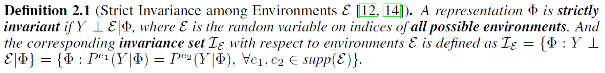

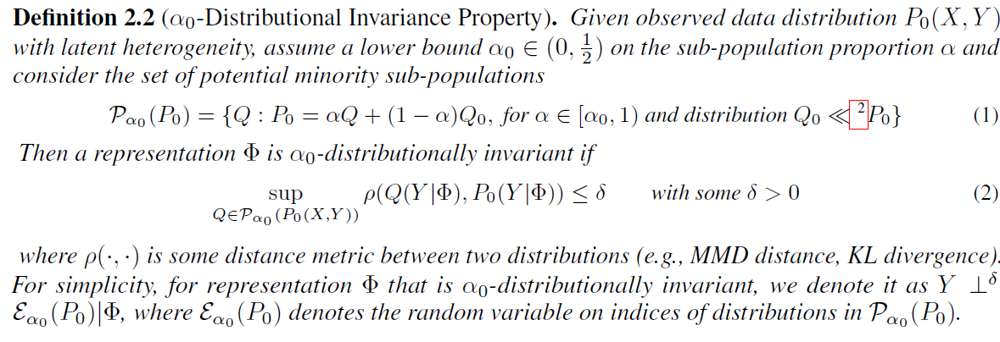

`My comment`:

My question here is that how to identify the distributions?

So they just divide the training process into **two interactive parts: (1) Variation Exploitation and (2) Variation Elimination**

And the distribution: `P(X,Y)`, `X` is observed variables, they don't view `X` as a combination of casual factors and non-causal factors.

And they just want to find one distribution `Q` under the similar-threshold: `alpha` that is the most similar to the training distribution using the `MMD` methods.

### related work

- `HRM`
- `DRO`
- `DG`

## Method

### framework

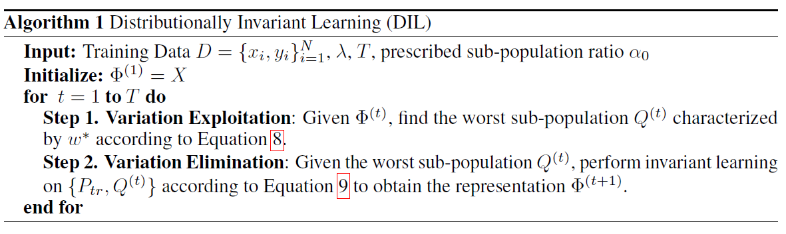

learn the maximal distributional invariant predictor

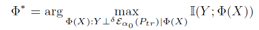

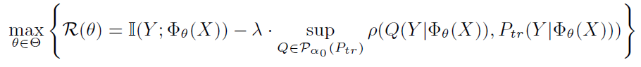

### Step 1: Variation Exploitation

`aim`: find the sub-population

`methods`:

`MMD`: to distinguish two distributions

kernel  (\phi) + `MMD` metric  

and the estimator:

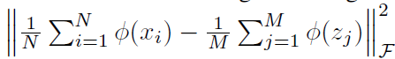

`conditional MMD`:

both `x` and `y` have a kernel function

and the estimator:

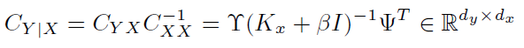

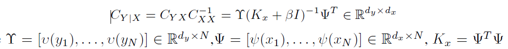

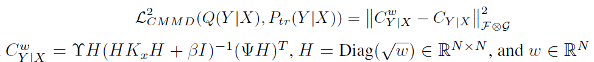

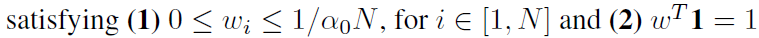

`My comment`:

We can use the `CMMD` to help identify the different distributions. In fact, it's a sample-re-weighting method, though re-weighting, they have successfully constructed a distribution that mostly dislike the original one while satisfying their assumption.

### Step 2: Variation Elimination

 Their optimization goal is simple:

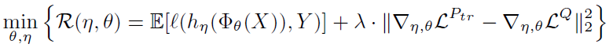

And the first term is based on mutual information, the second term is the regularization term for learning the invariant properties.

## Experiment

`Test results` :

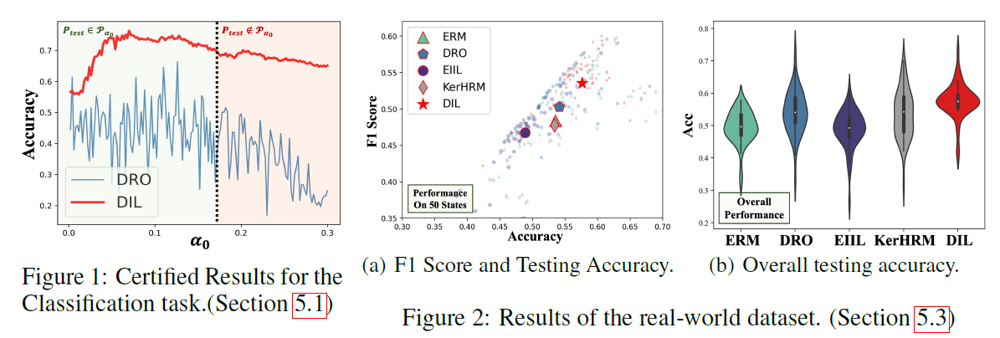

## `Zi-tao Shuai`'s comments

I think the insights would lie on the kernel operations.

We can use their method in a mediate step. And view the mediate embeddings as the input `X`, then identify the distributions.
