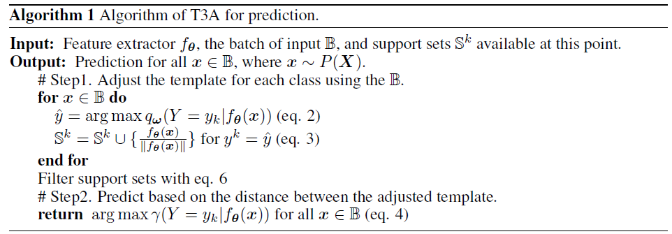

## Domain generalization - methods - 8

[`Zi-tao Shuai`'s comments](#`Zi-tao Shuai`'s comments)

## Overview

`Title`:  Test-time classifier adjustment module for model-agnostic domain generalization

`Links`: https://arxiv.org/pdf/2006.10726.pdf

`contribution`: propose a testing-time method for `DG`

`source`: `NIPS 2021`

`institution`: `U of Tokyo` 

## Background

### introduction

`Settings`:

Each dataset is viewed as a different domain.

Each domain has a corresponding distribution. 

 `My comment`:

It's not reasonable from nowadays perspective.

Case 1: their assumed covariates are fixed in a dataset.

Question 1: there might be many variables that they haven't accounted for.

Case 2: their assumed covariates are variant.

Question 2: a dataset can't be represented by a single distribution. 

### motivation

#### `views about the data sources`:

**Main question: how to utilize the accessible labels and the unlabeled testing data.**

####  What can testing data tell us?

Some clues about the distribution of the covariates in the testing dataset.

`question`: without labels, how to measure discrepancy and similarity? 

### related work

- Unsupervised domain adaptation
- Source-free domain adaptation
- Test-time adaptation
- Prototypical networks

## Methods

`Model`:

they trained a testing-time linear classifier

`My comment`:

the network structure is small and based on my experiment results, only when we change an `MLP` or a small part of the network in the testing time can we improve the predicting accuracy of the model.

`Strategy`:

 (1) compute a pseudo-prototype representation for each class using online unlabeled data augmented by the base classifier trained in the source domains

 (2) and then classify each sample based on its distance to the pseudoprototypes.

`My comment`:

It's domain-label-agnostic, and I think **the information of different classes is retained in the pseudoprototypes**, which can be **well matched with the network except for the last linear layer**. And the parameters of these parts of the network are fixed during the testing time. And the unlabeled data is used to update the last linear layer.

`Algorithm`:

`Theoretical`:

last layer: `q_w`

feature extractor: `f_{\theta}`

proxy weights: `w`

extracted feature: `z = f_{\theta}(x)`

Since they view each domain as a single distribution, they should maintain a set of supporting factors.

And for the updating process:

And there is a **serious problem**: it's infeasible to retain all past data.

So only a part of the support set is restored as follows based on the entropy:

`My comment`:

It sounds like contrastive learning.

And the supporting sets can be viewed as a data-replay process, which makes it feasible to retain the information of all past data.

Besides, **restoring data that are of high entropies** is an inspiring idea.

## Experiment

They divide the data into two sets: one set is used for training, and one set is used for testing. They are not crossed with each other. 

Then the results:

It's not so eminent.

## `Zi-tao Shuai`'s comments

Finally, the authors claim that their consideration of the relationship between the distributions and domains is coarse, and they just want to use several samples to approximate them.

In the future, we can focus on how to optimize this problem.
