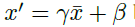

## Domain generalization - methods - 9

[`Zi-tao Shuai`'s comments](#`Zi-tao Shuai`'s comments)

## Overview

`Title`:  TENT: FULLY TEST-TIME ADAPTATION BY ENTROPY MINIMIZATION

`Links`: https://arxiv.org/pdf/2006.10726.pdf

`contribution`: 

`source`: `ICLR2021`

`institution`: `UCB` 

## Background

### introduction

`requirement for robust model`:

- accuracy
- efficiency
- availability

`main idea`: normalizes and transforms inference on target data by estimating statistics and optimizing affine parameters batch-by-batch.

`approach`: by minimizing the entropy on the test data

### motivation

`adaptation perspective`

Sometimes the source domain data is not required. (But I think the setting is not solid, at least we need a source domain to provide some classification loss.)

And basic to intuition, this fully-time testing-time domain adaptation seems not stable.

And consider the `source domain -> target domain` adapting process, the authors think of the `source model -> target model` updating process. So there imported a new variable: model parameters.

`how to figure the distributions`

Two approaches:

1. `batch norm`: provide the mu and sigma
2. `VAE`: the hidden layer's output (not used)

So the batch norm layer's information should be considered.

### related work

## Methods

`updating details`:

The backbone can't be modified, since the authors claim that this operation might lead the model to diverge from the training process.

So they just deploy operations on the batch norm layer and the **linear layer**.(Sounds like fine-tuning.)

And the linear layer can be represented by a scale parameter: `\gamma` and a shift parameter: `\beta`:

And the loss function is based on Shannon entropy on the testing datasets.

`Framework`

## Experiment

## `Zi-tao Shuai`'s comments

In fact, it's not of so much interest for me, personally.

