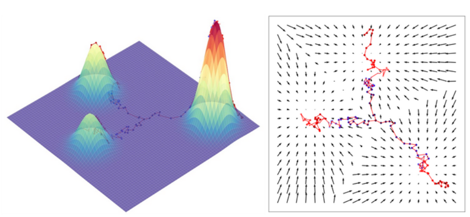
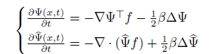
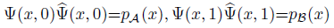
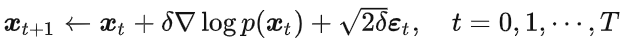
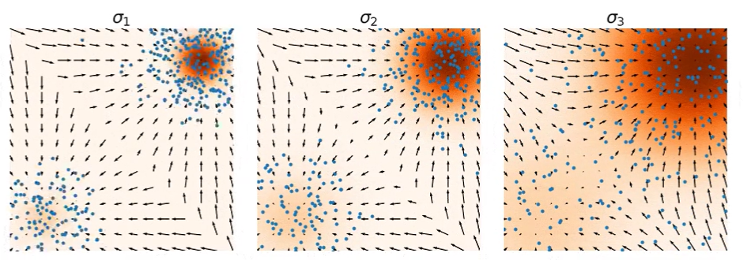
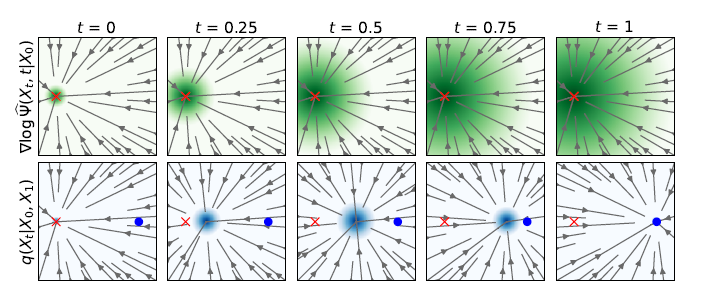

## Paper Review

By Zitao Shuai (ztshuai@umich.edu) 

### Basic Information

Title: I2SB: Image-to-Image Schr¨odinger Bridge

Source: JMLR

Institute: Gatech

### Overview

One of the motivations of the traditional diffusion model is learning the noise added to the picture is easier than learning the noised picture directly. Based on this assumption, the traditional diffusion model removes the noise step by step. However, this paper proposes another way to denoising: directly transform the degraded images to clean images in a diffusion-like way.

**Note:**

This paper is heavy in math. But their motivations are clear: to directly learn the mapping between degraded images and clean images and import some structural information that can be used as prior.

But I also have some questions. The shifts between degraded images and clean images are small. Therefore, is this work still useful in translating highly different two pictures? For example, can we use it to learn a model to solve the inverse imaging problem?

Since we agree on the intuition that learning noise and adding up them (in a linear way) is easier for models to learn, and this paper has shown the higher generalizable ability of the proposed model, is the difference brought from the degraded image prior?

Since I'm not good at mathematics staff, let's analyze their intuitions and methods and backgrounds to have a better understanding of this novel approach and think about how we can benefit from this work. 

### Energy Based Model

It's hard to understand this paper without learning something about the energy-based model.

For a given $p(x)$ we can write it as $p(x)=\frac{e^{-f(x)}}{Z(\theta)}$ where $Z(\theta)$ is the normalization term.

**We can image the probability as the potential energy**, and image the probability $P(x_t|x_0)$ is transporting in the mountains.

Fortunately, the model we want to learn can be viewed as a conditional probability, hence we can view the model we want to learn is transporting in the mountains.

**It sounds wired, therefore we can name the model as score function $s_{\theta}(x)$**,

[1] Luo C. Understanding diffusion models: A unified perspective[J]. arXiv preprint arXiv:2208.11970, 2022.

### The gradient and the model

We might keep asking what's the meaning of the term $\nabla log$xxx.

Firstly, since we consider the conditional probability $p(x_t|x_0)$, there is a Tweedie's Formula for a gaussion $z\sim N((x_t,x_0)',\sum_z)$:

$$x_0=x_t+\sum_z\nabla logP(x_t)$$

After a series of derivations, we know the **noise $\epsilon=k\nabla logP(x_t)$. Since we don't want to say a model is walking in the mountain, we say a potential energy-like score is walking in the mountain.**

And note that  **$P(x_t)$ can be replaced by other energy potentials with some properties**. Specifically, in this paper, these properties are shown in:

### Non-linearity and Generalization

This paper mentions the non-linearity, I think it comes from the definition of $\psi$.

The SB bridge is defined as:

And as the paper shows, if we take the log() on both sides, we have: $log(P(x))=log(\psi(x))+log(\hat{\psi(x)})$.

Hence $log(P(x))-log(\psi(x))=log(\hat{\psi(x)})$

It looks like traditional SGM is the case that $log(\psi(x))=0$. 

Therefore, we can view SGM is a special case of this paper's method.

### How to Bridge two points

The model can be viewed as a log gradient(with norm and direction), and it can be used to update the $x_t$ using Langevin dynamics:

Our goal is to learn accurate log gradients. The author of the original paper drew it as arrors and showed the graph in his blog. We can compare it with the graph shown in this paper:

(Standard score-based diffusion model. $\sigma_1<\sigma_2<\sigma_3$)

[2] https://yang-song.net/blog/2021/score/

(This paper)

We can see that when we gradually increase the variance, the model tends to be accurate in the first graph, and the density area keeps increasing.

And the second graph shows that as the diffusion bridge moves from p_A to p_B, the area increases.

There comes a last question, why don't we move the red center to the blue center directly?

**I think that's because we can only tackle Gaussian distribution directly, recall the Tweedie's theorem, we might need to use some properties of x_0 which is a normal Gaussion. If we start from an arbitrary p_A,  we don't know how to sample it directly. Hence we need to transform it to $p_A(x)=\psi(x,0)\hat{\psi(x,0)}$ to bridge p_A and p_B.**

### Benefit from this paper

At least it forces me to read previous literature about the score-based diffusion model and have a deeper understanding of it.
